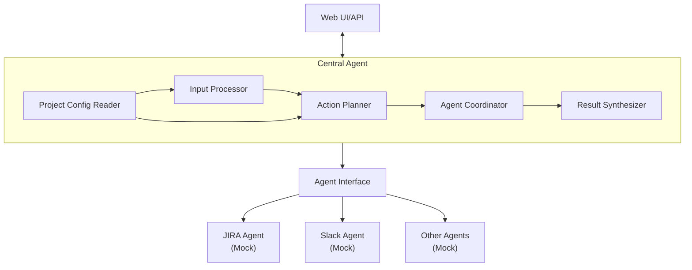
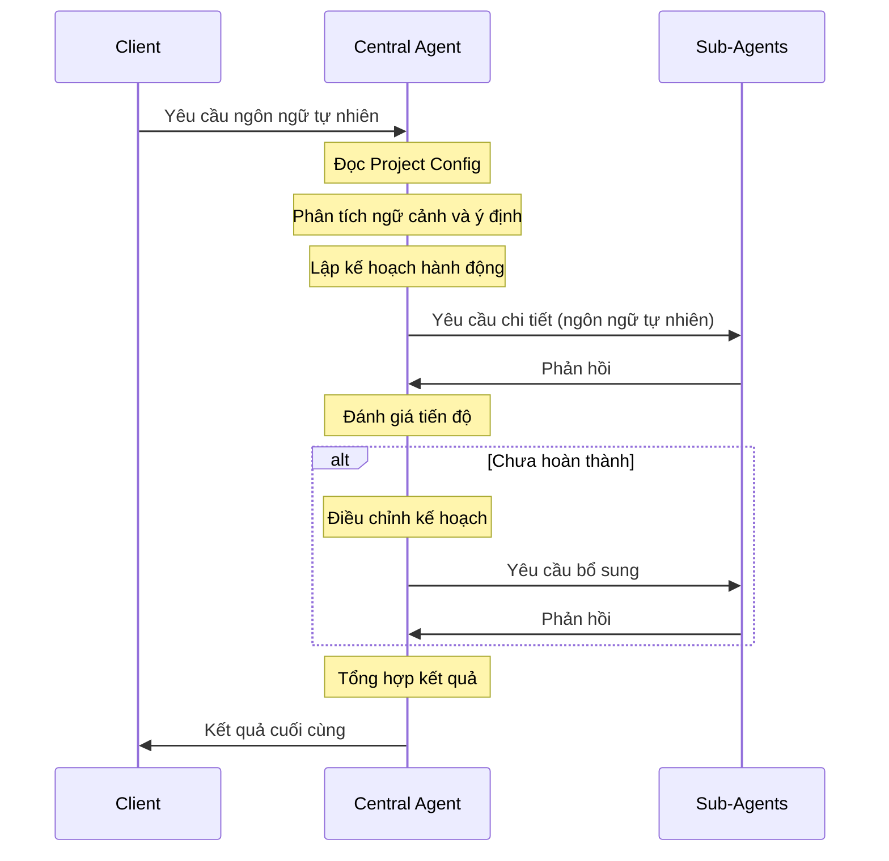

# Thiết kế triển khai Central Agent

## 1. Tổng quan
Central Agent là thành phần cốt lõi của DevAssist Bot, đóng vai trò xử lý ngôn ngữ tự nhiên và điều phối các agent chức năng. Để triển khai trong giai đoạn đầu khi các agent khác chưa hoàn thiện, chúng ta sẽ tập trung vào việc xây dựng kiến trúc core của Central Agent và sử dụng mock data cho các agent khác.

## 2. Kiến trúc cơ bản



## 3. Quy trình xử lý chi tiết

### 3.1 Quy trình tổng thể
Khi người dùng đưa ra một yêu cầu bằng ngôn ngữ tự nhiên như "tôi xong việc hôm nay rồi", Central Agent sẽ thực hiện quy trình xử lý sau:



### 3.2 Chi tiết các thành phần

#### 3.2.1 Project Config Reader
**Nhiệm vụ:**
- Đọc thông tin dự án từ `project_config.json`
- Cung cấp thông tin về Jira project, Slack channel, thông tin thành viên
- Cung cấp context cho việc hiểu đúng yêu cầu người dùng

**Ví dụ:**
Khi nhận yêu cầu "tôi xong việc hôm nay rồi", Project Config Reader sẽ cung cấp:
- Jira project key (XDEMO2)
- Slack channel mặc định (C08JFTGTN2K)
- Thông tin người dùng hiện tại
- Các cấu hình khác liên quan

#### 3.2.2 Input Processor
**Nhiệm vụ:**
- Phân tích văn bản đầu vào của người dùng
- Xác định ý định và ngữ cảnh của yêu cầu
- Nếu yêu cầu mơ hồ, có thể đề xuất làm rõ

**Quy trình chi tiết:**
1. Nhận văn bản đầu vào
2. Gửi văn bản đến OpenAI API với function calling
3. Trích xuất ý định chính (ví dụ: "báo cáo hoàn thành công việc")
4. Phân tích ngữ cảnh (thời gian, người dùng, project)
5. Tạo intent objects được chuẩn hóa

**Ví dụ đầu vào:**
```
"tôi xong việc hôm nay rồi"
```

**Ví dụ đầu ra sau khi xử lý:**
```
Người dùng Phúc muốn báo cáo rằng họ đã hoàn thành tất cả công việc được giao trong ngày hôm nay (5/6/2023). Họ muốn:
1. Cập nhật trạng thái các task được giao cho họ trong dự án XDEMO2 thành "Done"
2. Thông báo cho team về việc hoàn thành công việc

Ngữ cảnh: Yêu cầu được gửi vào cuối ngày làm việc, liên quan đến dự án XDEMO2, và cần thông báo cho team.
```

#### 3.2.3 Action Planner
**Nhiệm vụ:**
- Lập kế hoạch hành động từ ý định đã trích xuất
- Xác định các bước cần thực hiện (có thể nhiều bước)
- Xác định các agent cần gọi cho mỗi bước
- Tạo prompt ngôn ngữ tự nhiên cho từng agent
- Quản lý phụ thuộc giữa các bước

**Quy trình chi tiết:**
1. Nhận intent objects từ Input Processor
2. Xác định các agent cần tham gia (JIRA, Slack, v.v.)
3. Tạo các bước xử lý theo trình tự logic
4. Tạo prompt ngôn ngữ tự nhiên chi tiết cho từng agent
5. Thiết lập quan hệ phụ thuộc giữa các bước
6. Tạo ActionPlan object với các ActionStep

**Cấu trúc Action Plan đầy đủ:**
```typescript
interface ActionPlan {
  steps: ActionStep[];
  currentStepIndex: number;
  executionContext: Record<string, any>;
  status: PlanStatus;
  startTime?: Date;
  endTime?: Date;
  error?: Error;
  overallProgress: number;
}

interface ActionStep {
  id: string;
  agentType: AgentType;
  prompt: string;
  dependsOn: string[];
  condition?: string;
  maxRetries?: number;
  retryCount?: number;
  timeout?: number;
  status: StepStatus;
  result?: StepResult;
  startTime?: Date;
  endTime?: Date;
  error?: Error;
}

interface StepResult {
  success: boolean;
  data?: any;
  error?: any;
  metadata?: {
    executionTime?: number;
    tokenUsage?: number;
  };
}

enum StepStatus {
  PENDING = 'pending',     // Chưa bắt đầu
  WAITING = 'waiting',     // Đang chờ các step phụ thuộc
  RUNNING = 'running',     // Đang thực thi
  SUCCEEDED = 'succeeded', // Thành công
  FAILED = 'failed',       // Thất bại
  RETRYING = 'retrying',   // Đang thử lại
  SKIPPED = 'skipped',     // Bỏ qua (do điều kiện không thỏa)
  CANCELLED = 'cancelled'  // Đã hủy
}

enum PlanStatus {
  CREATED = 'created',     // Mới tạo
  RUNNING = 'running',     // Đang thực thi
  COMPLETED = 'completed', // Hoàn thành thành công
  FAILED = 'failed',       // Thất bại
  CANCELLED = 'cancelled'  // Đã hủy
}
```

**Ví dụ kế hoạch cho "tôi xong việc hôm nay rồi":**
```json
{
  "plan": {
    "steps": [
      {
        "id": "step1",
        "agentType": "JIRA",
        "prompt": "Tìm kiếm tất cả các issue được gán cho người dùng hiện tại (Phúc) với dự án XDEMO2. Chỉ trả về các task đã được cập nhật hôm nay và chưa hoàn thành. Format kết quả dưới dạng JSON với các trường key, summary, status.",
        "dependsOn": [],
        "maxRetries": 2,
        "timeout": 15000,
        "status": "PENDING"
      },
      {
        "id": "step2",
        "agentType": "JIRA",
        "prompt": "Cập nhật trạng thái các task sau sang 'Done': {result.step1.issues.map(i => i.key).join(', ')}. Dự án: XDEMO2.",
        "dependsOn": ["step1"],
        "condition": "result.step1.issues.length > 0",
        "maxRetries": 3,
        "timeout": 20000,
        "status": "PENDING"
      },
      {
        "id": "step3",
        "agentType": "SLACK",
        "prompt": "Gửi tin nhắn tới channel #project-alpha (ID: C08JFTGTN2K) với nội dung: 'Phúc đã hoàn thành {result.step1.issues.length} task hôm nay: {result.step1.issues.map(i => i.key + ': ' + i.summary).join(', ')}'",
        "dependsOn": ["step2"],
        "condition": "result.step1.issues.length > 0",
        "maxRetries": 2,
        "timeout": 10000,
        "status": "PENDING"
      }
    ],
    "currentStepIndex": 0,
    "executionContext": {},
    "status": "CREATED",
    "overallProgress": 0
  }
}
```

**Quản lý kết quả và trạng thái:**

1. **Lưu trữ kết quả**: Mỗi khi một sub-agent thực hiện một step và trả về kết quả, kết quả này được lưu trong thuộc tính `result` của step tương ứng:
   ```typescript
   // Sau khi step1 hoàn thành
   plan.steps[0].result = {
     success: true,
     data: {
       issues: [
         {key: 'XDEMO2-5', summary: 'Cập nhật tính năng đăng nhập', status: 'In Progress'},
         {key: 'XDEMO2-7', summary: 'Fix lỗi validation form', status: 'In Progress'}
       ]
     },
     metadata: {
       executionTime: 1250,
       tokenUsage: 320
     }
   };
   plan.steps[0].status = 'SUCCEEDED';
   plan.steps[0].endTime = new Date();
   ```

2. **Truy cập kết quả từ các step trước**: Kết quả từ các step trước được lưu trong `executionContext` và có thể được truy cập trong các prompt của các step sau thông qua cú pháp template:
   ```javascript
   // executionContext sau khi step1 hoàn thành
   {
     "result": {
       "step1": {
         "success": true,
         "data": {
           "issues": [
             {"key": "XDEMO2-5", "summary": "Cập nhật tính năng đăng nhập", "status": "In Progress"},
             {"key": "XDEMO2-7", "summary": "Fix lỗi validation form", "status": "In Progress"}
           ]
         }
       }
     }
   }
   
   // Cách prompt được render với context
   const renderedPrompt = renderPromptTemplate(
     step.prompt, 
     plan.executionContext
   );
   // Kết quả: "Cập nhật trạng thái các task sau sang 'Done': XDEMO2-5, XDEMO2-7. Dự án: XDEMO2."
   ```

3. **Theo dõi trạng thái và xử lý lỗi**:
   ```typescript
   // Khi step2 gặp lỗi
   plan.steps[1].status = 'FAILED';
   plan.steps[1].error = new Error('JIRA API Error: Invalid transition');
   
   // Quyết định thử lại step2
   if (plan.steps[1].retryCount < plan.steps[1].maxRetries) {
     plan.steps[1].retryCount++;
     plan.steps[1].status = 'RETRYING';
     // Thực hiện lại step2 với prompt có thể được điều chỉnh
   } else {
     // Không thể thử lại nữa
     plan.status = 'FAILED';
     plan.error = new Error('Failed to complete step2 after multiple retries');
   }
   ```

4. **Đánh giá điều kiện (condition)**: Trước khi thực hiện một step, Agent Coordinator đánh giá điều kiện của step đó dựa trên kết quả từ các step trước:
   ```typescript
   // Đánh giá điều kiện để thực hiện step2
   const conditionResult = evaluateCondition(
     step.condition, 
     plan.executionContext
   );
   
   if (conditionResult) {
     // Thực hiện step
     executeStep(step);
   } else {
     // Bỏ qua step
     step.status = 'SKIPPED';
     moveToNextStep();
   }
   ```

5. **Cập nhật tiến độ tổng thể**:
   ```typescript
   // Tính toán tiến độ tổng thể dựa trên trạng thái các step
   const completedSteps = plan.steps.filter(
     s => ['SUCCEEDED', 'SKIPPED', 'FAILED'].includes(s.status)
   ).length;
   plan.overallProgress = (completedSteps / plan.steps.length) * 100;
   ```

**Cách hoạt động chi tiết:**
1. Central Agent tạo ActionPlan với các step và trạng thái ban đầu
2. Agent Coordinator thực thi từng step theo thứ tự, đánh giá điều kiện phụ thuộc
3. Mỗi Sub-Agent nhận prompt và trả về kết quả
4. Kết quả được lưu vào executionContext và cập nhật trạng thái của step
5. Các quyết định tiếp theo (thực hiện step tiếp, thử lại, bỏ qua, v.v.) dựa trên trạng thái hiện tại
6. Khi hoàn thành kế hoạch, Result Synthesizer tổng hợp kết quả từ executionContext

**Ví dụ tương tác với Sub-Agent JIRA:**
```
// Prompt từ Central Agent
"Tìm kiếm tất cả các issue được gán cho người dùng hiện tại (Phúc) với dự án XDEMO2. Chỉ trả về các task đã được cập nhật hôm nay và chưa hoàn thành. Format kết quả dưới dạng JSON với các trường key, summary, status."

// JIRA Agent tự xác định:
// - Action: searchIssues
// - Parameters: {
//     jql: "assignee = '557058:24acce7b-a0c1-4f45-97f1-7eb4afd2ff5f' AND status != 'Done' AND updated >= startOfDay()",
//     fields: ["key", "summary", "status"],
//     project: "XDEMO2"
//   }

// Phản hồi từ JIRA Agent
"Đã tìm thấy 3 task:
{
  'issues': [
    {'key': 'XDEMO2-5', 'summary': 'Cập nhật tính năng đăng nhập', 'status': 'In Progress'},
    {'key': 'XDEMO2-7', 'summary': 'Fix lỗi validation form', 'status': 'In Progress'},
    {'key': 'XDEMO2-8', 'summary': 'Thêm unit test cho module authentication', 'status': 'To Do'}
  ]
}"
```

#### 3.2.4 Agent Coordinator
**Nhiệm vụ:**
- Thực thi kế hoạch đã được tạo
- Gọi các agent chức năng với prompt phù hợp
- Quản lý luồng thực thi giữa các bước
- Xử lý lỗi và điều chỉnh kế hoạch nếu cần

**Quy trình chi tiết:**
1. Nhận ActionPlan từ Action Planner
2. Kiểm tra điều kiện phụ thuộc của các bước
3. Gửi yêu cầu đến sub-agent bằng ngôn ngữ tự nhiên chi tiết
4. Thu thập kết quả và cập nhật vào context
5. Nếu gặp lỗi, xử lý điều chỉnh kế hoạch
6. Tiếp tục thực hiện các bước tiếp theo

**Ví dụ prompt gửi tới JIRA Agent:**
```
Tìm kiếm tất cả các issue được gán cho người dùng hiện tại và chưa hoàn thành, nhưng đã được cập nhật trong ngày hôm nay. Chỉ trả về các trường key, summary và status. 
Sử dụng JQL: "assignee = currentUser() AND status != 'Done' AND updated >= startOfDay()"
ProjectKey: XDEMO2
```

**Ví dụ xử lý lỗi:**
```
Nếu JIRA Agent trả về "Không tìm thấy issue nào", điều chỉnh kế hoạch để tìm kiếm các issue được cập nhật trong tuần thay vì trong ngày.
```

#### 3.2.5 Result Synthesizer
**Nhiệm vụ:**
- Tổng hợp kết quả từ các bước đã thực hiện
- Định dạng kết quả cuối cùng để trả về cho người dùng
- Tạo tóm tắt các hành động đã thực hiện

**Quy trình chi tiết:**
1. Thu thập kết quả từ các bước đã hoàn thành
2. Tổng hợp thông tin từ nhiều nguồn nếu cần
3. Định dạng phản hồi theo cấu trúc dễ hiểu
4. Tạo thông điệp cuối cùng cho người dùng

**Ví dụ phản hồi tổng hợp:**
```
Đã hoàn thành 3 task của bạn hôm nay:
- XDEMO2-5: Cập nhật tính năng đăng nhập
- XDEMO2-7: Fix lỗi validation form
- XDEMO2-8: Thêm unit test cho module authentication

Đã thông báo cho team trong kênh #project-alpha.
```

### 3.3 Tương tác chi tiết với Sub-Agents

Central Agent sử dụng ngôn ngữ tự nhiên có cấu trúc để tương tác với các Sub-Agent và quản lý kết quả trả về trong suốt quá trình thực thi:

#### 3.3.1 Mô hình tương tác

1. **Ngôn ngữ tự nhiên - Natural Language Interface**
   - Central Agent gửi prompt ngôn ngữ tự nhiên chi tiết đến các Sub-Agent
   - Sub-Agent tự xác định cách thức thực hiện yêu cầu và trả về kết quả
   - Không truyền trực tiếp các action/parameter cụ thể mà để Sub-Agent quyết định

2. **Theo dõi trạng thái và kết quả**
   - Mỗi Step trong ActionPlan có trạng thái (PENDING, RUNNING, SUCCEEDED, FAILED, v.v.)
   - Kết quả trả về từ Sub-Agent được lưu trong thuộc tính `result` của Step
   - Kết quả này được cập nhật vào `executionContext` để các Step tiếp theo có thể sử dụng

3. **Xử lý phụ thuộc và điều kiện**
   - Agent Coordinator chỉ thực thi một Step khi tất cả các Step phụ thuộc đã hoàn thành
   - Đánh giá điều kiện (condition) của Step dựa trên `executionContext` để quyết định có thực hiện hay không

#### 3.3.2 Quy trình tương tác chi tiết

1. **Chuẩn bị prompt**
   ```typescript
   // Render prompt với context từ các step trước
   const renderedPrompt = renderPromptTemplate(
     step.prompt, 
     plan.executionContext
   );
   ```

2. **Gửi yêu cầu đến Sub-Agent**
   ```typescript
   // Gọi agent với prompt ngôn ngữ tự nhiên
   const agentResponse = await agentService.executePrompt(
     step.agentType,
     renderedPrompt,
     { timeout: step.timeout }
   );
   ```

3. **Xử lý kết quả trả về**
   ```typescript
   // Lưu kết quả vào Step
   step.result = {
     success: agentResponse.success,
     data: agentResponse.data,
     metadata: agentResponse.metadata
   };
   
   // Cập nhật trạng thái Step
   step.status = agentResponse.success ? 'SUCCEEDED' : 'FAILED';
   step.endTime = new Date();
   
   // Cập nhật ExecutionContext
   plan.executionContext.result = {
     ...plan.executionContext.result,
     [step.id]: step.result
   };
   ```

4. **Xử lý lỗi và retry**
   ```typescript
   if (!agentResponse.success && step.retryCount < step.maxRetries) {
     // Tăng retryCount
     step.retryCount++;
     step.status = 'RETRYING';
     
     // Có thể điều chỉnh prompt dựa trên lỗi
     const adjustedPrompt = generateRetryPrompt(
       renderedPrompt, 
       agentResponse.error
     );
     
     // Thực hiện lại
     return executeStep(step, adjustedPrompt);
   }
   ```

#### 3.3.3 Ví dụ tương tác hoàn chỉnh

**Step 1: Tìm kiếm JIRA Issues**

```
// Prompt gửi tới JIRA Agent
"Tìm kiếm tất cả các issue được gán cho người dùng hiện tại (Phúc) với dự án XDEMO2. Chỉ trả về các task đã được cập nhật hôm nay và chưa hoàn thành. Format kết quả dưới dạng JSON với các trường key, summary, status."

// JIRA Agent xử lý:
// 1. Xác định cần thực hiện hành động searchIssues
// 2. Tự xây dựng JQL query: "assignee = currentUser() AND project = XDEMO2 AND status != 'Done' AND updated >= startOfDay()"
// 3. Thực hiện tìm kiếm và trả về kết quả

// Phản hồi từ JIRA Agent
{
  "success": true,
  "data": {
    "issues": [
      {"key": "XDEMO2-5", "summary": "Cập nhật tính năng đăng nhập", "status": "In Progress"},
      {"key": "XDEMO2-7", "summary": "Fix lỗi validation form", "status": "In Progress"}
    ]
  },
  "metadata": {
    "executionTime": 1250,
    "tokenUsage": 320
  }
}

// Central Agent cập nhật ActionStep
step1.result = {
  success: true,
  data: {
    issues: [
      {"key": "XDEMO2-5", "summary": "Cập nhật tính năng đăng nhập", "status": "In Progress"},
      {"key": "XDEMO2-7", "summary": "Fix lỗi validation form", "status": "In Progress"}
    ]
  },
  metadata: {
    executionTime: 1250,
    tokenUsage: 320
  }
};
step1.status = 'SUCCEEDED';
step1.endTime = new Date();

// Cập nhật ExecutionContext
plan.executionContext.result = {
  step1: step1.result
};
```

**Step 2: Cập nhật trạng thái issues**

```
// Evaluate condition
const condition = "result.step1.issues.length > 0";
const conditionResult = evaluateCondition(condition, plan.executionContext);

if (conditionResult) {
  // Render prompt với context
  const renderedPrompt = renderPromptTemplate(
    "Cập nhật trạng thái các task sau sang 'Done': {result.step1.issues.map(i => i.key).join(', ')}. Dự án: XDEMO2.",
    plan.executionContext
  );
  // => "Cập nhật trạng thái các task sau sang 'Done': XDEMO2-5, XDEMO2-7. Dự án: XDEMO2."
  
  // Gửi prompt cho JIRA Agent
  const agentResponse = await agentService.executePrompt(
    AgentType.JIRA,
    renderedPrompt,
    { timeout: 20000 }
  );
  
  // JIRA Agent xử lý:
  // 1. Xác định cần thực hiện hành động updateIssueStatus
  // 2. Tự xác định tham số: issueKeys = ["XDEMO2-5", "XDEMO2-7"], status = "Done"
  // 3. Thực hiện cập nhật và trả về kết quả
  
  // Phản hồi từ JIRA Agent
  // {
  //   "success": true,
  //   "data": {
  //     "updatedIssues": ["XDEMO2-5", "XDEMO2-7"],
  //     "transitionId": "31"
  //   },
  //   "metadata": {
  //     "executionTime": 2100,
  //     "tokenUsage": 280
  //   }
  // }
  
  // Central Agent cập nhật step2
  step2.result = agentResponse;
  step2.status = 'SUCCEEDED';
  step2.endTime = new Date();
  
  // Cập nhật ExecutionContext
  plan.executionContext.result.step2 = step2.result;
}
```

**Step 3: Gửi thông báo Slack**

```
// Tương tự như Step 2, evaluate condition và render prompt
// ...

// Prompt gửi tới Slack Agent
"Gửi tin nhắn tới channel #project-alpha (ID: C08JFTGTN2K) với nội dung: 'Phúc đã hoàn thành 2 task hôm nay: XDEMO2-5: Cập nhật tính năng đăng nhập, XDEMO2-7: Fix lỗi validation form'"

// Slack Agent xử lý:
// 1. Xác định cần thực hiện hành động sendMessage
// 2. Tự xác định tham số: channel = "C08JFTGTN2K", text = "Phúc đã hoàn thành 2 task hôm nay: ..."
// 3. Gửi tin nhắn và trả về kết quả

// Phản hồi từ Slack Agent
// {
//   "success": true,
//   "data": {
//     "messageId": "1621234567.123456",
//     "timestamp": "1621234567.123456"
//   },
//   "metadata": {
//     "executionTime": 850,
//     "tokenUsage": 210
//   }
// }

// Central Agent cập nhật step3
step3.result = agentResponse;
step3.status = 'SUCCEEDED';
step3.endTime = new Date();

// Cập nhật ExecutionContext
plan.executionContext.result.step3 = step3.result;

// Cập nhật trạng thái plan
plan.status = 'COMPLETED';
plan.endTime = new Date();
plan.overallProgress = 100;
```

#### 3.3.4 Xử lý lỗi và điều chỉnh

1. **Trường hợp JIRA Agent không tìm thấy issues**
   ```
   // Phản hồi từ JIRA Agent
   {
     "success": true,
     "data": {
       "issues": []
     },
     "metadata": {
       "executionTime": 980,
       "tokenUsage": 280
     }
   }
   
   // Condition evaluation
   const condition = "result.step1.issues.length > 0";
   const conditionResult = evaluateCondition(condition, plan.executionContext);
   // => false
   
   // Skip step2 và step3
   step2.status = 'SKIPPED';
   step3.status = 'SKIPPED';
   
   // Báo cáo kết quả
   "Không tìm thấy task nào cần cập nhật trạng thái."
   ```

2. **Trường hợp JIRA Agent gặp lỗi**
   ```
   // Phản hồi từ JIRA Agent
   {
     "success": false,
     "error": {
       "code": "JIRA_API_ERROR",
       "message": "Invalid transition: Cannot transition from 'To Do' to 'Done'"
     },
     "metadata": {
       "executionTime": 1500,
       "tokenUsage": 310
     }
   }
   
   // Retry logic
   if (step2.retryCount < step2.maxRetries) {
     step2.retryCount++;
     step2.status = 'RETRYING';
     
     // Điều chỉnh prompt
     const adjustedPrompt = 
       "Cập nhật trạng thái các task sau sang 'Done', sử dụng các transition cần thiết (có thể cần chuyển từ 'To Do' sang 'In Progress' trước): XDEMO2-5, XDEMO2-7. Dự án: XDEMO2.";
     
     // Thực hiện lại step2 với prompt điều chỉnh
     // ...
   }
   ```

#### 3.3.5 Lợi ích của thiết kế này

1. **Linh hoạt**: Sub-Agent có thể tự quyết định cách thực hiện yêu cầu dựa trên prompt
2. **Dễ mở rộng**: Có thể thêm các Sub-Agent mới mà không cần thay đổi cấu trúc core
3. **Theo dõi tiến độ**: Theo dõi chi tiết trạng thái của từng bước và toàn bộ kế hoạch
4. **Xử lý lỗi thông minh**: Cơ chế retry và điều chỉnh prompt khi gặp lỗi
5. **Quản lý phụ thuộc**: Xử lý các bước phụ thuộc vào kết quả của bước trước

## 4. Phương pháp triển khai

### 4.1 Công nghệ sử dụng

- **Ngôn ngữ lập trình**: TypeScript
- **Framework**: Node.js
- **LLM**: OpenAI API (model GPT-4.0 Turbo)
- **Cơ sở dữ liệu**: MongoDB (lưu trữ conversation history, execution context)
- **Message Queue**: RabbitMQ (giao tiếp giữa Central Agent và Sub-Agents)
- **Logging**: Elasticsearch + Kibana (theo dõi, debug các prompt và response)
- **API documentation**: OpenAPI/Swagger
- **Testing**: Jest, Supertest

### 4.2 Cấu trúc thư mục

```
src/
├── config/                  # Cấu hình ứng dụng
├── core/                    # Core functionalities
│   ├── central-agent/       # Central Agent implementation
│   │   ├── input-processor/ # Input processing logic
│   │   ├── action-planner/  # Action planning logic
│   │   ├── coordinator/     # Agent coordination logic
│   │   └── synthesizer/     # Result synthesizing logic
│   ├── models/              # Shared data models
│   └── utils/               # Utilities and helpers
├── agents/                  # Adapter for sub-agents
│   ├── jira/                # JIRA agent adapter
│   ├── slack/               # Slack agent adapter
│   └── agent-factory.ts     # Factory for creating agent instances
├── services/                # External service integrations
│   ├── llm-service.ts       # LLM service integration (OpenAI)
│   ├── queue-service.ts     # Message queue service
│   └── storage-service.ts   # Storage service
├── api/                     # API endpoints
│   ├── controllers/         # API controllers
│   ├── middlewares/         # API middlewares
│   ├── routes/              # API routes
│   └── validators/          # API validators
├── types/                   # TypeScript type definitions
└── app.ts                   # Application entry point
```

### 4.3 Chiến lược triển khai

Để triển khai Central Agent hiệu quả, chúng ta sẽ áp dụng các chiến lược sau:

1. **Phát triển từng module độc lập**: Mỗi thành phần (Input Processor, Action Planner, Agent Coordinator, Result Synthesizer) sẽ được phát triển và kiểm thử độc lập trước khi tích hợp vào hệ thống.

2. **Mock Sub-Agents**: Trong giai đoạn đầu, các Sub-Agent sẽ được mock để tập trung phát triển Central Agent.

3. **Phương pháp phát triển lặp**: Triển khai từng phần nhỏ, kiểm thử kỹ lưỡng và cải thiện liên tục:
   - Giai đoạn 1: Core components với các tính năng cơ bản
   - Giai đoạn 2: Cải thiện và tối ưu các prompt LLM
   - Giai đoạn 3: Tích hợp với Sub-Agents thật
   - Giai đoạn 4: Mở rộng tính năng và tối ưu hiệu suất

4. **Theo dõi và gỡ lỗi**: 
   - Logging chi tiết các prompt và phản hồi
   - Theo dõi thời gian xử lý từng bước
   - Thu thập phản hồi người dùng về chất lượng

5. **Testing và Đánh giá**:
   - Unit testing cho từng module
   - Integration testing cho các luồng xử lý hoàn chỉnh
   - Benchmark hiệu suất xử lý

Chi tiết cụ thể về cách triển khai từng module và kế hoạch kiểm thử chi tiết sẽ được mô tả trong tài liệu riêng.

## 5. Các điểm cần lưu ý

### 5.1 Khả năng mở rộng

Central Agent sẽ được thiết kế với khả năng mở rộng cao:
- Có thể thêm Sub-Agent mới dễ dàng thông qua Agent Factory
- Cấu trúc ActionPlan linh hoạt, có thể mở rộng thêm các loại condition và dependency phức tạp hơn
- Interface thống nhất giữa các thành phần giúp dễ dàng thay thế hoặc nâng cấp từng phần

### 5.2 Các thách thức dự kiến

1. **Độ chính xác của LLM**: 
   - Prompt engineering để đảm bảo nhận được kết quả nhất quán
   - Xử lý các trường hợp LLM không trả về JSON đúng định dạng

2. **Hiệu suất**:
   - Tối ưu hóa số lượng gọi API đến OpenAI
   - Caching và reusing kết quả khi có thể

3. **Xử lý lỗi phức tạp**:
   - Phát triển cơ chế retry và recovery thông minh
   - Giám sát và cảnh báo khi có lỗi nghiêm trọng

### 5.3 Roadmap phát triển

**Giai đoạn 1 (2-3 tuần)**:
- Triển khai Core Components
- Mock Sub-Agents
- Unit Tests

**Giai đoạn 2 (2 tuần)**:
- Tối ưu Prompts LLM
- Cải thiện xử lý lỗi
- Integration Tests

**Giai đoạn 3 (3 tuần)**:
- Tích hợp với Sub-Agents thật
- Tối ưu hiệu suất
- User Acceptance Testing

## 6. Mẫu OpenAI Function Definition

```