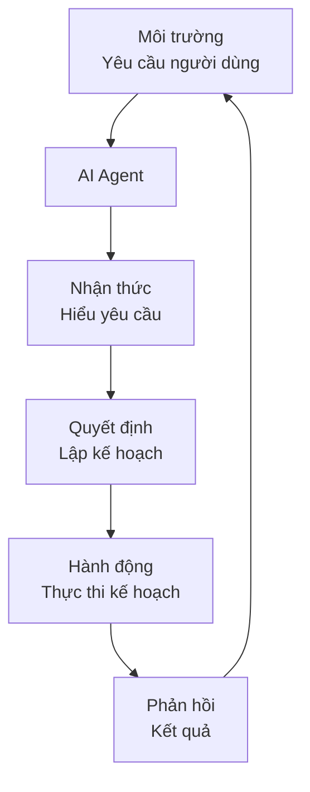
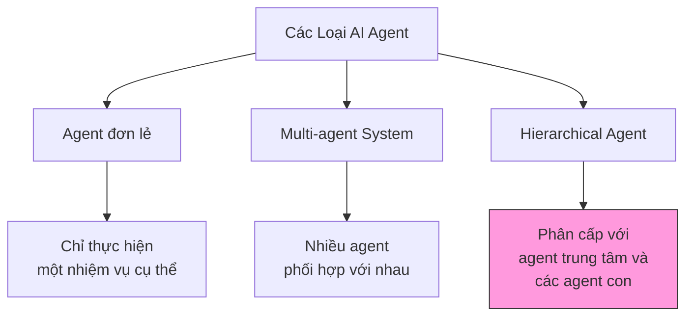
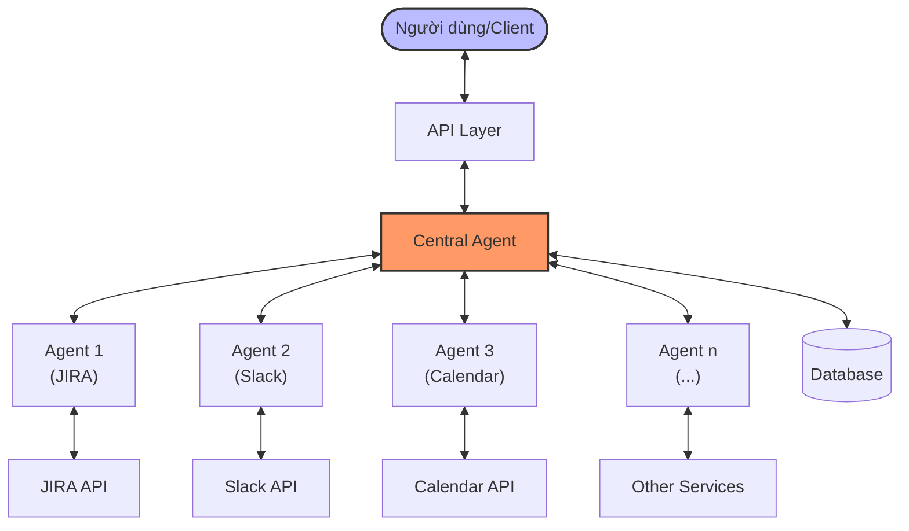
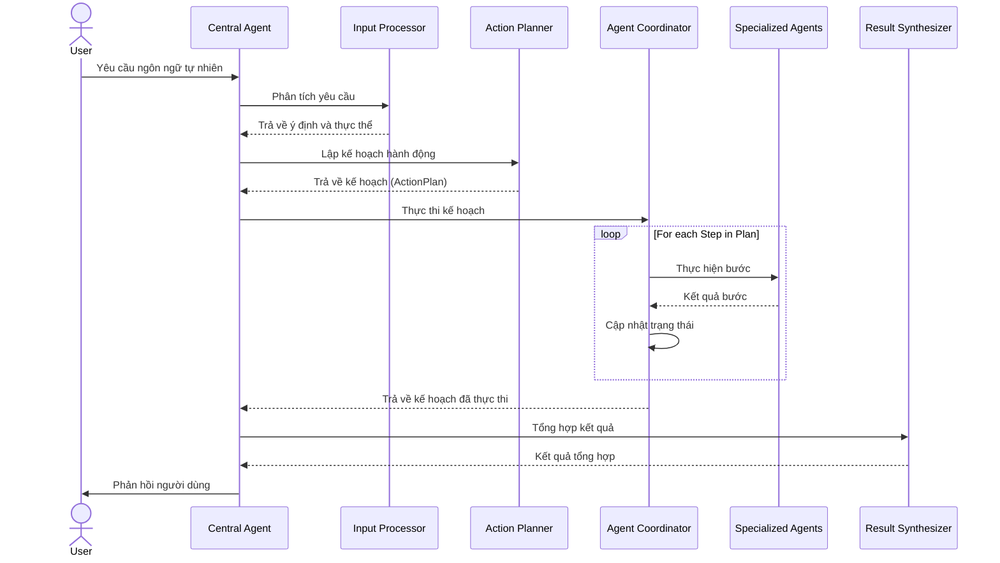
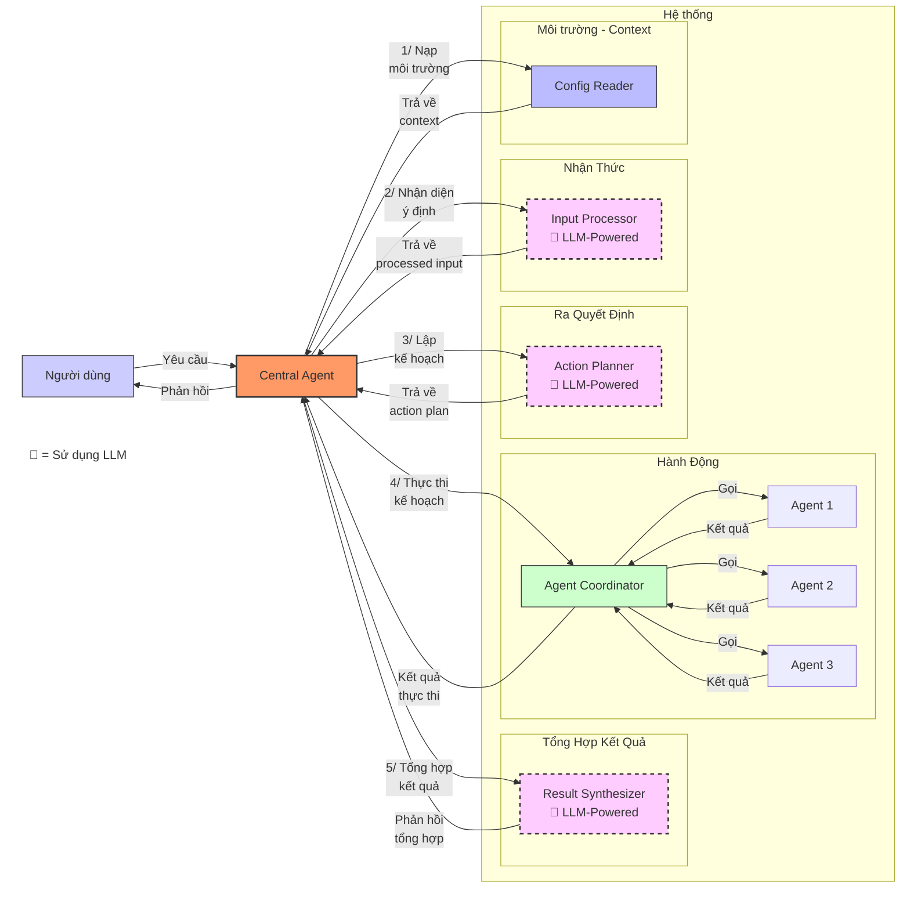
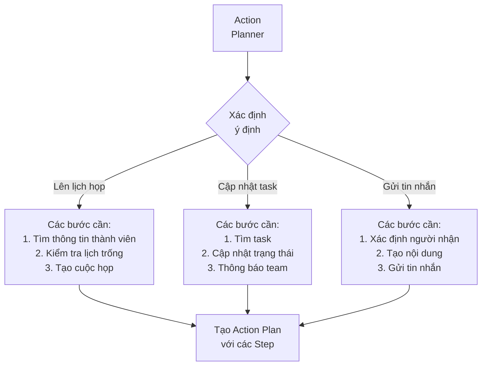
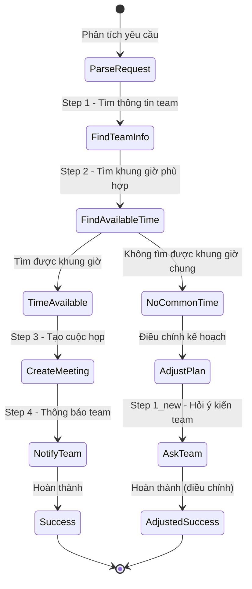
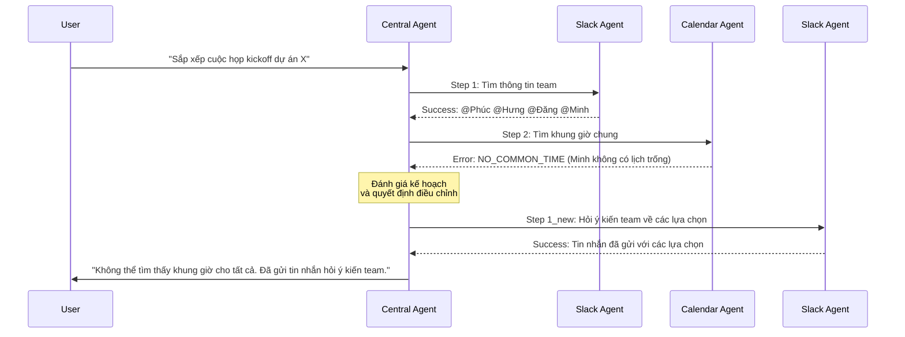
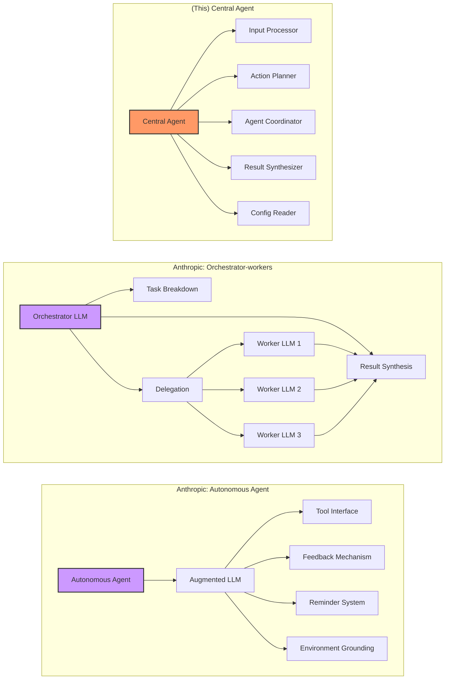
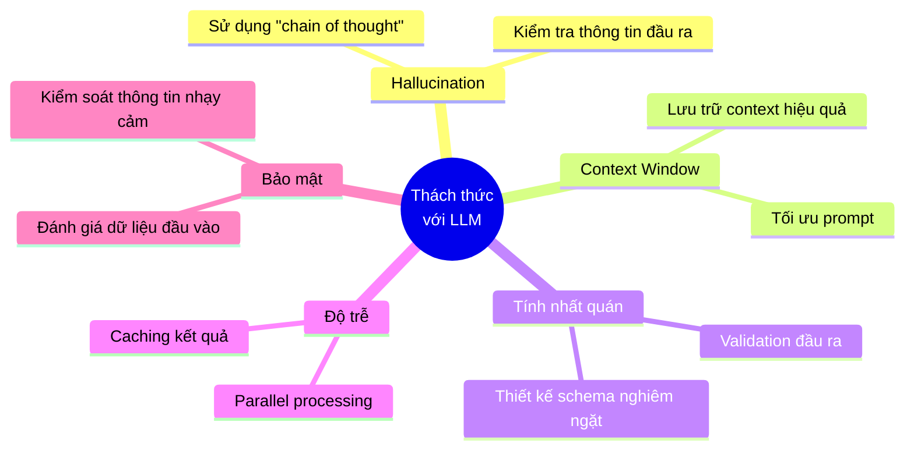

# Hướng Dẫn Phát Triển AI Agent Cơ Bản

## Mục lục
1. [Giới thiệu về AI Agent](#1-giới-thiệu-về-ai-agent)
2. [Kiến trúc Central Agent điều phối](#2-kiến-trúc-central-agent-điều-phối)
3. [Các thành phần cốt lõi](#3-các-thành-phần-cốt-lõi)
4. [Chi tiết về Action Planner](#4-chi-tiết-về-action-planner)
5. [So sánh với các kiến trúc agent khác](#5-so-sánh-với-các-kiến-trúc-agent-khác)
6. [Các thách thức khi triển khai AI Agent](#6-các-thách-thức-khi-triển-khai-ai-agent)
7. [Tài liệu tham khảo](#7-tài-liệu-tham-khảo)
8. [Lời kết](#8-lời-kết)

## 1. Giới thiệu về AI Agent

### 1.1 AI Agent là gì?
AI Agent (hay Đặc vụ AI) là một hệ thống phần mềm thông minh có khả năng:
- Nhận thức môi trường thông qua dữ liệu đầu vào
- Đưa ra quyết định dựa trên logic và trí tuệ nhân tạo
- Thực hiện hành động để đạt được mục tiêu cụ thể
- Học hỏi và cải thiện theo thời gian (tùy loại)

Khác với các ứng dụng AI thông thường, AI Agent có khả năng chủ động và linh hoạt trong việc giải quyết vấn đề, thay vì chỉ thực hiện một tác vụ cụ thể.



### 1.2 Ứng dụng của AI Agent
- **Tự động hóa quy trình làm việc**: Tự động hóa các tác vụ lặp đi lặp lại
- **Hỗ trợ ra quyết định**: Phân tích dữ liệu và đề xuất giải pháp
- **Tương tác với người dùng**: Trả lời câu hỏi, thực hiện yêu cầu
- **Tích hợp hệ thống**: Kết nối và phối hợp giữa nhiều hệ thống khác nhau

### 1.3 Các loại AI Agent



## 2. Kiến trúc Central Agent điều phối

Kiến trúc Central Agent điều phối là mô hình phổ biến và hiệu quả cho các hệ thống AI Agent phức tạp. Trong mô hình này, một agent trung tâm (Central Agent) đóng vai trò điều phối và quản lý các agent chuyên biệt (Specialized Agents) để thực hiện các tác vụ cụ thể.

### 2.1 Tổng quan kiến trúc



### 2.2 Luồng xử lý dữ liệu



## 3. Các thành phần cốt lõi



### 3.1 Config Reader (Bộ đọc cấu hình)
- **Nhiệm vụ**: Đọc thông tin dự án như thành viên, kênh liên lạc, mã dự án
- **Đầu vào**: Thông tin người dùng, ID dự án
- **Đầu ra**: Context cho việc hiểu đúng và thực hiện yêu cầu

**Ví dụ cấu trúc môi trường cho dự án phát triển phần mềm:**

| Thông tin môi trường | Mô tả | Ví dụ |
|--------------------------|-----------|-------------|
| Danh sách thành viên | Thành viên trong dự án | Phúc (PM), Đăng (Developer), Hưng (Tester) |
| Mã dự án | Định danh dự án | XDEMO2 |
| Kênh liên lạc | Kênh giao tiếp | #project-alpha (Slack) |
| Công cụ quản lý | Hệ thống quản lý công việc | JIRA |
| Thông tin xác thực | API token, credentials | jiraToken, slackToken |
| Lịch dự án | Sprint, deadline | Sprint 5: 01/05-15/05/2025 |
| Nguồn lực | Phòng họp, thiết bị | Mercury, Venus (meeting rooms) |

### 3.2 Input Processor (Bộ xử lý đầu vào)
- **Nhiệm vụ**: Phân tích và hiểu yêu cầu đầu vào từ người dùng (dạng ngôn ngữ tự nhiên)
- **Công nghệ phổ biến**: LLM (Large Language Model) như GPT, Gemini, Llama
- **Đầu ra**: Cấu trúc dữ liệu hiểu được ý định người dùng

**Prompt mẫu cho LLM**:
```
Bạn là một Input Processor trong hệ thống AI Agent. Nhiệm vụ của bạn là phân tích yêu cầu sau của người dùng để xác định:

1. Ý định chính (intent)
2. Các thực thể (entities) quan trọng
3. Ngữ cảnh (context) liên quan

Dựa trên thông tin sau:
- Yêu cầu người dùng: "{input}"
- Thông tin người dùng: {userInfo}
- Thông tin dự án: {projectInfo}

Trả về kết quả dưới dạng JSON với các trường sau:
- intent: ý định chính của người dùng
- entities: danh sách các thực thể được trích xuất
- requiredAgents: các loại agent cần để xử lý yêu cầu này
- detailedDescription: mô tả chi tiết về ý định người dùng
```

### 3.3 Action Planner (Bộ lập kế hoạch)
- **Nhiệm vụ**: Tạo kế hoạch hành động với các bước cụ thể
- **Đầu vào**: Kết quả xử lý từ Input Processor
- **Đầu ra**: Action Plan gồm các bước cần thực hiện
- **Đặc điểm**: Quản lý phụ thuộc giữa các bước, xử lý điều kiện

**Prompt mẫu cho LLM**:
```
Bạn là Action Planner trong hệ thống AI Agent. Nhiệm vụ của bạn là tạo kế hoạch hành động chi tiết dựa trên yêu cầu đã được phân tích.

Thông tin đầu vào:
- Phân tích yêu cầu: {processedInput}
- Thông tin dự án: {projectContext}
- Các agent có sẵn: {availableAgents}

Hãy tạo một kế hoạch hành động với các bước cụ thể, mỗi bước bao gồm:
1. ID bước
2. Loại agent cần sử dụng
3. Prompt chi tiết cho agent
4. Các bước phụ thuộc (nếu có)
5. Điều kiện thực hiện (nếu có)
6. Số lần thử lại tối đa
7. Thời gian chờ tối đa

Đảm bảo kế hoạch:
- Có thứ tự logic
- Xử lý được nhiều tình huống
- Tận dụng kết quả từ các bước trước
- Bao gồm xử lý lỗi cơ bản

Trả về dưới dạng JSON với cấu trúc ActionPlan.
```



### 3.4 Agent Coordinator (Bộ điều phối)
- **Nhiệm vụ**: Điều phối việc thực thi kế hoạch
- **Khả năng**: Gọi các agent con, theo dõi tiến độ, xử lý lỗi và retry


### 3.5 Result Synthesizer (Bộ tổng hợp kết quả)
- **Nhiệm vụ**: Tổng hợp kết quả từ các bước thành phản hồi cuối cùng
- **Đầu ra**: Văn bản ngôn ngữ tự nhiên cho người dùng

**Prompt mẫu cho LLM**:
```
Bạn là Result Synthesizer trong hệ thống AI Agent. Nhiệm vụ của bạn là tổng hợp kết quả từ việc thực hiện kế hoạch thành một phản hồi rõ ràng cho người dùng.

Thông tin đầu vào:
- Kế hoạch đã thực thi: {executedPlan}
- Yêu cầu ban đầu: {originalRequest}
- Ngôn ngữ phản hồi: Tiếng Việt

Hãy tạo một phản hồi tổng hợp:
1. Ngắn gọn và dễ hiểu
2. Tập trung vào kết quả chính
3. Đề cập đến các vấn đề quan trọng nếu có
4. Đề xuất hành động tiếp theo nếu cần

Phản hồi phải phù hợp với:
- Tiến độ hoàn thành kế hoạch
- Trạng thái của các bước
- Mục tiêu ban đầu của người dùng
```

## 4. Chi tiết về Action Planner

Action Planner là thành phần quan trọng nhất trong kiến trúc Central Agent, chịu trách nhiệm chuyển đổi ý định của người dùng thành kế hoạch hành động cụ thể mà hệ thống có thể thực thi.

### 4.1 Cấu trúc ActionPlan và ActionStep

ActionPlan là cấu trúc dữ liệu chính trong hệ thống, đại diện cho toàn bộ kế hoạch thực thi một yêu cầu. Dưới đây là cấu trúc đơn giản của một ActionPlan:

```json
{
  "id": "plan-123",
  "status": "running",
  "steps": [
    {
      "id": "step1",
      "agentType": "SLACK",
      "prompt": "Tìm kiếm tin nhắn liên quan đến cuộc họp",
      "dependsOn": [],
      "status": "succeeded"
    },
    {
      "id": "step2",
      "agentType": "CALENDAR",
      "prompt": "Tìm thời gian rảnh chung cho team",
      "dependsOn": ["step1"],
      "status": "running"
    }
  ],
  "executionContext": {
    "result": {}
  }
}
```

#### Các trường quan trọng trong ActionPlan

| Trường | Mô tả | Ví dụ giá trị |
|--------|-------|--------------|
| id | Định danh kế hoạch | "plan-123", "meeting-setup-456" |
| status | Trạng thái thực thi | "created", "running", "completed", "failed" |
| steps | Danh sách các bước | Mảng các ActionStep |
| executionContext | Ngữ cảnh thực thi, lưu kết quả các bước | Đối tượng chứa kết quả |

#### Các trường quan trọng trong ActionStep

| Trường | Mô tả | Ví dụ giá trị |
|--------|-------|--------------|
| id | Định danh bước | "step1", "fetchTeamMembers" |
| agentType | Loại agent thực hiện | "SLACK", "CALENDAR", "JIRA" |
| prompt | Chỉ dẫn chi tiết cho agent | "Tìm lịch rảnh của Phúc, Hưng, Đăng từ 1/6-5/6" |
| dependsOn | Các bước phụ thuộc | ["step1", "step2"] |
| condition | Điều kiện để thực hiện bước | "result.step1.success === true" |
| status | Trạng thái của bước | "pending", "running", "succeeded", "failed" |

### 4.2 Ví dụ về một ActionPlan thực tế

Với yêu cầu: "Sắp xếp cuộc họp với team để kickoff dự án X"



### 4.3 Xử lý lỗi và điều chỉnh kế hoạch

Khi không tìm được thời gian phù hợp cho tất cả mọi người:



#### Các chiến lược xử lý lỗi

| Loại lỗi | Chiến lược | Ví dụ |
|----------|------------|------|
| Thiếu thông tin | Quay lại hỏi người dùng | "Bạn muốn cuộc họp diễn ra trong khoảng thời gian nào?" |
| Xung đột | Tìm giải pháp thay thế | Đề xuất một số người tham gia online |
| Thất bại kết nối | Retry với backoff | Thử lại sau 5s, 10s, 30s |
| Lỗi logic | Điều chỉnh kế hoạch | Thay đổi thứ tự các bước |
| Không thể giải quyết | Báo cáo và gợi ý | "Không thể sắp xếp cuộc họp, có thể chuyển sang email?" |

## 5. So sánh với các kiến trúc agent khác



### 5.1 So sánh kiến trúc

| Kiến trúc | Đặc điểm chính | Ưu điểm | Nhược điểm | Khi nào sử dụng |
|-----------|---------------|--------|-----------|----------------|
| Central Agent | Agent trung tâm điều phối các agent con riêng biệt | - Phân chia trách nhiệm rõ ràng<br>- Dễ mở rộng/thay thế thành phần<br>- Kiểm soát luồng chi tiết<br>- Cơ chế feedback và điều chỉnh kế hoạch | - Phức tạp khi triển khai<br>- Phải quản lý nhiều thành phần | Khi cần kiểm soát chi tiết và linh hoạt trong việc tích hợp nhiều dịch vụ |
| Orchestrator-workers (Anthropic) | LLM trung tâm phân chia nhiệm vụ động và điều phối các worker LLMs | - Linh hoạt trong xác định nhiệm vụ phụ<br>- Phù hợp cho tác vụ phức tạp, không dự đoán được<br>- Dễ dàng tổng hợp kết quả từ nhiều nguồn | - Tốn kém khi sử dụng nhiều lệnh gọi LLM<br>- Phụ thuộc vào khả năng chia nhỏ nhiệm vụ của orchestrator<br>- Thiếu cơ chế feedback và điều chỉnh kế hoạch | Tác vụ phức tạp không thể dự đoán các nhiệm vụ phụ, như coding phức tạp hoặc tìm kiếm thông tin từ nhiều nguồn |
| Autonomous Agent (Anthropic) | Hệ thống tự chủ với LLM tăng cường điều khiển quy trình và sử dụng công cụ | - Khả năng thích ứng với phản hồi môi trường<br>- Tự chủ và linh hoạt cao<br>- Xử lý tốt các tác vụ không dự đoán được<br>- Cơ chế feedback mạnh mẽ | - Phức tạp trong triển khai<br>- Khó kiểm soát và dự đoán hành vi<br>- Yêu cầu kỹ thuật bảo mật cao hơn | Các tác vụ mở, các bước không dự đoán được, đặc biệt trong phân tích dữ liệu, hỗ trợ khách hàng hoặc nghiên cứu khoa học |

### 5.2 Tương đồng và khác biệt

#### Tương đồng
- Tất cả đều sử dụng thành phần trung tâm để phân công và điều phối công việc
- Đều có quy trình xử lý tuần tự từ đầu vào đến kết quả
- Khả năng mở rộng bằng cách thêm công cụ hoặc thành phần mới

#### Khác biệt chính
- **Cơ chế feedback**: Central Agent và Autonomous Agent có cơ chế feedback và điều chỉnh kế hoạch, Orchestrator-workers thiếu tính năng này
- **Mức độ tự chủ**: Autonomous Agent > Central Agent > Orchestrator-workers
- **Xác định nhiệm vụ phụ**: Central Agent (định nghĩa rõ ràng), Orchestrator-workers (phân chia động), Autonomous Agent (tự xác định và thích ứng)
- **Khả năng thích ứng**: Orchestrator-workers không thể điều chỉnh nếu kết quả không đạt yêu cầu

Anthropic nhấn mạnh ba nguyên tắc cốt lõi cho AI agent hiệu quả: đơn giản hóa trong thiết kế, minh bạch trong hoạt động, và tài liệu hóa/kiểm tra toàn diện.

## 6. Các thách thức khi triển khai AI Agent

### 6.1 Hạn chế của LLM và cách khắc phục



### 6.2 Nguyên tắc thiết kế AI Agent hiệu quả

1. **Chia nhỏ nhiệm vụ phức tạp**: Phân tách thành các bước đơn giản, dễ quản lý
2. **Thiết kế hướng trạng thái**: Lưu trữ và theo dõi trạng thái rõ ràng
3. **Khả năng quan sát (Observability)**: Logging, monitoring cho từng bước
4. **Thiết kế xử lý lỗi**: Retry logic, fallback mechanisms
5. **Cân nhắc hiệu năng**: Tối ưu số lượng lời gọi LLM, kích thước input

## 7. Lời kết

Việc tự xây dựng một AI Agent từ đầu thay vì sử dụng các SDK hay framework có sẵn tương tự như việc có nhiều tiệm bán phở, nhưng vẫn có người muốn tự nấu phở tại nhà. Điều quan trọng ở đây là để thực sự hiểu được các concept và logic nền tảng, thì việc tự xây dựng từ đầu là cách học hiệu quả nhất.

Khi đã nắm vững các khái niệm cốt lõi và logic thiết kế, bạn sẽ có thể dễ dàng áp dụng kiến thức này để triển khai AI Agent trên bất kỳ ngôn ngữ lập trình, framework hay nền tảng nào. Việc hiểu sâu về cơ chế hoạt động bên trong cũng cho phép bạn debug và tối ưu hệ thống hiệu quả hơn khi gặp vấn đề.

Hơn nữa, việc xây dựng từ đầu cho phép bạn tùy chỉnh hoàn toàn theo nhu cầu cụ thể của dự án, không bị giới hạn bởi các chức năng và thiết kế có sẵn trong các SDK. Đây là lợi thế lớn khi phát triển các ứng dụng AI Agent chuyên biệt cho doanh nghiệp.

