# Hướng Dẫn Phát Triển AI Agent Cơ Bản

## Mục lục
1. [Giới thiệu về AI Agent](#1-giới-thiệu-về-ai-agent)
2. [Kiến trúc Central Agent điều phối](#2-kiến-trúc-central-agent-điều-phối)
3. [Các thành phần cốt lõi](#3-các-thành-phần-cốt-lõi)
4. [Hướng dẫn triển khai Central Agent](#4-hướng-dẫn-triển-khai-central-agent)
5. [Ví dụ triển khai cụ thể](#5-ví-dụ-triển-khai-cụ-thể)
6. [Các lỗi thường gặp và cách khắc phục](#6-các-lỗi-thường-gặp-và-cách-khắc-phục)
7. [Tài liệu tham khảo](#7-tài-liệu-tham-khảo)

## 1. Giới thiệu về AI Agent

### 1.1 AI Agent là gì?
AI Agent (hay Đặc vụ AI) là một hệ thống phần mềm thông minh có khả năng:
- Nhận thức môi trường thông qua dữ liệu đầu vào
- Đưa ra quyết định dựa trên logic và trí tuệ nhân tạo
- Thực hiện hành động để đạt được mục tiêu cụ thể
- Học hỏi và cải thiện theo thời gian (tùy loại)

Khác với các ứng dụng AI thông thường, AI Agent có khả năng chủ động và linh hoạt trong việc giải quyết vấn đề, thay vì chỉ thực hiện một tác vụ cụ thể.

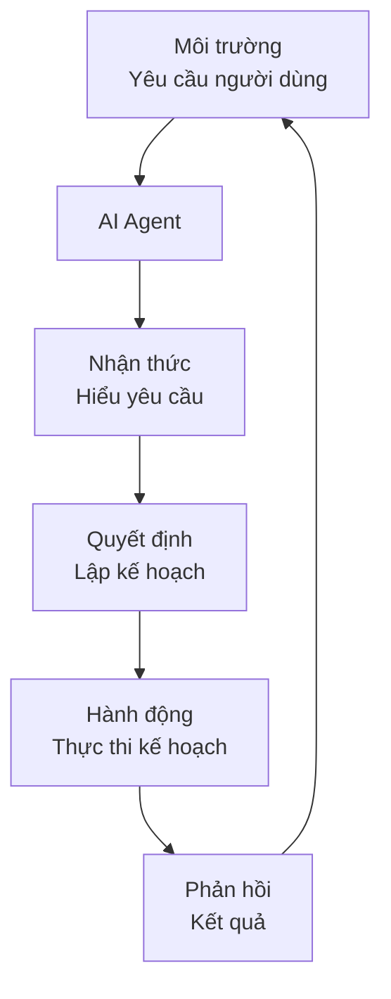

### 1.2 Ứng dụng của AI Agent
- **Tự động hóa quy trình làm việc**: Tự động hóa các tác vụ lặp đi lặp lại
- **Hỗ trợ ra quyết định**: Phân tích dữ liệu và đề xuất giải pháp
- **Tương tác với người dùng**: Trả lời câu hỏi, thực hiện yêu cầu
- **Tích hợp hệ thống**: Kết nối và phối hợp giữa nhiều hệ thống khác nhau

### 1.3 Các loại AI Agent

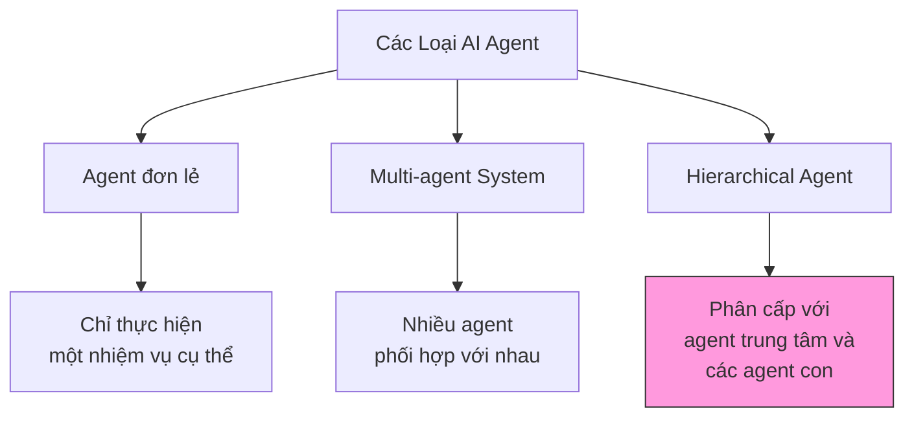

## 2. Kiến trúc Central Agent điều phối

Kiến trúc Central Agent điều phối là mô hình phổ biến và hiệu quả cho các hệ thống AI Agent phức tạp. Trong mô hình này, một agent trung tâm (Central Agent) đóng vai trò điều phối và quản lý các agent chuyên biệt (Specialized Agents) để thực hiện các tác vụ cụ thể.

### 2.1 Tổng quan kiến trúc


### 2.2 Luồng xử lý dữ liệu

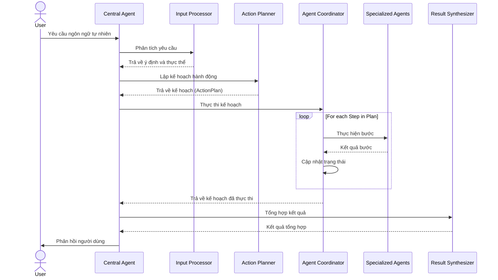

### 2.3 Ưu điểm của kiến trúc Central Agent

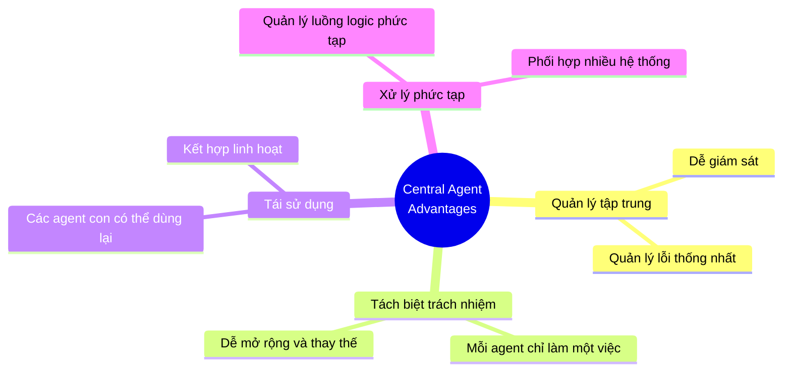

## 3. Các thành phần cốt lõi

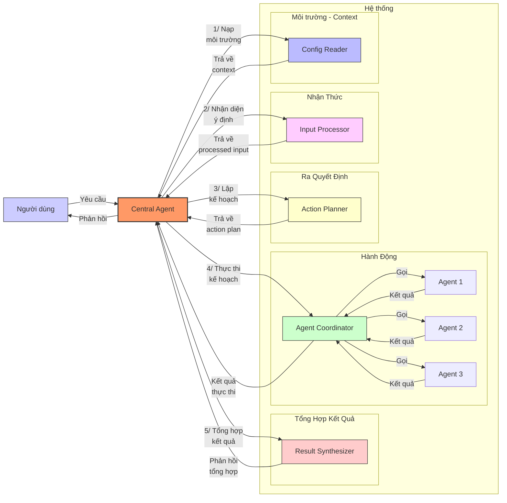

### 3.1 Config Reader (Bộ đọc cấu hình)
- **Nhiệm vụ**: Đọc thông tin dự án như thành viên, kênh liên lạc, mã dự án
- **Đầu vào**: Thông tin người dùng, ID dự án
- **Đầu ra**: Context cho việc hiểu đúng và thực hiện yêu cầu

**Ví dụ cấu trúc môi trường cho dự án phát triển phần mềm:**

| Thông tin môi trường | Mô tả | Ví dụ |
|--------------------------|-----------|-------------|
| Danh sách thành viên | Thành viên trong dự án | Phúc (PM), Đăng (Developer), Hưng (Tester) |
| Mã dự án | Định danh dự án | XDEMO2 |
| Kênh liên lạc | Kênh giao tiếp | #project-alpha (Slack) |
| Công cụ quản lý | Hệ thống quản lý công việc | JIRA |
| Thông tin xác thực | API token, credentials | jiraToken, slackToken |
| Lịch dự án | Sprint, deadline | Sprint 5: 01/05-15/05/2025 |
| Nguồn lực | Phòng họp, thiết bị | Mercury, Venus (meeting rooms) |

### 3.2 Input Processor (Bộ xử lý đầu vào)
- **Nhiệm vụ**: Phân tích và hiểu yêu cầu đầu vào từ người dùng (dạng ngôn ngữ tự nhiên)
- **Công nghệ phổ biến**: LLM (Large Language Model) như GPT, Gemini, Llama
- **Đầu ra**: Cấu trúc dữ liệu hiểu được ý định người dùng

**Prompt mẫu cho LLM**:
```
Bạn là một Input Processor trong hệ thống AI Agent. Nhiệm vụ của bạn là phân tích yêu cầu sau của người dùng để xác định:

1. Ý định chính (intent)
2. Các thực thể (entities) quan trọng
3. Ngữ cảnh (context) liên quan

Dựa trên thông tin sau:
- Yêu cầu người dùng: "{input}"
- Thông tin người dùng: {userInfo}
- Thông tin dự án: {projectInfo}

Trả về kết quả dưới dạng JSON với các trường sau:
- intent: ý định chính của người dùng
- entities: danh sách các thực thể được trích xuất
- requiredAgents: các loại agent cần để xử lý yêu cầu này
- detailedDescription: mô tả chi tiết về ý định người dùng
```

### 3.3 Action Planner (Bộ lập kế hoạch)
- **Nhiệm vụ**: Tạo kế hoạch hành động với các bước cụ thể
- **Đầu vào**: Kết quả xử lý từ Input Processor
- **Đầu ra**: Action Plan gồm các bước cần thực hiện
- **Đặc điểm**: Quản lý phụ thuộc giữa các bước, xử lý điều kiện

**Prompt mẫu cho LLM**:
```
Bạn là Action Planner trong hệ thống AI Agent. Nhiệm vụ của bạn là tạo kế hoạch hành động chi tiết dựa trên yêu cầu đã được phân tích.

Thông tin đầu vào:
- Phân tích yêu cầu: {processedInput}
- Thông tin dự án: {projectContext}
- Các agent có sẵn: {availableAgents}

Hãy tạo một kế hoạch hành động với các bước cụ thể, mỗi bước bao gồm:
1. ID bước
2. Loại agent cần sử dụng
3. Prompt chi tiết cho agent
4. Các bước phụ thuộc (nếu có)
5. Điều kiện thực hiện (nếu có)
6. Số lần thử lại tối đa
7. Thời gian chờ tối đa

Đảm bảo kế hoạch:
- Có thứ tự logic
- Xử lý được nhiều tình huống
- Tận dụng kết quả từ các bước trước
- Bao gồm xử lý lỗi cơ bản

Trả về dưới dạng JSON với cấu trúc ActionPlan.
```

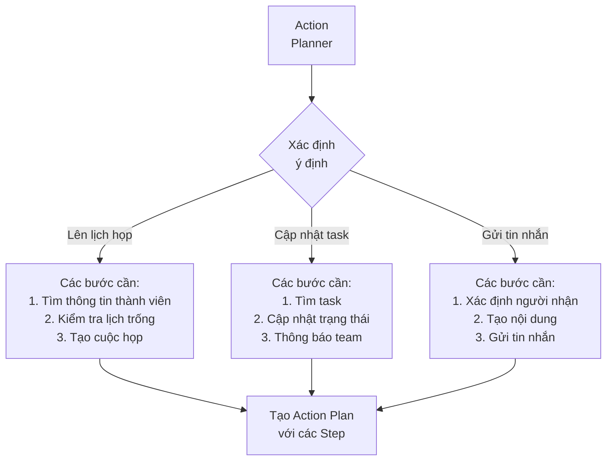

### 3.4 Agent Coordinator (Bộ điều phối)
- **Nhiệm vụ**: Điều phối việc thực thi kế hoạch
- **Khả năng**: Gọi các agent con, theo dõi tiến độ, xử lý lỗi và retry

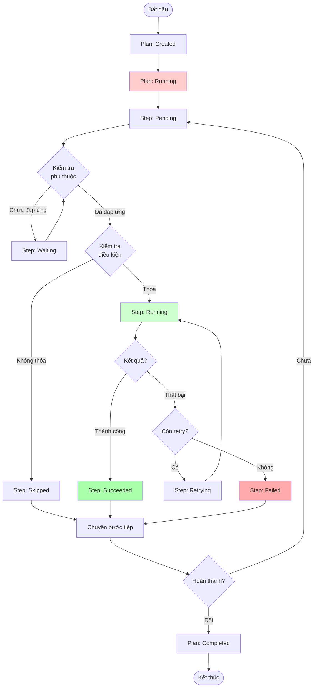

### 3.5 Result Synthesizer (Bộ tổng hợp kết quả)
- **Nhiệm vụ**: Tổng hợp kết quả từ các bước thành phản hồi cuối cùng
- **Đầu ra**: Văn bản ngôn ngữ tự nhiên cho người dùng

**Prompt mẫu cho LLM**:
```
Bạn là Result Synthesizer trong hệ thống AI Agent. Nhiệm vụ của bạn là tổng hợp kết quả từ việc thực hiện kế hoạch thành một phản hồi rõ ràng cho người dùng.

Thông tin đầu vào:
- Kế hoạch đã thực thi: {executedPlan}
- Yêu cầu ban đầu: {originalRequest}
- Ngôn ngữ phản hồi: Tiếng Việt

Hãy tạo một phản hồi tổng hợp:
1. Ngắn gọn và dễ hiểu
2. Tập trung vào kết quả chính
3. Đề cập đến các vấn đề quan trọng nếu có
4. Đề xuất hành động tiếp theo nếu cần

Phản hồi phải phù hợp với:
- Tiến độ hoàn thành kế hoạch
- Trạng thái của các bước
- Mục tiêu ban đầu của người dùng
```

## 4. Hướng dẫn triển khai Central Agent

### 4.1 Cấu trúc dữ liệu

Cấu trúc JSON của ActionPlan và ActionStep:

```json
{
  "id": "plan-1a2b3c",
  "status": "running",
  "startTime": "2025-04-20T14:05:49.344Z",
  "currentStepIndex": 1,
  "overallProgress": 33,
  "steps": [
    {
      "id": "step1",
      "agentType": "SLACK",
      "prompt": "Tìm kiếm tin nhắn về tính năng mới và cuộc họp trong kênh dev-team",
      "dependsOn": [],
      "condition": null,
      "maxRetries": 2,
      "timeout": 15000,
      "status": "succeeded",
      "startTime": "2025-04-20T14:05:49.646Z",
      "endTime": "2025-04-20T14:05:50.246Z",
      "result": {
        "success": true,
        "data": {
          "messages": [
            {
              "text": "Chúng ta cần tổ chức cuộc họp về tính năng authentication",
              "user": "Phúc",
              "timestamp": "2025-04-18T14:05:49.646Z"
            }
          ]
        },
        "metadata": {
          "executionTime": 340,
          "tokenUsage": 220
        }
      }
    },
    {
      "id": "step2",
      "agentType": "CALENDAR",
      "prompt": "Tìm thời gian rảnh chung cho Phúc, Hưng, Đăng và Minh trong tuần này",
      "dependsOn": ["step1"],
      "condition": null,
      "maxRetries": 2,
      "timeout": 20000,
      "status": "running",
      "startTime": "2025-04-20T14:05:50.300Z"
    },
    {
      "id": "step3",
      "agentType": "CALENDAR",
      "prompt": "Tạo cuộc họp mới tại thời gian {result.step2.availableSlots[0]}",
      "dependsOn": ["step2"],
      "condition": "result.step2.availableSlots && result.step2.availableSlots.length > 0",
      "maxRetries": 2,
      "timeout": 15000,
      "status": "pending"
    }
  ],
  "executionContext": {
    "result": {
      "step1": {
        "success": true,
        "data": {
          "messages": [...]
        }
      }
    }
  },
  "isAdjustment": false,
  "metadata": {
    "userId": "user123",
    "projectId": "XDEMO2"
  }
}
```

### 4.2 Cấu trúc module

#### Cấu trúc thư mục

```
src/
├── central-agent/
│   ├── models/
│   │   ├── action-plan.model.ts
│   │   └── execution-context.model.ts
│   ├── input-processor/
│   │   └── input-processor.service.ts
│   ├── project-config/
│   │   └── project-config-reader.service.ts
│   ├── action-planner/
│   │   └── action-planner.service.ts
│   ├── agent-coordinator/
│   │   └── agent-coordinator.service.ts
│   ├── result-synthesizer/
│   │   └── result-synthesizer.service.ts
│   ├── file-storage/
│   │   └── action-plan-storage.service.ts
│   ├── central-agent.controller.ts
│   ├── central-agent.module.ts
│   └── central-agent.service.ts
├── agents/
│   ├── agent.interface.ts
│   ├── jira-agent/
│   ├── slack-agent/
│   └── calendar-agent/
├── config/
│   ├── project_config_demo.json
│   └── config.ts
└── utils/
    ├── logger.ts
    └── error-handler.ts
```

#### Phân chia trách nhiệm

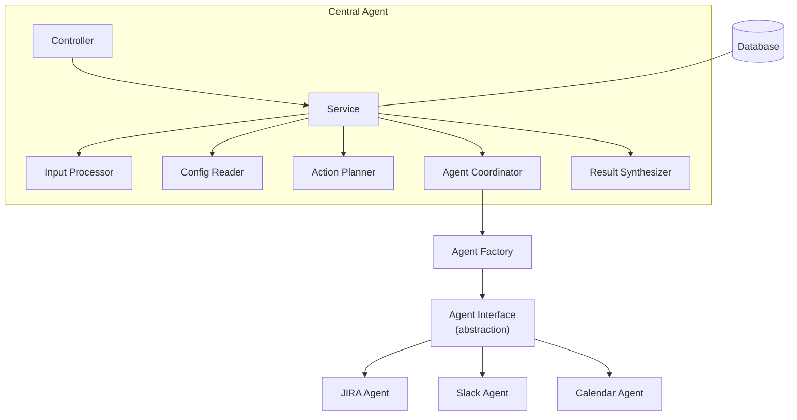

### 4.3 Hướng dẫn thiết kế prompt cho LLM

#### Nguyên tắc thiết kế prompt

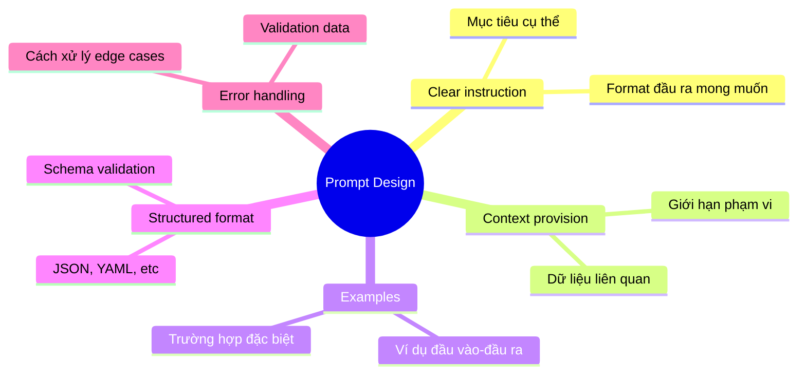

## 5. Ví dụ triển khai cụ thể

### 5.1 Ví dụ về một ActionPlan thực tế

Với yêu cầu: "Sắp xếp cuộc họp với team để kickoff dự án X"

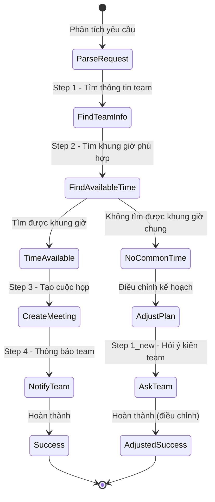

### 5.2 Xử lý lỗi và điều chỉnh kế hoạch

Khi không tìm được thời gian phù hợp cho tất cả mọi người:

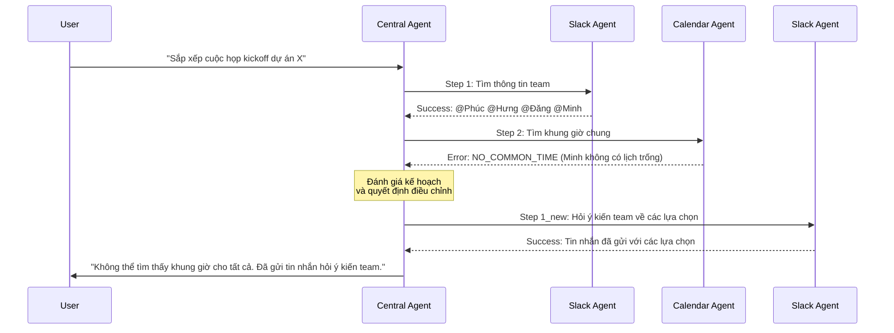

