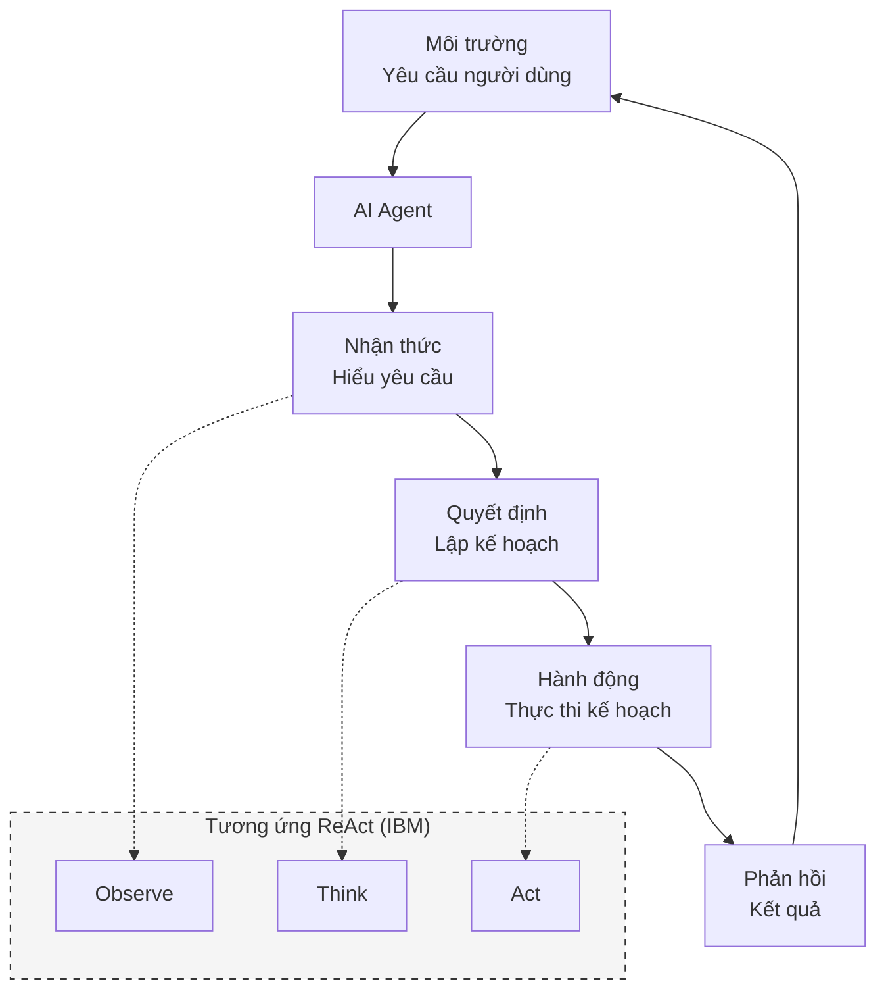
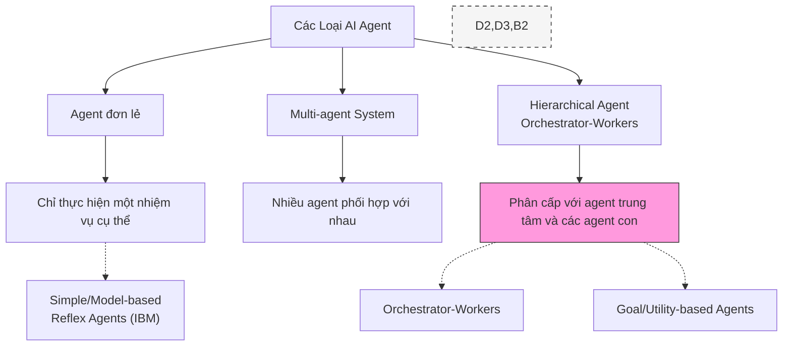
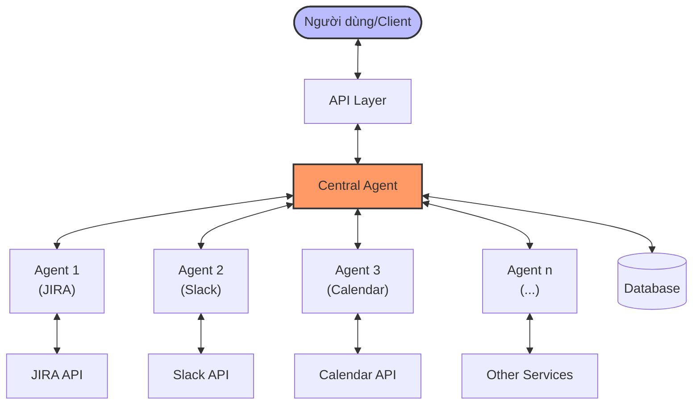
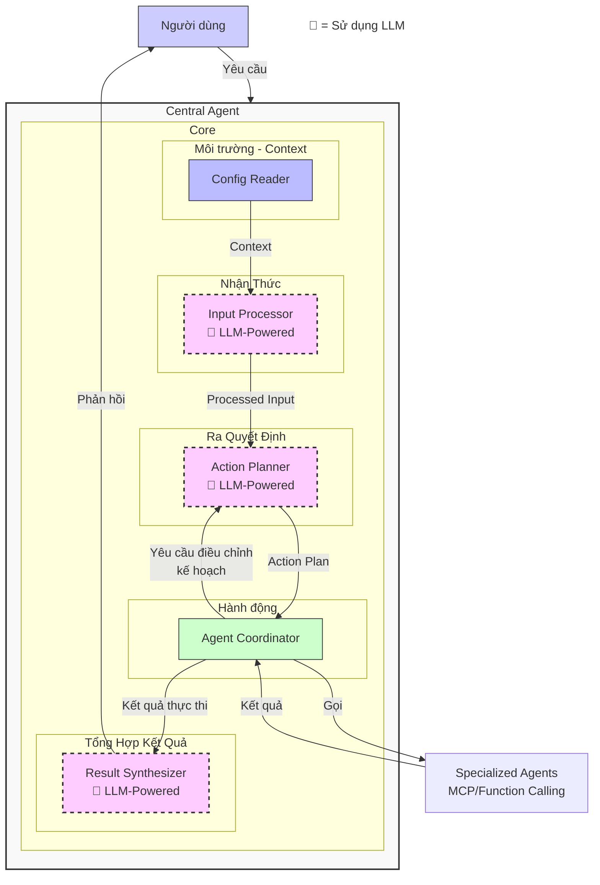
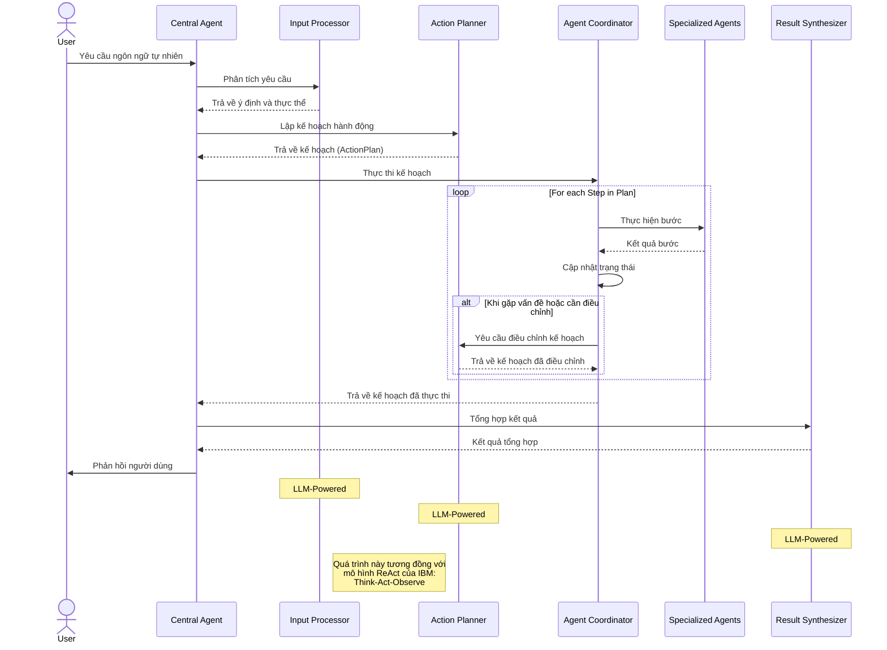

# Hướng Dẫn Phát Triển AI Agent - Phần 1: Kiến Trúc Tổng Quan

> **Tài liệu hướng dẫn dành cho kỹ sư phát triển AI Agent tại công ty.**
>
> Bộ tài liệu này gồm 2 phần:
> - [Phần 1: Kiến Trúc Tổng Quan](./ai_agent_development_guide_part1.md) (tài liệu hiện tại)
> - [Phần 2: Chi Tiết Bên Trong Central Agent](./ai_agent_development_guide_part2.md)
> - Phần 3: Đi sâu vào Sub-agent (dự kiến)

## Tại sao nên tự xây dựng AI Agent?

Hiện nay, thị trường đã có nhiều SDK, framework và dịch vụ AI Agent có sẵn. Tuy nhiên, việc tự xây dựng AI Agent từ đầu mang lại những lợi ích vô cùng quan trọng:

**1. Hiểu sâu về nguyên lý hoạt động**: Tương tự như việc có thể đi ăn phở ở nhiều tiệm, nhưng người đầu bếp giỏi vẫn muốn tự nấu phở để hiểu bản chất của món ăn. Việc tự xây dựng AI Agent giúp bạn thấu hiểu các khái niệm cốt lõi và logic thiết kế.

**2. Đảm bảo an toàn và bảo mật dữ liệu**: Khi sử dụng các dịch vụ AI Agent bên ngoài, dữ liệu công ty thường phải truyền qua hệ thống của bên thứ ba, tạo ra các rủi ro bảo mật tiềm ẩn. Đối với các tổ chức lớn như LY Corporation, việc bảo vệ thông tin nhạy cảm là ưu tiên hàng đầu. Tự xây dựng AI Agent cho phép triển khai hoàn toàn trong hệ thống nội bộ, kiểm soát luồng dữ liệu, và tuân thủ các quy định bảo mật nghiêm ngặt của doanh nghiệp và pháp luật.

**3. Kiểm soát toàn diện và hiệu quả cao hơn**: Việc tự phát triển mang lại nhiều lợi thế:
- **Tùy biến linh hoạt**: Điều chỉnh mọi khía cạnh của hệ thống theo nhu cầu cụ thể của doanh nghiệp
- **Triển khai đa nền tảng**: Áp dụng kiến thức trên bất kỳ ngôn ngữ lập trình hay framework nào phù hợp nhất với hạ tầng hiện có
- **Debug và tối ưu hiệu quả**: Dễ dàng xác định, phân tích và khắc phục các vấn đề phát sinh
- **Mở rộng và điều chỉnh nhanh chóng**: Thích ứng nhanh với yêu cầu mới mà không phụ thuộc vào nhà cung cấp bên ngoài

Bộ tài liệu này sẽ hướng dẫn bạn cách xây dựng AI Agent từ nền tảng, giúp bạn hiểu rõ từng thành phần và cách chúng phối hợp với nhau.

## Giới thiệu về bộ tài liệu

Tài liệu này mô tả chi tiết cách thiết kế và triển khai một hệ thống AI Agent theo mô hình "Central-Sub Agent". Mô hình này áp dụng nguyên tắc "Orchestrator-Workers" nơi một Agent trung tâm (Central Agent) điều phối nhiều Agent chuyên biệt (Sub-Agents) để hoàn thành các tác vụ phức tạp.

Bộ tài liệu được chia thành hai phần:
- **Phần 1** (tài liệu hiện tại): Giới thiệu khái niệm, mục đích và kiến trúc tổng thể của hệ thống
- **Phần 2**: Đi sâu vào chi tiết triển khai, tập trung vào các thành phần quan trọng và cơ chế giao tiếp giữa chúng
- **Phần 3**: Tiếp tục tìm hiểu về các Sub-Agent, chọn giao thức nào, MCP hay là Fuction Calling

Hãy bắt đầu với các khái niệm cơ bản.

## 1. Giới thiệu về AI Agent

### 1.1 AI Agent là gì?
AI Agent (hay Đặc vụ AI) là một hệ thống phần mềm thông minh có khả năng:
- Nhận thức môi trường thông qua dữ liệu đầu vào
- Đưa ra quyết định dựa trên logic và trí tuệ nhân tạo
- Thực hiện hành động để đạt được mục tiêu cụ thể
- Học hỏi và cải thiện theo thời gian (tùy loại)

Khác với các ứng dụng AI thông thường, AI Agent có khả năng chủ động và linh hoạt trong việc giải quyết vấn đề, thay vì chỉ thực hiện một tác vụ cụ thể.

**So sánh với định nghĩa của Anthropic và IBM:**
- **Anthropic** ([Building Effective Agents](https://www.anthropic.com/engineering/building-effective-agents)): Định nghĩa Agents là "hệ thống trong đó LLMs chủ động điều khiển quá trình và việc sử dụng công cụ của chính nó", tương đồng với mô hình của chúng ta.
- **IBM** ([AI Agents](https://www.ibm.com/think/topics/ai-agents)): Mô tả AI Agent là "hệ thống có khả năng tự động thực hiện nhiệm vụ bằng cách tự thiết kế quy trình làm việc và sử dụng các công cụ có sẵn".

### 1.2 Ứng dụng của AI Agent
- **Tự động hóa quy trình làm việc**: Tự động hóa các tác vụ lặp đi lặp lại
- **Hỗ trợ ra quyết định**: Phân tích dữ liệu và đề xuất giải pháp
- **Tương tác với người dùng**: Trả lời câu hỏi, thực hiện yêu cầu
- **Tích hợp hệ thống**: Kết nối và phối hợp giữa nhiều hệ thống khác nhau

Anthropic xác định AI Agents đặc biệt phù hợp cho lĩnh vực hỗ trợ khách hàng và lập trình, trong khi IBM mở rộng ứng dụng sang chăm sóc sức khỏe, ứng phó thảm họa và phân tích tài chính.

### 1.3 Các loại AI Agent

## 2. Kiến trúc Central Agent điều phối

Kiến trúc Central Agent điều phối là mô hình phổ biến và hiệu quả cho các hệ thống AI Agent phức tạp. Trong mô hình này, một agent trung tâm (Central Agent) đóng vai trò điều phối và quản lý các agent chuyên biệt (Specialized Agents) để thực hiện các tác vụ cụ thể.

**So sánh:**
- Tương đồng với mẫu **Orchestrator-Workers** của Anthropic, nơi "LLM trung tâm động phân chia tác vụ, phân công cho các LLM làm việc và tổng hợp kết quả"
- Phù hợp với mô hình **Centralized Orchestration** và **Goal-based Agent** của IBM

### 2.1 Tổng quan kiến trúc

### 2.2 Thành phần cốt lõi và luồng xử lý

Central Agent bao gồm các thành phần chuyên biệt kết hợp với nhau để xử lý yêu cầu của người dùng theo một quy trình logic. Luồng xử lý đi qua 5 bước chính từ khi nhận yêu cầu đến khi trả về kết quả.

#### 2.2.1 Các thành phần cốt lõi

#### 2.2.2 Tổng quan các thành phần và cơ chế feedback

Central Agent bao gồm 5 thành phần chính kết hợp với nhau để tạo nên một hệ thống thích ứng cao:

| Thành phần | Chức năng chính | Đặc điểm nổi bật |
|------------|-----------------|------------------|
| **Config Reader** | Đọc thông tin môi trường, dự án | Cung cấp context ban đầu cho các quyết định |
| **Input Processor** 🧠 | Phân tích yêu cầu, trích xuất ý định | Sử dụng LLM để hiểu ngôn ngữ tự nhiên |
| **Action Planner** 🧠 | Tạo và điều chỉnh kế hoạch hành động | Nhận feedback từ Agent Coordinator để điều chỉnh kế hoạch |
| **Agent Coordinator** | Thực thi kế hoạch, phối hợp các agents | Phát hiện vấn đề và kích hoạt feedback loop |
| **Result Synthesizer** 🧠 | Tổng hợp kết quả thành phản hồi | Tạo phản hồi tự nhiên cho người dùng |

**Cơ chế feedback loop:** Khi Agent Coordinator phát hiện vấn đề trong quá trình thực thi (như không tìm được thời gian họp chung, sub-agent trả về lỗi, v.v.), nó sẽ gửi yêu cầu điều chỉnh đến Action Planner. Action Planner phân tích tình huống và tạo ra kế hoạch thay thế phù hợp, giúp hệ thống thích ứng với tình huống thực tế mà không cần can thiệp từ người dùng.

#### 2.2.3 Luồng xử lý cơ bản

### 2.3. Tham khảo và so sánh

| Khía cạnh | Kiến trúc đề xuất | Anthropic | IBM |
|-----------|-------------------|-----------|-----|
| Cách tiếp cận | Hierarchical với Central Agent | Orchestrator-Workers | Centralized Orchestration |
| Mô hình cơ bản | LLM-powered với các agent chuyên biệt | LLM được tăng cường với công cụ | Các mô hình từ Reflex đến Learning Agents |
| Tài liệu tham khảo | | [Building Effective Agents](https://www.anthropic.com/engineering/building-effective-agents) | [AI Agents](https://www.ibm.com/think/topics/ai-agents) |

Kiến trúc đề xuất kết hợp những đặc điểm tốt nhất từ cả hai định nghĩa, tạo ra một mô hình Orchestrator-Workers (Anthropic) kết hợp với Goal/Utility-based Agent (IBM), đặc biệt phù hợp cho các tác vụ phức tạp cần sự phối hợp giữa nhiều hệ thống khác nhau.

## 3. Điều gì tiếp theo?

Trong Phần 1 này, chúng ta đã khám phá khái niệm cơ bản về AI Agent và kiến trúc tổng thể của mô hình Central-Sub Agent. Nhưng làm thế nào để thực sự biến những khái niệm này thành một hệ thống hoạt động? Làm cách nào để hai thành phần quan trọng nhất - Action Planner và Agent Coordinator - "trò chuyện" với nhau để giải quyết các vấn đề phức tạp?

Trong [Phần 2: Chi Tiết Bên Trong Central Agent](./ai_agent_development_guide_part2.md), chúng ta sẽ:
- Mổ xẻ cách Action Planner phân tích yêu cầu và tạo ra kế hoạch chi tiết với những cấu trúc dữ liệu thực tế
- Khám phá cơ chế Agent Coordinator thực thi kế hoạch thông qua các bước phức tạp, với xử lý lỗi mạnh mẽ
- Tìm hiểu về "feedback loop" đặc biệt - cơ chế giúp hệ thống tự thích nghi khi đối mặt với tình huống ngoài dự kiến
- Xem những ví dụ thực tế về cách hệ thống này giải quyết các tình huống phức tạp thông qua việc phân tích từng bước xử lý

Bạn sẽ thấy cách các thành phần lý thuyết chuyển thành code thực tế, và cách AI Agent có thể giải quyết các vấn đề thực tế mà không cần sự can thiệp của con người, thậm chí khi đối mặt với những tình huống không lường trước.