# AI Agent Development Guide - Part 1: Architecture Overview

> **Guide document for AI Agent developers at the company.**
>
> This documentation consists of 2 parts:
> - [Part 1: Architecture Overview](./ai_agent_development_guide_part1_en.md) (current document)
> - [Part 2: Details Inside Central Agent](./ai_agent_development_guide_part2_en.md)
> - Part 3: Deep Dive into Sub-agents (planned)

## Why Build Your Own AI Agent?

There are already many AI Agent SDKs, frameworks, and services available on the market. However, building your own AI Agent from scratch offers significant advantages:

**1. Deep understanding of operating principles**: Similar to how one can eat pho at many restaurants, but a skilled chef wants to cook their own pho to understand the essence of the dish. Building your own AI Agent helps you understand core concepts and design logic.

**2. Ensuring data safety and security**: When using external AI Agent services, company data often needs to be transmitted through third-party systems, creating potential security risks. For large organizations like LY Corporation, protecting sensitive information is a top priority. Building your own AI Agent allows for completely internal deployment, controlling data flow, and complying with strict enterprise security regulations and laws.

**3. Comprehensive control and higher efficiency**: Self-development brings many advantages:
- **Flexible customization**: Adjust every aspect of the system according to specific business needs
- **Cross-platform deployment**: Apply knowledge on any programming language or framework that best fits existing infrastructure
- **Efficient debugging and optimization**: Easily identify, analyze, and fix emerging issues
- **Rapid expansion and adjustment**: Quickly adapt to new requirements without depending on external providers

This documentation will guide you on how to build an AI Agent from the foundation, helping you understand each component and how they work together.

## Introduction to the documentation

This document describes in detail how to design and implement an AI Agent system based on the "Central-Sub Agent" model. This model applies the "Orchestrator-Workers" principle where a Central Agent coordinates multiple specialized agents (Sub-Agents) to complete complex tasks.

The documentation is divided into two parts:
- **Part 1** (current document): Introduces concepts, purposes, and the overall architecture of the system
- **Part 2**: Delves into implementation details, focusing on important components and communication mechanisms between them
- **Part 3**: Continues to explore Sub-Agents, choosing protocols, MCP or Function Calling

Let's start with the basic concepts.

## 1. Introduction to AI Agents

### 1.1 What is an AI Agent?
An AI Agent is an intelligent software system capable of:
- Perceiving the environment through input data
- Making decisions based on logic and artificial intelligence
- Taking actions to achieve specific goals
- Learning and improving over time (depending on the type)

Unlike conventional AI applications, AI Agents have the ability to be proactive and flexible in problem-solving, rather than just performing a specific task.

**Comparison with Anthropic and IBM definitions:**
- **Anthropic** ([Building Effective Agents](https://www.anthropic.com/engineering/building-effective-agents)): Defines Agents as "systems where LLMs actively control their own process and tool usage," which aligns with our model.
- **IBM** ([AI Agents](https://www.ibm.com/think/topics/ai-agents)): Describes AI Agents as "systems capable of automatically performing tasks by designing their own workflow and using available tools."

### 1.2 Applications of AI Agents
- **Workflow automation**: Automating repetitive tasks
- **Decision support**: Analyzing data and suggesting solutions
- **User interaction**: Answering questions, fulfilling requests
- **System integration**: Connecting and coordinating between multiple systems

Anthropic identifies AI Agents as particularly suitable for customer support and programming, while IBM extends applications to healthcare, disaster response, and financial analysis.

### 1.3 Types of AI Agents

## 2. Central Agent Orchestration Architecture

The Central Agent orchestration architecture is a popular and effective model for complex AI Agent systems. In this model, a central agent plays the role of coordinator and manager of specialized agents to perform specific tasks.

**Comparison:**
- Similar to Anthropic's **Orchestrator-Workers** pattern, where "a central LLM dynamically divides tasks, assigns them to worker LLMs, and synthesizes results"
- Aligns with IBM's **Centralized Orchestration** and **Goal-based Agent** models

### 2.1 Architecture Overview

### 2.2 Core Components and Processing Flow

The Central Agent includes specialized components that work together to process user requests in a logical workflow. The processing flow goes through 5 main steps from receiving the request to returning the result.

#### 2.2.1 Core Components

```mermaid
graph TB
    User[User] -->|Request| CA
    
    subgraph CA[Central Agent]
        direction TB
        PCR[Config Reader] -->|Context| IP
        IP[Input Processor<br>🧠 LLM-Powered] -->|Processed Input| AP
        AP[Action Planner<br>🧠 LLM-Powered] -->|Action Plan| AC
        AC[Agent Coordinator] -->|Execution Results| RS
        
        %% Feedback loop
        AC -->|Plan adjustment<br>request| AP
        
        RS[Result Synthesizer<br>🧠 LLM-Powered]
        
        subgraph Core
            direction LR
            subgraph "Result Synthesis"
                RS
            end

            subgraph "Action"
                AC
            end
    
            subgraph "Decision Making"
                AP
            end
    
            subgraph "Perception"
                IP
            end
    
            subgraph "Environment - Context"
                PCR
            end
        end
    end
    
    AC -->|Call| A1[Specialized Agents<br>MCP/Function Calling]
    A1 -->|Results| AC
    
    RS -->|Response| User
    
    classDef llmPowered fill:#fcf,stroke:#333,stroke-width:2px,stroke-dasharray: 5 5
    class IP,AP,RS llmPowered
    
    style CA fill:#f9f9f9,stroke:#333,stroke-width:2px
    style PCR fill:#bbf,stroke:#333
    style AC fill:#cfc,stroke:#333
    style User fill:#ccf,stroke:#333
    
    %% Legend
    LLM[🧠 = LLM-Powered]
    style LLM fill:none,stroke:none
```

#### 2.2.2 Overview of Components and Feedback Mechanism

The Central Agent consists of 5 main components working together to create a highly adaptive system:

| Component | Main Function | Key Features |
|------------|-----------------|------------------|
| **Config Reader** | Reads environment, project information | Provides initial context for decisions |
| **Input Processor** 🧠 | Analyzes requests, extracts intents | Uses LLM to understand natural language |
| **Action Planner** 🧠 | Creates and adjusts action plans | Receives feedback from Agent Coordinator to adjust plans |
| **Agent Coordinator** | Executes plans, coordinates agents | Detects issues and triggers feedback loop |
| **Result Synthesizer** 🧠 | Synthesizes results into responses | Creates natural responses for users |

**Feedback loop mechanism:** When the Agent Coordinator detects issues during execution (such as not finding common meeting times, sub-agent returning errors, etc.), it sends adjustment requests to the Action Planner. The Action Planner analyzes the situation and creates appropriate alternative plans, helping the system adapt to real situations without requiring user intervention.

#### 2.2.3 Basic Processing Flow

### 2.3. References and Comparisons

| Aspect | Proposed Architecture | Anthropic | IBM |
|-----------|-------------------|-----------|-----|
| Approach | Hierarchical with Central Agent | Orchestrator-Workers | Centralized Orchestration |
| Basic Model | LLM-powered with specialized agents | Tool-augmented LLM | Models from Reflex to Learning Agents |
| Reference | | [Building Effective Agents](https://www.anthropic.com/engineering/building-effective-agents) | [AI Agents](https://www.ibm.com/think/topics/ai-agents) |

The proposed architecture combines the best features from both definitions, creating an Orchestrator-Workers model (Anthropic) combined with Goal/Utility-based Agent (IBM), particularly suitable for complex tasks requiring coordination between multiple different systems.

## 3. What's Next?

In this Part 1, we have explored the basic concepts of AI Agents and the overall architecture of the Central-Sub Agent model. But how do we actually turn these concepts into a working system? How do the two most important components - Action Planner and Agent Coordinator - "communicate" with each other to solve complex problems?

In [Part 2: Details Inside Central Agent](./ai_agent_development_guide_part2_en.md), we will:
- Dissect how the Action Planner analyzes requests and creates detailed plans with real data structures
- Explore how the Agent Coordinator executes plans through complex steps, with robust error handling
- Learn about the special "feedback loop" - a mechanism that helps the system adapt when facing unexpected situations
- See real examples of how this system solves complex situations through step-by-step analysis

You'll see how theoretical components translate into actual code, and how AI Agents can solve real problems without human intervention, even when facing unforeseen situations. 