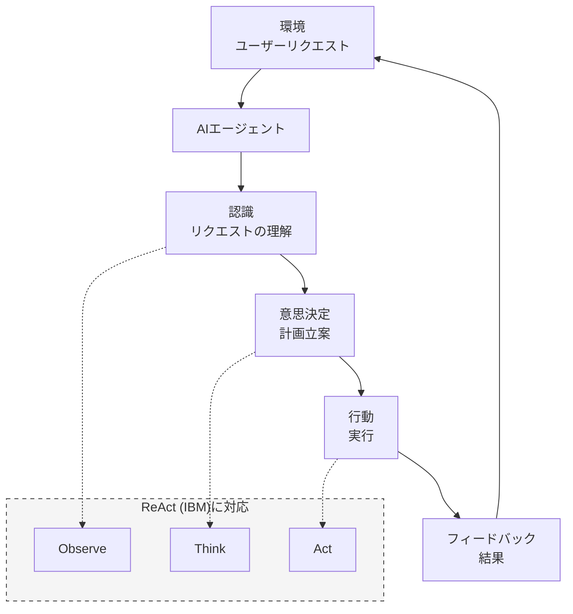
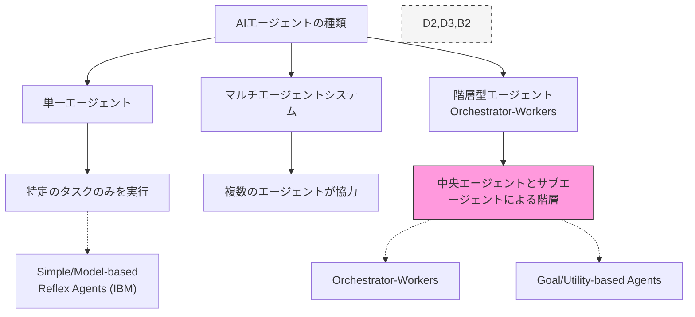
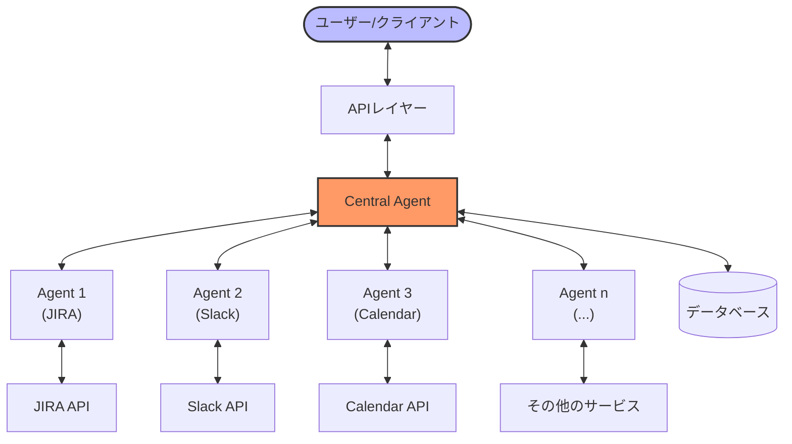
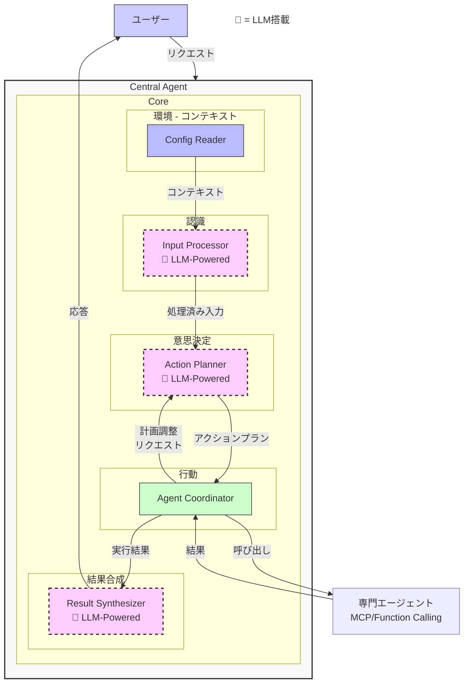
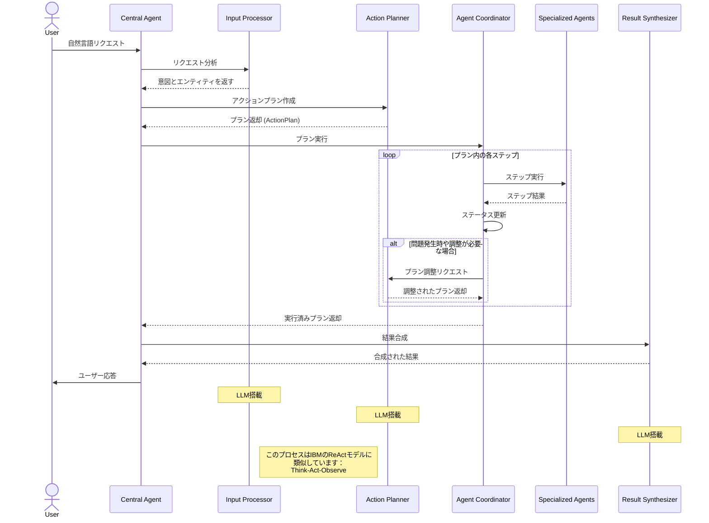

# AI エージェント開発ガイド - パート1: アーキテクチャ概要

> **会社のAIエージェント開発者向けガイドドキュメント**
>
> このドキュメントは2つのパートで構成されています：
> - [パート1: アーキテクチャ概要](./ai_agent_development_guide_part1_ja.md) (現在のドキュメント)
> - [パート2: Central Agentの詳細](./ai_agent_development_guide_part2_ja.md)
> - パート3: Sub-agentの詳細 (予定)

## なぜ独自のAIエージェントを構築するのか？

現在、市場には多くのAIエージェントSDK、フレームワーク、サービスが存在します。しかし、AIエージェントをゼロから構築することには重要な利点があります：

**1. 動作原理の深い理解**: 多くの店でフォーを食べることはできますが、優れたシェフは料理の本質を理解するために自分でフォーを作りたいと考えるのと同様です。独自のAIエージェントを構築することで、コアコンセプトと設計ロジックを理解できます。

**2. データの安全性とセキュリティの確保**: 外部のAIエージェントサービスを使用する場合、企業データはサードパーティのシステムを通過する必要があり、潜在的なセキュリティリスクが生じます。LY Corporationのような大規模組織にとって、機密情報の保護は最優先事項です。独自のAIエージェントを構築することで、完全に社内システム内での展開が可能になり、データフローを制御し、厳格な企業セキュリティ規制や法律に準拠することができます。

**3. 包括的な制御と高い効率性**: 自己開発には多くの利点があります：
- **柔軟なカスタマイズ**: ビジネスの特定のニーズに応じてシステムのあらゆる側面を調整
- **クロスプラットフォーム展開**: 既存のインフラに最適なプログラミング言語やフレームワークで知識を適用
- **効率的なデバッグと最適化**: 発生する問題を容易に特定、分析、修正
- **迅速な拡張と調整**: 外部プロバイダーに依存せずに新しい要件に素早く適応

このドキュメントでは、AIエージェントを基礎から構築する方法を案内し、各コンポーネントとそれらの連携方法を理解するのに役立ちます。

## ドキュメントの紹介

このドキュメントでは、「Central-Sub Agent」モデルに基づいたAIエージェントシステムの設計と実装について詳細に説明します。このモデルでは、中央エージェント（Central Agent）が複数の専門エージェント（Sub-Agents）を調整して複雑なタスクを完了する「Orchestrator-Workers」原則を適用します。

ドキュメントは二つのパートに分かれています：
- **パート1**（現在のドキュメント）: システムの概念、目的、全体的なアーキテクチャを紹介
- **パート2**: 実装の詳細に踏み込み、重要なコンポーネントとそれらの間の通信メカニズムに焦点を当てる
- **パート3**: Sub-Agentの探求を続け、プロトコルの選択、MCPまたはFunction Callingについて

基本的な概念から始めましょう。

## 1. AIエージェントの紹介

### 1.1 AIエージェントとは？
AIエージェント（AI Agent）は、以下の能力を持つインテリジェントなソフトウェアシステムです：
- 入力データを通じて環境を認識する
- ロジックと人工知能に基づいて意思決定を行う
- 特定の目標を達成するために行動する
- 時間の経過とともに学習し改善する（タイプによる）

従来のAIアプリケーションとは異なり、AIエージェントは特定のタスクを実行するだけでなく、問題解決において能動的かつ柔軟な能力を持っています。

**AnthropicとIBMの定義との比較：**
- **Anthropic** ([Building Effective Agents](https://www.anthropic.com/engineering/building-effective-agents)): エージェントを「LLMが自身のプロセスとツール使用を積極的に制御するシステム」と定義しており、これは私たちのモデルと一致しています。
- **IBM** ([AI Agents](https://www.ibm.com/think/topics/ai-agents)): AIエージェントを「自身のワークフローを設計し、利用可能なツールを使用してタスクを自動的に実行できるシステム」と説明しています。

### 1.2 AIエージェントの応用
- **ワークフロー自動化**: 繰り返しタスクの自動化
- **意思決定支援**: データ分析とソリューション提案
- **ユーザーインタラクション**: 質問への回答、要求の実行
- **システム統合**: 複数のシステム間の接続と調整

Anthropicは、AIエージェントが特に顧客サポートとプログラミングに適していると特定し、IBMはヘルスケア、災害対応、財務分析などの応用分野を拡大しています。

### 1.3 AIエージェントの種類

## 2. Central Agent調整アーキテクチャ

Central Agent調整アーキテクチャは、複雑なAIエージェントシステムのための人気で効果的なモデルです。このモデルでは、中央エージェントが特定のタスクを実行するために専門エージェントのコーディネーターおよびマネージャーの役割を果たします。

**比較：**
- AnthropicのOrchestrator-Workersパターンに類似しており、「中央LLMが動的にタスクを分割し、ワーカーLLMに割り当て、結果を統合する」
- IBMの中央集権型オーケストレーションおよびゴールベースエージェントモデルと一致

### 2.1 アーキテクチャ概要

### 2.2 コアコンポーネントと処理フロー

Central Agentには、論理的なワークフローでユーザーリクエストを処理するために連携する専門コンポーネントが含まれています。処理フローはリクエストの受信から結果の返却まで、5つの主要ステップを経由します。

#### 2.2.1 コアコンポーネント

#### 2.2.2 コンポーネントの概要とフィードバックメカニズム

Central Agentは、高度に適応可能なシステムを作成するために連携する5つの主要コンポーネントで構成されています：

| コンポーネント | 主な機能 | 主な特徴 |
|------------|-----------------|------------------|
| **Config Reader** | 環境、プロジェクト情報の読み取り | 意思決定の初期コンテキストを提供 |
| **Input Processor** 🧠 | リクエストの分析、意図の抽出 | 自然言語を理解するためにLLMを使用 |
| **Action Planner** 🧠 | アクションプランの作成と調整 | Agent Coordinatorからフィードバックを受け取り計画を調整 |
| **Agent Coordinator** | 計画の実行、エージェントの調整 | 問題を検出しフィードバックループをトリガー |
| **Result Synthesizer** 🧠 | 結果をレスポンスに合成 | ユーザー向けの自然な応答を作成 |

**フィードバックループメカニズム:** Agent Coordinatorが実行中に問題を検出した場合（共通の会議時間が見つからない、サブエージェントがエラーを返すなど）、Action Plannerに調整リクエストを送信します。Action Plannerは状況を分析し、適切な代替計画を作成し、ユーザーの介入なしにシステムが実際の状況に適応できるようにします。

#### 2.2.3 基本処理フロー

### 2.3. 参考情報と比較

| 側面 | 提案アーキテクチャ | Anthropic | IBM |
|-----------|-------------------|-----------|-----|
| アプローチ | Central Agentによる階層型 | Orchestrator-Workers | 中央集権型オーケストレーション |
| 基本モデル | 専門エージェントを持つLLM搭載 | ツール強化LLM | ReflexからLearning Agentsまでのモデル |
| 参考資料 | | [Building Effective Agents](https://www.anthropic.com/engineering/building-effective-agents) | [AI Agents](https://www.ibm.com/think/topics/ai-agents) |

提案アーキテクチャは両方の定義から最良の機能を組み合わせ、Orchestrator-WorkersモデルとGoal/Utility-based Agentを統合し、異なる複数のシステム間の調整を必要とする複雑なタスクに特に適しています。

## 3. 次のステップ

このパート1では、AIエージェントの基本概念とCentral-Sub Agentモデルの全体的なアーキテクチャを探索しました。しかし、これらの概念を実際にどのように機能するシステムに変換するのでしょうか？最も重要な2つのコンポーネント - Action PlannerとAgent Coordinatorは、複雑な問題を解決するためにどのように「通信」するのでしょうか？

[パート2: Central Agentの詳細](./ai_agent_development_guide_part2_ja.md)では、次のことを説明します：
- Action Plannerがリクエストを分析し、実際のデータ構造で詳細な計画を作成する方法を解剖
- Agent Coordinatorが堅牢なエラー処理を備えた複雑なステップを通じて計画を実行する方法を探索
- 予期せぬ状況に直面した際にシステムが適応するのを助ける特別な「フィードバックループ」メカニズムについて学ぶ
- このシステムがステップバイステップの分析を通じて複雑な状況を解決する方法の実例を見る

理論的なコンポーネントが実際のコードにどのように変換され、AIエージェントが予見できない状況に直面しても人間の介入なしに実際の問題をどのように解決できるかを見ることができます。 