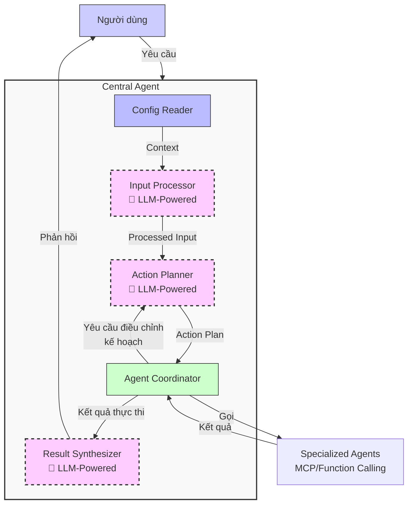
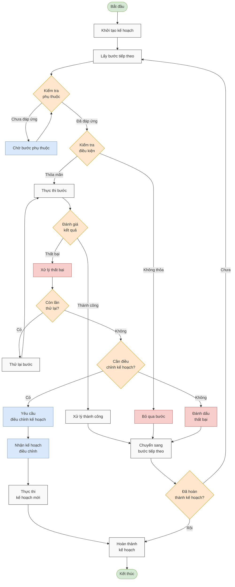
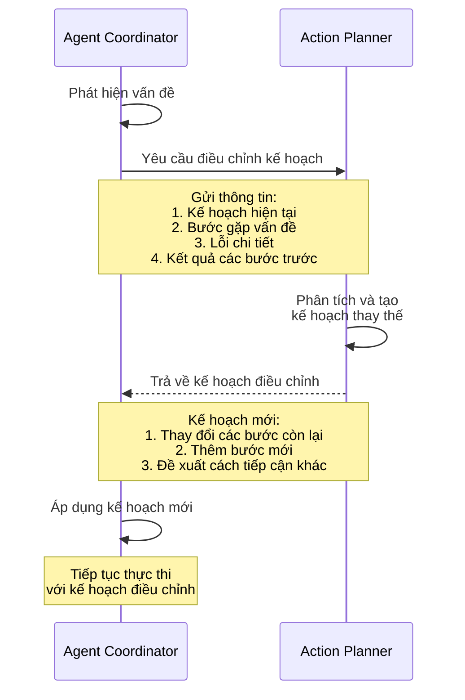
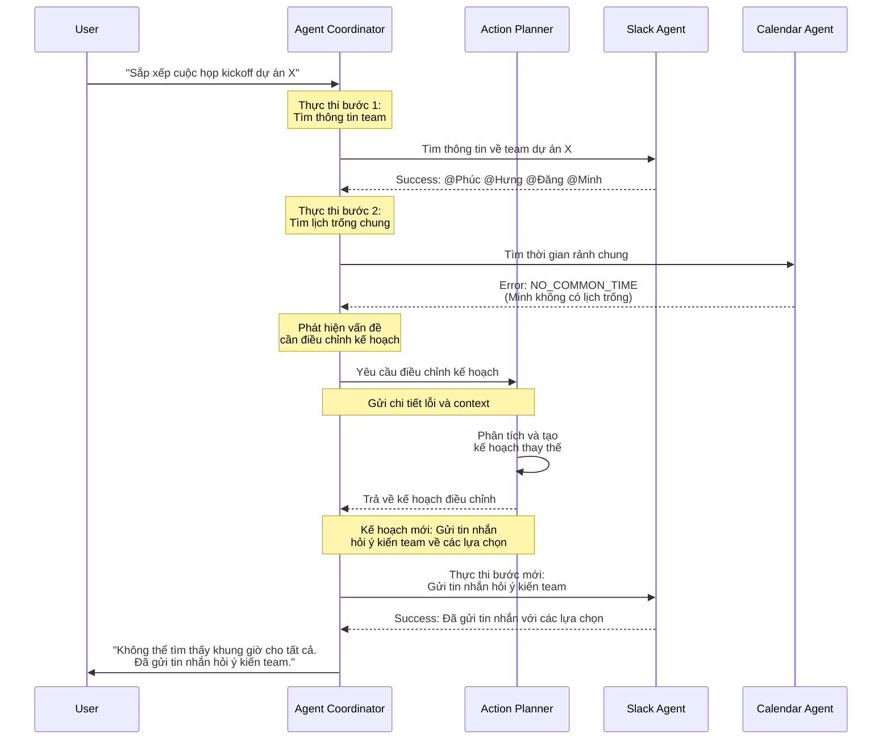

# Hướng Dẫn Phát Triển AI Agent - Phần 2: Chi Tiết Bên Trong Central Agent

> **Tài liệu hướng dẫn dành cho kỹ sư phát triển AI Agent tại công ty.**
>
> Bộ tài liệu này gồm 2 phần:
> - [Phần 1: Kiến Trúc Tổng Quan](./ai_agent_development_guide_part1.md)
> - [Phần 2: Chi Tiết Bên Trong Central Agent](./ai_agent_development_guide_part2.md) (tài liệu hiện tại)
> - Phần 3: Đi sâu vào Sub-agent (dự kiến)

## Giới thiệu

Phần 2 này đi sâu vào chi tiết triển khai của mô hình Central-Sub Agent, tập trung vào các thành phần cốt lõi và cơ chế giao tiếp giữa chúng. Nếu bạn chưa đọc [Phần 1: Kiến Trúc Tổng Quan](./ai_agent_development_guide_part1.md), vui lòng xem phần đó trước để hiểu về khái niệm và kiến trúc tổng thể.

Tài liệu này sẽ cung cấp:
1. Chi tiết về từng thành phần trong Central Agent
2. Tương tác giữa Action Planner và Agent Coordinator
3. Cách xử lý lỗi và tình huống ngoại lệ
4. Ví dụ triển khai thực tế

Để nhắc lại, đây là tổng quan về các thành phần chính trong kiến trúc Central Agent:



## 1. Chi tiết về các thành phần

### 1.1 Config Reader (Bộ đọc cấu hình)
- **Nhiệm vụ**: Đọc thông tin dự án như thành viên, kênh liên lạc, mã dự án
- **Đầu vào**: Thông tin người dùng, ID dự án
- **Đầu ra**: Context cho việc hiểu đúng và thực hiện yêu cầu

**Ví dụ cấu trúc môi trường cho dự án phát triển phần mềm:**

| Thông tin môi trường | Mô tả | Ví dụ |
|--------------------------|-----------|-------------|
| Danh sách thành viên | Thành viên trong dự án | Phúc (PM), Đăng (Developer), Hưng (Tester) |
| Mã dự án | Định danh dự án | XDEMO2 |
| Kênh liên lạc | Kênh giao tiếp | #project-alpha (Slack) |
| Công cụ quản lý | Hệ thống quản lý công việc | JIRA |
| Thông tin xác thực | API token, credentials | jiraToken, slackToken |
| Lịch dự án | Sprint, deadline | Sprint 5: 01/05-15/05/2025 |
| Nguồn lực | Phòng họp, thiết bị | Mercury, Venus (meeting rooms) |

### 1.2 Input Processor (Bộ xử lý đầu vào)
- **Nhiệm vụ**: Phân tích và hiểu yêu cầu đầu vào từ người dùng (dạng ngôn ngữ tự nhiên)
- **Công nghệ phổ biến**: LLM (Large Language Model) như GPT, Gemini, Llama
- **Đầu ra**: Cấu trúc dữ liệu hiểu được ý định người dùng

**Prompt mẫu cho LLM**:
```
Bạn là một Input Processor trong hệ thống AI Agent. Nhiệm vụ của bạn là phân tích yêu cầu sau của người dùng để xác định:

1. Ý định chính (intent)
2. Các thực thể (entities) quan trọng
3. Ngữ cảnh (context) liên quan

Dựa trên thông tin sau:
- Yêu cầu người dùng: "{input}"
- Thông tin người dùng: {userInfo}
- Thông tin dự án: {projectInfo}

Trả về kết quả dưới dạng JSON với các trường sau:
- intent: ý định chính của người dùng
- entities: danh sách các thực thể được trích xuất
- requiredAgents: các loại agent cần để xử lý yêu cầu này
- detailedDescription: mô tả chi tiết về ý định người dùng
```

**Ví dụ đầu ra sau khi xử lý**:
```json
{
  "intent": "schedule_meeting",
  "entities": {
    "participants": ["Phúc", "Đăng", "Hưng"],
    "purpose": "kickoff dự án X",
    "timeframe": "trong tuần này"
  },
  "requiredAgents": ["SLACK", "CALENDAR"],
  "detailedDescription": "Người dùng muốn sắp xếp một cuộc họp với Phúc, Đăng, Hưng để kickoff dự án X. Cuộc họp nên được tổ chức trong tuần này."
}
```

### 1.3 Action Planner (Bộ lập kế hoạch)
- **Nhiệm vụ**: Tạo kế hoạch hành động với các bước cụ thể
- **Đầu vào**: Kết quả xử lý từ Input Processor
- **Đầu ra**: Action Plan gồm các bước cần thực hiện
- **Đặc điểm**: Quản lý phụ thuộc giữa các bước, xử lý điều kiện

**Prompt mẫu cho LLM**:
```
Bạn là Action Planner trong hệ thống AI Agent. Nhiệm vụ của bạn là tạo kế hoạch hành động chi tiết dựa trên yêu cầu đã được phân tích.

Thông tin đầu vào:
- Phân tích yêu cầu: {processedInput}
- Thông tin dự án: {projectContext}
- Các agent có sẵn: {availableAgents}

Hãy tạo một kế hoạch hành động với các bước cụ thể, mỗi bước bao gồm:
1. ID bước
2. Loại agent cần sử dụng
3. Prompt chi tiết cho agent
4. Các bước phụ thuộc (nếu có)
5. Điều kiện thực hiện (nếu có)
6. Số lần thử lại tối đa
7. Thời gian chờ tối đa

Đảm bảo kế hoạch:
- Có thứ tự logic
- Xử lý được nhiều tình huống
- Tận dụng kết quả từ các bước trước
- Bao gồm xử lý lỗi cơ bản

Trả về dưới dạng JSON với cấu trúc ActionPlan.
```

**Ví dụ kế hoạch hành động**:
```json
{
  "steps": [
    {
      "id": "step1",
      "agentType": "SLACK",
      "prompt": "Tìm thông tin về dự án X và thành viên Phúc, Đăng, Hưng trong kênh #project-alpha",
      "dependsOn": [],
      "maxRetries": 2,
      "status": "succeeded"
    },
    {
      "id": "step2",
      "agentType": "CALENDAR",
      "prompt": "Tìm khung giờ trống chung cho Phúc, Đăng và Hưng trong tuần này",
      "dependsOn": ["step1"],
      "condition": "result.step1.success === true",
      "status": "running"
    },
    {
      "id": "step3",
      "agentType": "CALENDAR",
      "prompt": "Tạo cuộc họp với tiêu đề 'Kickoff dự án X' sử dụng khung giờ đầu tiên tìm được ở bước trước",
      "dependsOn": ["step2"],
      "condition": "result.step2.availableSlots.length > 0",
      "maxRetries": 2,
      "status": "pending"
    },
    {
      "id": "step4",
      "agentType": "SLACK",
      "prompt": "Thông báo về cuộc họp đã tạo trong kênh #project-alpha, đề cập @Phúc @Đăng @Hưng",
      "dependsOn": ["step3"],
      "condition": "result.step3.success === true",
      "maxRetries": 2,
      "status": "pending"
    }
  ]
}
```

### 1.4 Agent Coordinator (Bộ điều phối)
- **Nhiệm vụ**: Điều phối việc thực thi kế hoạch
- **Khả năng**: Gọi các agent con, theo dõi tiến độ, xử lý lỗi và retry
- **Xử lý trạng thái**: Quản lý các trạng thái của từng bước và toàn bộ kế hoạch

**Các trạng thái của bước (Step Status)**:
- **PENDING**: Chưa bắt đầu thực hiện
- **WAITING**: Đang chờ các bước phụ thuộc hoàn thành
- **RUNNING**: Đang thực thi
- **SUCCEEDED**: Thực hiện thành công
- **FAILED**: Thất bại
- **RETRYING**: Đang thử lại
- **SKIPPED**: Bị bỏ qua (do điều kiện không thỏa)
- **CANCELLED**: Đã hủy

**Xử lý điều kiện và phụ thuộc**:
```javascript
// Đánh giá điều kiện để thực hiện step
const conditionResult = evaluateCondition(
  step.condition, 
  plan.executionContext
);

if (conditionResult) {
  // Thực hiện step
  executeStep(step);
} else {
  // Bỏ qua step
  step.status = 'SKIPPED';
  moveToNextStep();
}
```

### 1.5 Result Synthesizer (Bộ tổng hợp kết quả)
- **Nhiệm vụ**: Tổng hợp kết quả từ các bước thành phản hồi cuối cùng
- **Đầu ra**: Văn bản ngôn ngữ tự nhiên cho người dùng
- **Đặc điểm**: Tập trung vào thông tin quan trọng, dễ hiểu, phù hợp với yêu cầu ban đầu

**Prompt mẫu cho LLM**:
```
Bạn là Result Synthesizer trong hệ thống AI Agent. Nhiệm vụ của bạn là tổng hợp kết quả từ việc thực hiện kế hoạch thành một phản hồi rõ ràng cho người dùng.

Thông tin đầu vào:
- Kế hoạch đã thực thi: {executedPlan}
- Yêu cầu ban đầu: {originalRequest}
- Ngôn ngữ phản hồi: Tiếng Việt

Hãy tạo một phản hồi tổng hợp:
1. Ngắn gọn và dễ hiểu
2. Tập trung vào kết quả chính
3. Đề cập đến các vấn đề quan trọng nếu có
4. Đề xuất hành động tiếp theo nếu cần

Phản hồi phải phù hợp với:
- Tiến độ hoàn thành kế hoạch
- Trạng thái của các bước
- Mục tiêu ban đầu của người dùng
```

**Ví dụ phản hồi tổng hợp**:
```
Đã sắp xếp cuộc họp kickoff dự án X vào lúc 10:30-12:00, thứ Ba (22/04) tại phòng Jupiter với Phúc, Đăng và Hưng. Thông báo đã được gửi đến kênh #project-alpha trên Slack.
```

## 2. Chi tiết về Action Planner và Agent Coordinator

Action Planner và Agent Coordinator là hai thành phần cốt lõi của Central Agent, có tương tác chặt chẽ và phức tạp với nhau. Phần này đi sâu vào chi tiết cấu trúc dữ liệu, quy trình phối hợp và cơ chế xử lý lỗi giữa hai thành phần này.

### 2.1 Action Planner: Từ ý định đến kế hoạch thực thi

Action Planner đóng vai trò quan trọng nhất trong kiến trúc Central Agent, chịu trách nhiệm chuyển đổi ý định của người dùng thành kế hoạch hành động cụ thể mà hệ thống có thể thực thi.

#### 2.1.1 Cấu trúc ActionPlan và ActionStep

ActionPlan là cấu trúc dữ liệu chính trong hệ thống, đại diện cho toàn bộ kế hoạch thực thi một yêu cầu:

```typescript
interface ActionPlan {
  id: string;
  status: PlanStatus;
  steps: ActionStep[];
  currentStepIndex: number;
  executionContext: Record<string, any>;
  isAdjustment?: boolean;
  startTime?: Date;
  endTime?: Date;
  error?: Error;
  overallProgress: number;
}

interface ActionStep {
  id: string;
  agentType: AgentType;
  prompt: string;
  dependsOn: string[];
  condition?: string;
  maxRetries?: number;
  retryCount?: number;
  timeout?: number;
  status: StepStatus;
  result?: StepResult;
  startTime?: Date;
  endTime?: Date;
  error?: Error;
  evaluation?: StepEvaluation;
}

enum StepStatus {
  PENDING = 'pending',     // Chưa bắt đầu
  WAITING = 'waiting',     // Đang chờ các step phụ thuộc
  RUNNING = 'running',     // Đang thực thi
  SUCCEEDED = 'succeeded', // Thành công
  FAILED = 'failed',       // Thất bại
  RETRYING = 'retrying',   // Đang thử lại
  SKIPPED = 'skipped',     // Bỏ qua (do điều kiện không thỏa)
  CANCELLED = 'cancelled'  // Đã hủy
}

enum PlanStatus {
  CREATED = 'created',     // Mới tạo
  RUNNING = 'running',     // Đang thực thi
  COMPLETED = 'completed', // Hoàn thành thành công
  FAILED = 'failed',       // Thất bại
  CANCELLED = 'cancelled'  // Đã hủy
}
```

**Ví dụ ActionPlan thực tế:**

```json
{
  "id": "plan-123",
  "status": "running",
  "steps": [
    {
      "id": "step1",
      "agentType": "SLACK",
      "prompt": "Tìm kiếm tin nhắn liên quan đến cuộc họp và dự án X",
      "dependsOn": [],
      "maxRetries": 2,
      "status": "succeeded"
    },
    {
      "id": "step2",
      "agentType": "CALENDAR",
      "prompt": "Tìm thời gian rảnh chung cho @Phúc, @Hưng, @Đăng từ ngày 20/4 đến 24/4",
      "dependsOn": ["step1"],
      "condition": "result.step1.success === true",
      "status": "running"
    }
  ],
  "currentStepIndex": 1,
  "executionContext": {
    "result": {
      "step1": {
        "success": true,
        "data": {
          "messages": [
            {"text": "Chúng ta cần có cuộc họp kickoff dự án X", "user": "Phúc"},
            {"text": "Tôi có thể tham gia từ thứ 3 đến thứ 5", "user": "Đăng"}
          ]
        }
      }
    }
  },
  "overallProgress": 50
}
```

#### 2.1.2 Quá trình tạo kế hoạch

Action Planner nhận input từ Input Processor, phân tích và tạo ra một ActionPlan hoàn chỉnh:

1. **Phân tích ý định và ngữ cảnh**:
   - Hiểu đúng mục tiêu chính của yêu cầu
   - Xác định các thực thể cần thiết (người, dự án, khung thời gian)
   - Xem xét các ràng buộc và điều kiện ngầm định

2. **Quyết định chuỗi hành động**:
   - Xác định các sub-agent cần gọi (JIRA, Slack, Calendar, v.v.)
   - Thiết lập các bước tuần tự và song song
   - Xác định phụ thuộc giữa các bước

3. **Thiết lập điều kiện và xử lý lỗi**:
   - Đặt điều kiện cho từng bước (nếu cần)
   - Cấu hình số lần retry và timeout
   - Lên kế hoạch dự phòng (fallback plan)

### 2.2 Agent Coordinator: Điều phối và thực thi

Agent Coordinator nhận kế hoạch từ Action Planner và chịu trách nhiệm thực thi, theo dõi tiến độ, và xử lý các tình huống ngoại lệ.

#### 2.2.1 Quy trình thực thi kế hoạch



#### 2.2.2 Cơ chế tương tác với Sub-Agent

Agent Coordinator gọi các Sub-Agent để thực hiện từng bước trong kế hoạch:

1. **Chuẩn bị và gửi yêu cầu**: 
   - Render prompt với context từ các bước trước
   - Chuyển đổi thành format phù hợp với Sub-Agent
   - Đặt timeout và cờ tracking

2. **Xử lý phản hồi**:
   - Phân tích kết quả trả về
   - Cập nhật executionContext
   - Đánh giá thành công hay thất bại

**Ví dụ tương tác với Sub-Agent:**
```
// Prompt từ Action Planner
"Tìm thời gian rảnh chung cho Phúc, Đăng và Hưng từ 20/4 đến 24/4"

// Rendering với context
const renderedPrompt = "Tìm thời gian rảnh chung cho Phúc, Đăng và Hưng (đã tìm thấy trong kênh #project-alpha) từ 20/4 đến 24/4 cho cuộc họp kickoff dự án X";

// Kết quả từ Calendar Agent
{
  "success": true,
  "data": {
    "availableSlots": [
      {
        "startTime": "2025-04-22T09:00:00Z",
        "endTime": "2025-04-22T10:30:00Z",
        "participants": ["Phúc", "Đăng", "Hưng"],
        "location": "Jupiter"
      },
      {
        "startTime": "2025-04-23T14:00:00Z",
        "endTime": "2025-04-23T15:30:00Z",
        "participants": ["Phúc", "Đăng", "Hưng"],
        "location": "Mars"
      }
    ]
  }
}
```

### 2.3 Feedback Loop và xử lý tình huống ngoại lệ

Cơ chế feedback loop giữa Agent Coordinator và Action Planner là đặc điểm quan trọng nhất giúp hệ thống thích ứng với tình huống thực tế.

#### 2.3.1 Khi nào cần điều chỉnh kế hoạch?

Agent Coordinator sẽ yêu cầu điều chỉnh kế hoạch trong các tình huống sau:

1. **Lỗi không thể khôi phục**:
   - Đã hết số lần retry
   - Lỗi nghiêm trọng từ Sub-Agent (như service không khả dụng)
   - Timeout vượt quá ngưỡng cho phép

2. **Thông tin không đủ hoặc mâu thuẫn**:
   - Thiếu thông tin để tiếp tục (ví dụ: không thể tìm thấy dự án)
   - Kết quả trả về không đúng định dạng hoặc không đầy đủ

3. **Kết quả không như mong đợi**:
   - Không tìm thấy thời gian trống chung (như trường hợp lịch của Minh)
   - Không tìm thấy tài nguyên cần thiết (phòng họp, tài liệu)

#### 2.3.2 Quy trình điều chỉnh kế hoạch



#### 2.3.3 Ví dụ thực tế: Xử lý khi không tìm được lịch trống chung

Dưới đây là ví dụ về cách hệ thống xử lý tình huống khi không thể tìm thấy thời gian trống chung cho tất cả thành viên:



### 2.4 Chiến lược xử lý lỗi

Agent Coordinator kết hợp nhiều chiến lược xử lý lỗi để đảm bảo độ tin cậy của hệ thống:

| Loại lỗi | Chiến lược | Cách triển khai |
|----------|------------|-----------------|
| **Lỗi tạm thời** | Retry với backoff | Thử lại với khoảng thời gian tăng dần: 5s → 10s → 30s |
| **Thiếu thông tin** | Điều chỉnh kế hoạch | Thêm bước để thu thập thông tin còn thiếu |
| **Xung đột** | Tìm giải pháp thay thế | Điều chỉnh kế hoạch để đề xuất phương án khác |
| **Không thể thực hiện** | Thông báo và đề xuất | Trả lại kết quả rõ ràng với lý do và đề xuất |

## 3. Dự kiến nội dung Phần 3: Đi sâu vào Sub-agent

Sau khi đã tìm hiểu về kiến trúc tổng thể của hệ thống Central-Sub Agent (Phần 1) và chi tiết cách hoạt động của Central Agent cùng tương tác giữa Action Planner và Agent Coordinator (Phần 2), câu hỏi quan trọng tiếp theo là: làm thế nào để thiết kế và triển khai các Sub-agent một cách hiệu quả?

Trong Phần 3 (sắp tới), chúng ta sẽ khám phá:

1. **Các loại Sub-agent khác nhau**:
   - Sub-agent tích hợp API bên ngoài như Slack, JIRA, Google Calendar
   - Sub-agent xử lý dữ liệu nội bộ với database, file, documents
   - Sub-agent đặc biệt cho tác vụ phân tích dữ liệu

2. **Cơ chế giao tiếp giữa Central Agent và Sub-agent**:
   - Model Context Protocol (MCP)
   - Function Calling
   - So sánh ưu nhược điểm của mỗi cách tiếp cận

... (chưa nghĩ ra)

Phần 3 hứa hẹn sẽ giúp bạn hiểu sâu hơn về "lớp dưới cùng" của hệ thống - nơi các Sub-agent tương tác trực tiếp với thế giới bên ngoài, và cách chúng hoạt động trong môi trường đa dạng với nhiều loại service và API khác nhau.

---

Để hiểu rõ hơn về tổng thể kiến trúc của AI Agent và nắm cách các thành phần kết nối với nhau, vui lòng tham khảo [Phần 1: Kiến Trúc Tổng Quan](./ai_agent_development_guide_part1.md).