# AI Agent Development Guide - Part 2: Details Inside Central Agent

> **Guide document for AI Agent developers at the company.**
>
> This documentation consists of 2 parts:
> - [Part 1: Architecture Overview](./ai_agent_development_guide_part1_en.md)
> - [Part 2: Details Inside Central Agent](./ai_agent_development_guide_part2_en.md) (current document)
> - Part 3: Deep Dive into Sub-agents (planned)

## Introduction

This Part 2 delves into the implementation details of the Central-Sub Agent model, focusing on core components and communication mechanisms between them. If you haven't read [Part 1: Architecture Overview](./ai_agent_development_guide_part1_en.md), please refer to that section first to understand the concepts and overall architecture.

This document will provide:
1. Details on each component in the Central Agent
2. Interaction between Action Planner and Agent Coordinator
3. Error handling and exception handling
4. Practical implementation examples

To recap, here is an overview of the main components in the Central Agent architecture:

```mermaid
graph TB
    User[User] -->|Request| CA
    
    subgraph CA[Central Agent]
        direction TB
        PCR[Config Reader] -->|Context| IP
        IP[Input Processor<br>🧠 LLM-Powered] -->|Processed Input| AP
        AP[Action Planner<br>🧠 LLM-Powered] -->|Action Plan| AC
        AC[Agent Coordinator] -->|Execution Results| RS
        
        %% Feedback loop
        AC -->|Plan adjustment<br>request| AP
        
        RS[Result Synthesizer<br>🧠 LLM-Powered]
    end
    
    AC -->|Call| A1[Specialized Agents<br>MCP/Function Calling]
    A1 -->|Results| AC
    
    RS -->|Response| User
    
    classDef llmPowered fill:#fcf,stroke:#333,stroke-width:2px,stroke-dasharray: 5 5
    class IP,AP,RS llmPowered
    
    style CA fill:#f9f9f9,stroke:#333,stroke-width:2px
    style PCR fill:#bbf,stroke:#333
    style AC fill:#cfc,stroke:#333
    style User fill:#ccf,stroke:#333
```



## 1. Component Details

### 1.1 Config Reader
- **Task**: Read project information such as members, communication channels, project codes
- **Input**: User information, project ID
- **Output**: Context for properly understanding and executing requests

**Example environment structure for software development projects:**

| Environment Information | Description | Example |
|--------------------------|-----------|-------------|
| Member list | Project members | Phil (PM), Dan (Developer), Hugh (Tester) |
| Project code | Project identifier | XDEMO2 |
| Communication channels | Communication channels | #project-alpha (Slack) |
| Management tools | Task management system | JIRA |
| Authentication info | API tokens, credentials | jiraToken, slackToken |
| Project schedule | Sprint, deadline | Sprint 5: 01/05-15/05/2025 |
| Resources | Meeting rooms, equipment | Mercury, Venus (meeting rooms) |

### 1.2 Input Processor
- **Task**: Analyze and understand input requests from users (in natural language)
- **Common technology**: LLM (Large Language Model) like GPT, Gemini, Llama
- **Output**: Data structure that understands user intent

**Sample prompt for LLM**:
```
You are an Input Processor in an AI Agent system. Your task is to analyze the following user request to identify:

1. Main intent
2. Important entities
3. Relevant context

Based on the following information:
- User request: "{input}"
- User information: {userInfo}
- Project information: {projectInfo}

Return the result in JSON format with the following fields:
- intent: the user's main intent
- entities: list of extracted entities
- requiredAgents: types of agents needed to process this request
- detailedDescription: detailed description of the user's intent
```

**Example output after processing**:
```json
{
  "intent": "schedule_meeting",
  "entities": {
    "participants": ["Phil", "Dan", "Hugh"],
    "purpose": "project X kickoff",
    "timeframe": "this week"
  },
  "requiredAgents": ["SLACK", "CALENDAR"],
  "detailedDescription": "User wants to schedule a meeting with Phil, Dan, Hugh for project X kickoff. The meeting should be held this week."
}
```

### 1.3 Action Planner
- **Task**: Create an action plan with specific steps
- **Input**: Processing result from Input Processor
- **Output**: Action Plan consisting of steps to be executed
- **Characteristics**: Manages dependencies between steps, handles conditions

**Sample prompt for LLM**:
```
You are an Action Planner in an AI Agent system. Your task is to create a detailed action plan based on the analyzed request.

Input information:
- Request analysis: {processedInput}
- Project information: {projectContext}
- Available agents: {availableAgents}

Create an action plan with specific steps, each including:
1. Step ID
2. Agent type to use
3. Detailed prompt for the agent
4. Dependent steps (if any)
5. Execution conditions (if any)
6. Maximum retry attempts
7. Maximum wait time

Ensure the plan:
- Has logical order
- Handles multiple scenarios
- Leverages results from previous steps
- Includes basic error handling

Return in JSON format with ActionPlan structure.
```

**Example action plan**:
```json
{
  "steps": [
    {
      "id": "step1",
      "agentType": "SLACK",
      "prompt": "Find information about project X and members Phil, Dan, Hugh in #project-alpha channel",
      "dependsOn": [],
      "maxRetries": 2,
      "status": "succeeded"
    },
    {
      "id": "step2",
      "agentType": "CALENDAR",
      "prompt": "Find common available time slots for Phil, Dan and Hugh this week",
      "dependsOn": ["step1"],
      "condition": "result.step1.success === true",
      "status": "running"
    },
    {
      "id": "step3",
      "agentType": "CALENDAR",
      "prompt": "Create a meeting titled 'Project X Kickoff' using the first available time slot found in the previous step",
      "dependsOn": ["step2"],
      "condition": "result.step2.availableSlots.length > 0",
      "maxRetries": 2,
      "status": "pending"
    },
    {
      "id": "step4",
      "agentType": "SLACK",
      "prompt": "Announce the created meeting in #project-alpha channel, mentioning @Phil @Dan @Hugh",
      "dependsOn": ["step3"],
      "condition": "result.step3.success === true",
      "maxRetries": 2,
      "status": "pending"
    }
  ]
}
```

### 1.4 Agent Coordinator
- **Task**: Coordinate plan execution
- **Capabilities**: Call sub-agents, track progress, handle errors and retries
- **State management**: Manage the status of each step and the entire plan

**Step Status**:
- **PENDING**: Not yet started
- **WAITING**: Waiting for dependent steps to complete
- **RUNNING**: Executing
- **SUCCEEDED**: Successfully completed
- **FAILED**: Failed
- **RETRYING**: Retrying
- **SKIPPED**: Skipped (due to unmet conditions)
- **CANCELLED**: Cancelled

**Handling conditions and dependencies**:
```javascript
// Evaluate condition to execute step
const conditionResult = evaluateCondition(
  step.condition, 
  plan.executionContext
);

if (conditionResult) {
  // Execute step
  executeStep(step);
} else {
  // Skip step
  step.status = 'SKIPPED';
  moveToNextStep();
}
```

### 1.5 Result Synthesizer
- **Task**: Synthesize results from steps into a final response
- **Output**: Natural language text for the user
- **Characteristics**: Focus on important information, easy to understand, aligned with the original request

**Sample prompt for LLM**:
```
You are a Result Synthesizer in an AI Agent system. Your task is to synthesize the results from plan execution into a clear response for the user.

Input information:
- Executed plan: {executedPlan}
- Original request: {originalRequest}
- Response language: English

Create a synthesized response that is:
1. Concise and easy to understand
2. Focused on main results
3. Mentions important issues if any
4. Suggests next actions if needed

The response must align with:
- Plan completion progress
- Status of steps
- User's original goal
```

**Example synthesized response**:
```
Scheduled Project X kickoff meeting for Tuesday (04/22) from 10:30-12:00 in Jupiter room with Phil, Dan, and Hugh. Notification has been sent to the #project-alpha channel on Slack.
```

## 2. Details on Action Planner and Agent Coordinator

Action Planner and Agent Coordinator are two core components of the Central Agent, with close and complex interaction. This section delves into data structure details, coordination processes, and error handling mechanisms between these two components.

### 2.1 Action Planner: From Intent to Execution Plan

The Action Planner plays the most important role in the Central Agent architecture, responsible for transforming user intent into specific action plans that the system can execute.

#### 2.1.1 ActionPlan and ActionStep Structure

ActionPlan is the main data structure in the system, representing the entire execution plan for a request:

```typescript
interface ActionPlan {
  id: string;
  status: PlanStatus;
  steps: ActionStep[];
  currentStepIndex: number;
  executionContext: Record<string, any>;
  isAdjustment?: boolean;
  startTime?: Date;
  endTime?: Date;
  error?: Error;
  overallProgress: number;
}

interface ActionStep {
  id: string;
  agentType: AgentType;
  prompt: string;
  dependsOn: string[];
  condition?: string;
  maxRetries?: number;
  retryCount?: number;
  timeout?: number;
  status: StepStatus;
  result?: StepResult;
  startTime?: Date;
  endTime?: Date;
  error?: Error;
  evaluation?: StepEvaluation;
}

enum StepStatus {
  PENDING = 'pending',     // Not started
  WAITING = 'waiting',     // Waiting for dependent steps
  RUNNING = 'running',     // Executing
  SUCCEEDED = 'succeeded', // Successful
  FAILED = 'failed',       // Failed
  RETRYING = 'retrying',   // Retrying
  SKIPPED = 'skipped',     // Skipped (condition not met)
  CANCELLED = 'cancelled'  // Cancelled
}

enum PlanStatus {
  CREATED = 'created',     // Newly created
  RUNNING = 'running',     // Executing
  COMPLETED = 'completed', // Successfully completed
  FAILED = 'failed',       // Failed
  CANCELLED = 'cancelled'  // Cancelled
}
```

**Real ActionPlan example:**

```json
{
  "id": "plan-123",
  "status": "running",
  "steps": [
    {
      "id": "step1",
      "agentType": "SLACK",
      "prompt": "Search for messages related to meetings and project X",
      "dependsOn": [],
      "maxRetries": 2,
      "status": "succeeded"
    },
    {
      "id": "step2",
      "agentType": "CALENDAR",
      "prompt": "Find common available times for @Phil, @Hugh, @Dan from 4/20 to 4/24",
      "dependsOn": ["step1"],
      "condition": "result.step1.success === true",
      "status": "running"
    }
  ],
  "currentStepIndex": 1,
  "executionContext": {
    "result": {
      "step1": {
        "success": true,
        "data": {
          "messages": [
            {"text": "We need to have a kickoff meeting for project X", "user": "Phil"},
            {"text": "I can join from Tuesday to Thursday", "user": "Dan"}
          ]
        }
      }
    }
  },
  "overallProgress": 50
}
```

#### 2.1.2 Plan Creation Process

The Action Planner receives input from the Input Processor, analyzes it, and creates a complete ActionPlan:

1. **Analyzing intent and context**:
   - Understanding the main goal of the request
   - Identifying necessary entities (people, projects, timeframes)
   - Considering constraints and implicit conditions

2. **Deciding action sequence**:
   - Identifying sub-agents to call (JIRA, Slack, Calendar, etc.)
   - Establishing sequential and parallel steps
   - Identifying dependencies between steps

3. **Setting conditions and error handling**:
   - Setting conditions for each step (if needed)
   - Configuring retry counts and timeouts
   - Planning for fallbacks

### 2.2 Agent Coordinator: Coordination and Execution

The Agent Coordinator receives plans from the Action Planner and is responsible for execution, progress tracking, and handling exceptional situations.

#### 2.2.1 Plan Execution Process


#### 2.2.2 Interaction Mechanism with Sub-Agents

The Agent Coordinator calls Sub-Agents to execute each step in the plan:

1. **Preparing and sending requests**: 
   - Render prompt with context from previous steps
   - Convert to format appropriate for Sub-Agent
   - Set timeout and tracking flags

2. **Handling responses**:
   - Analyze returned results
   - Update executionContext
   - Evaluate success or failure

**Example interaction with Sub-Agent:**
```
// Prompt from Action Planner
"Find common available times for Phil, Dan and Hugh from 4/20 to 4/24"

// Rendering with context
const renderedPrompt = "Find common available times for Phil, Dan and Hugh (found in #project-alpha channel) from 4/20 to 4/24 for Project X kickoff meeting";

// Result from Calendar Agent
{
  "success": true,
  "data": {
    "availableSlots": [
      {
        "startTime": "2025-04-22T09:00:00Z",
        "endTime": "2025-04-22T10:30:00Z",
        "participants": ["Phil", "Dan", "Hugh"],
        "location": "Jupiter"
      },
      {
        "startTime": "2025-04-23T14:00:00Z",
        "endTime": "2025-04-23T15:30:00Z",
        "participants": ["Phil", "Dan", "Hugh"],
        "location": "Mars"
      }
    ]
  }
}
```

### 2.3 Feedback Loop and Exception Handling

The feedback loop mechanism between Agent Coordinator and Action Planner is the most important feature helping the system adapt to real situations.

#### 2.3.1 When is Plan Adjustment Needed?

The Agent Coordinator will request plan adjustments in the following situations:

1. **Unrecoverable errors**:
   - Out of retry attempts
   - Serious errors from Sub-Agents (such as service unavailability)
   - Timeouts exceeding allowed thresholds

2. **Insufficient or conflicting information**:
   - Missing information to proceed (e.g., cannot find the project)
   - Results returned in incorrect format or incomplete

3. **Unexpected results**:
   - Cannot find common available time (as in Mike's calendar case)
   - Cannot find necessary resources (meeting rooms, documents)

#### 2.3.2 Plan Adjustment Process


#### 2.3.3 Real Example: Handling When No Common Available Time is Found

Below is an example of how the system handles situations when it cannot find a common available time for all members:


### 2.4 Error Handling Strategies

The Agent Coordinator combines multiple error handling strategies to ensure system reliability:

| Error Type | Strategy | Implementation |
|----------|------------|-----------------|
| **Temporary errors** | Retry with backoff | Retry with increasing intervals: 5s → 10s → 30s |
| **Missing information** | Plan adjustment | Add steps to collect missing information |
| **Conflicts** | Find alternatives | Adjust plan to propose different options |
| **Unfeasible requests** | Inform and suggest | Return clear results with reasons and suggestions |

## 3. Planned Content for Part 3: Deep Dive into Sub-agents

After exploring the overall architecture of the Central-Sub Agent system (Part 1) and details of the Central Agent's operation and interaction between Action Planner and Agent Coordinator (Part 2), the next important question is: how to design and implement Sub-agents effectively?

In Part 3 (upcoming), we will explore:

1. **Different types of Sub-agents**:
   - Sub-agents integrating external APIs like Slack, JIRA, Google Calendar
   - Sub-agents processing internal data with databases, files, documents
   - Special sub-agents for data analysis tasks

2. **Communication mechanisms between Central Agent and Sub-agents**:
   - Model Context Protocol (MCP)
   - Function Calling
   - Comparison of pros and cons of each approach

... (to be determined)

Part 3 promises to help you understand more deeply about the "bottom layer" of the system - where Sub-agents interact directly with the outside world, and how they operate in diverse environments with many different services and APIs.

---

To better understand the overall architecture of AI Agents and grasp how components connect with each other, please refer to [Part 1: Architecture Overview](./ai_agent_development_guide_part1_en.md). 