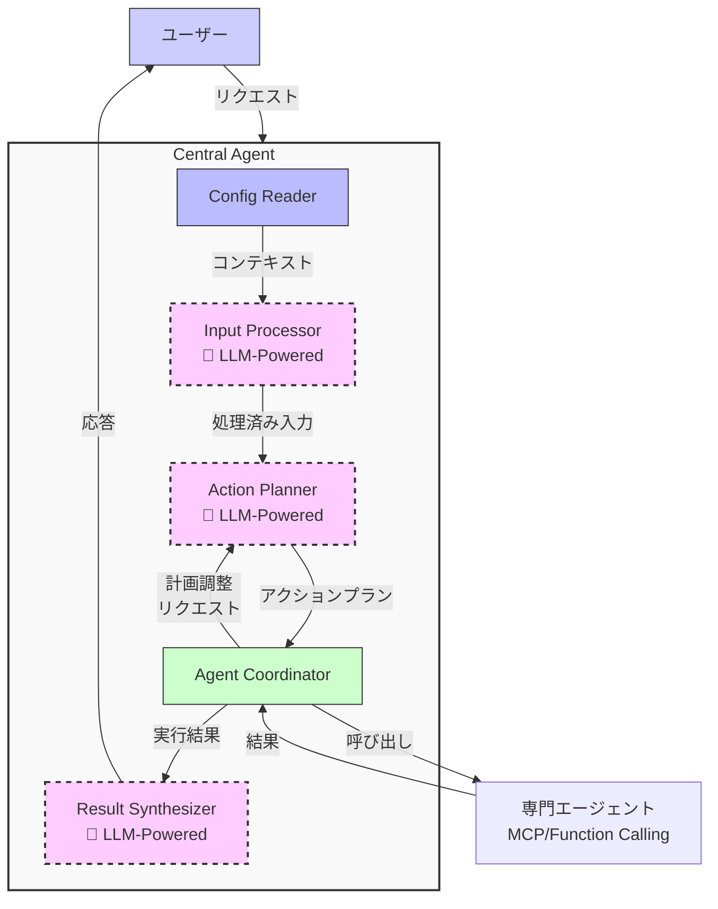

# AI エージェント開発ガイド - パート2: Central Agentの詳細

> **会社のAIエージェント開発者向けガイドドキュメント**
>
> このドキュメントは2つのパートで構成されています：
> - [パート1: アーキテクチャ概要](./ai_agent_development_guide_part1_ja.md)
> - [パート2: Central Agentの詳細](./ai_agent_development_guide_part2_ja.md) (現在のドキュメント)
> - パート3: Sub-agentの詳細 (予定)

## はじめに

このパート2では、Central-Sub Agentモデルの実装詳細、特にコアコンポーネントとそれらの間の通信メカニズムに焦点を当てます。まだ[パート1: アーキテクチャ概要](./ai_agent_development_guide_part1_ja.md)を読んでいない場合は、概念と全体的なアーキテクチャを理解するために先にそのセクションを参照してください。

このドキュメントでは以下を提供します：
1. Central Agentの各コンポーネントの詳細
2. Action PlannerとAgent Coordinatorの間の相互作用
3. エラー処理と例外処理
4. 実践的な実装例

Central Agentアーキテクチャの主要コンポーネントの概要を再確認します：



## 1. コンポーネントの詳細

### 1.1 Config Reader（設定リーダー）
- **タスク**: メンバー、通信チャンネル、プロジェクトコードなどのプロジェクト情報を読み取る
- **入力**: ユーザー情報、プロジェクトID
- **出力**: リクエストを適切に理解し実行するためのコンテキスト

**ソフトウェア開発プロジェクトの環境構造例:**

| 環境情報 | 説明 | 例 |
|--------------------------|-----------|-------------|
| メンバーリスト | プロジェクトメンバー | フィル（PM）、ダン（開発者）、ヒュー（テスター） |
| プロジェクトコード | プロジェクト識別子 | XDEMO2 |
| 通信チャンネル | 通信チャンネル | #project-alpha（Slack） |
| 管理ツール | タスク管理システム | JIRA |
| 認証情報 | APIトークン、資格情報 | jiraToken、slackToken |
| プロジェクトスケジュール | スプリント、締め切り | Sprint 5: 01/05-15/05/2025 |
| リソース | 会議室、機器 | Mercury、Venus（会議室） |

### 1.2 Input Processor（入力プロセッサ）
- **タスク**: ユーザーからの入力リクエスト（自然言語形式）を分析し理解する
- **一般的な技術**: LLM（Large Language Model）、GPT、Gemini、Llamaなど
- **出力**: ユーザーの意図を理解したデータ構造

**LLM用のサンプルプロンプト**:
```
あなたはAIエージェントシステムのInput Processorです。あなたのタスクは、以下のユーザーリクエストを分析して以下を特定することです：

1. 主な意図
2. 重要なエンティティ
3. 関連するコンテキスト

以下の情報に基づいて：
- ユーザーリクエスト："{input}"
- ユーザー情報：{userInfo}
- プロジェクト情報：{projectInfo}

以下のフィールドを持つJSON形式で結果を返してください：
- intent: ユーザーの主な意図
- entities: 抽出されたエンティティのリスト
- requiredAgents: このリクエストを処理するために必要なエージェントの種類
- detailedDescription: ユーザーの意図の詳細な説明
```

**処理後の出力例**:
```json
{
  "intent": "schedule_meeting",
  "entities": {
    "participants": ["フィル", "ダン", "ヒュー"],
    "purpose": "プロジェクトXのキックオフ",
    "timeframe": "今週"
  },
  "requiredAgents": ["SLACK", "CALENDAR"],
  "detailedDescription": "ユーザーはフィル、ダン、ヒューとプロジェクトXのキックオフミーティングをスケジュールしたいと考えています。会議は今週中に開催されるべきです。"
}
```

### 1.3 Action Planner（アクションプランナー）
- **タスク**: 具体的なステップを含むアクションプランを作成する
- **入力**: Input Processorからの処理結果
- **出力**: 実行すべきステップで構成されるアクションプラン
- **特徴**: ステップ間の依存関係を管理し、条件を処理する

**LLM用のサンプルプロンプト**:
```
あなたはAIエージェントシステムのAction Plannerです。あなたのタスクは、分析されたリクエストに基づいて詳細なアクションプランを作成することです。

入力情報：
- リクエスト分析：{processedInput}
- プロジェクト情報：{projectContext}
- 利用可能なエージェント：{availableAgents}

以下を含む具体的なステップを持つアクションプランを作成してください：
1. ステップID
2. 使用するエージェントタイプ
3. エージェントへの詳細なプロンプト
4. 依存ステップ（ある場合）
5. 実行条件（ある場合）
6. 最大リトライ回数
7. 最大待機時間

プランが以下の条件を満たすようにしてください：
- 論理的な順序を持つ
- 複数のシナリオを処理できる
- 前のステップの結果を活用する
- 基本的なエラー処理を含む

ActionPlan構造のJSON形式で返してください。
```

**アクションプランの例**:
```json
{
  "steps": [
    {
      "id": "step1",
      "agentType": "SLACK",
      "prompt": "#project-alphaチャンネルでプロジェクトXとメンバーのフィル、ダン、ヒューに関する情報を見つける",
      "dependsOn": [],
      "maxRetries": 2,
      "status": "succeeded"
    },
    {
      "id": "step2",
      "agentType": "CALENDAR",
      "prompt": "フィル、ダン、ヒューの今週の共通の空き時間スロットを見つける",
      "dependsOn": ["step1"],
      "condition": "result.step1.success === true",
      "status": "running"
    },
    {
      "id": "step3",
      "agentType": "CALENDAR",
      "prompt": "前のステップで見つかった最初の利用可能な時間スロットを使用して「プロジェクトXキックオフ」というタイトルの会議を作成する",
      "dependsOn": ["step2"],
      "condition": "result.step2.availableSlots.length > 0",
      "maxRetries": 2,
      "status": "pending"
    },
    {
      "id": "step4",
      "agentType": "SLACK",
      "prompt": "#project-alphaチャンネルで@フィル @ダン @ヒューにメンションして作成された会議をアナウンスする",
      "dependsOn": ["step3"],
      "condition": "result.step3.success === true",
      "maxRetries": 2,
      "status": "pending"
    }
  ]
}
```

### 1.4 Agent Coordinator（エージェントコーディネーター）
- **タスク**: プラン実行の調整
- **能力**: サブエージェントの呼び出し、進捗の追跡、エラーとリトライの処理
- **状態管理**: 各ステップと全体のプランの状態を管理

**ステップステータス**:
- **PENDING**: まだ開始していない
- **WAITING**: 依存ステップの完了を待機中
- **RUNNING**: 実行中
- **SUCCEEDED**: 正常に完了
- **FAILED**: 失敗
- **RETRYING**: リトライ中
- **SKIPPED**: スキップ（条件が満たされなかったため）
- **CANCELLED**: キャンセル済み

**条件と依存関係の処理**:
```javascript
// ステップを実行するための条件を評価
const conditionResult = evaluateCondition(
  step.condition, 
  plan.executionContext
);

if (conditionResult) {
  // ステップを実行
  executeStep(step);
} else {
  // ステップをスキップ
  step.status = 'SKIPPED';
  moveToNextStep();
}
```

### 1.5 Result Synthesizer（結果統合機）
- **タスク**: ステップからの結果を最終的な応答に統合する
- **出力**: ユーザー向けの自然言語テキスト
- **特徴**: 重要な情報に焦点を当て、理解しやすく、元のリクエストに合致している

**LLM用のサンプルプロンプト**:
```
あなたはAIエージェントシステムのResult Synthesizerです。あなたのタスクは、プラン実行からの結果をユーザーへの明確な応答に統合することです。

入力情報：
- 実行されたプラン：{executedPlan}
- 元のリクエスト：{originalRequest}
- 応答言語：日本語

以下の特性を持つ統合された応答を作成してください：
1. 簡潔で理解しやすい
2. 主な結果に焦点を当てている
3. 重要な問題がある場合には言及する
4. 必要に応じて次のアクションを提案する

応答は以下と一致する必要があります：
- プラン完了の進捗
- ステップのステータス
- ユーザーの元の目標
```

**統合された応答の例**:
```
火曜日（04/22）の10:30-12:00にJupiter会議室でフィル、ダン、ヒューとプロジェクトXのキックオフミーティングをスケジュールしました。Slack上の#project-alphaチャンネルに通知が送信されました。
```

## 2. Action PlannerとAgent Coordinatorの詳細

Action PlannerとAgent CoordinatorはCentral Agentの2つのコアコンポーネントであり、緊密かつ複雑な相互作用があります。このセクションでは、これら2つのコンポーネント間のデータ構造の詳細、調整プロセス、エラー処理メカニズムを掘り下げます。

### 2.1 Action Planner: 意図から実行プランへ

Action Plannerは、Central Agentアーキテクチャで最も重要な役割を果たし、ユーザーの意図をシステムが実行できる具体的なアクションプランに変換する責任を持ちます。

#### 2.1.1 ActionPlanとActionStep構造

ActionPlanはシステム内の主要なデータ構造であり、リクエストの実行計画全体を表します：

```typescript
interface ActionPlan {
  id: string;
  status: PlanStatus;
  steps: ActionStep[];
  currentStepIndex: number;
  executionContext: Record<string, any>;
  isAdjustment?: boolean;
  startTime?: Date;
  endTime?: Date;
  error?: Error;
  overallProgress: number;
}

interface ActionStep {
  id: string;
  agentType: AgentType;
  prompt: string;
  dependsOn: string[];
  condition?: string;
  maxRetries?: number;
  retryCount?: number;
  timeout?: number;
  status: StepStatus;
  result?: StepResult;
  startTime?: Date;
  endTime?: Date;
  error?: Error;
  evaluation?: StepEvaluation;
}

enum StepStatus {
  PENDING = 'pending',     // 開始していない
  WAITING = 'waiting',     // 依存ステップを待機中
  RUNNING = 'running',     // 実行中
  SUCCEEDED = 'succeeded', // 成功
  FAILED = 'failed',       // 失敗
  RETRYING = 'retrying',   // リトライ中
  SKIPPED = 'skipped',     // スキップ（条件未達）
  CANCELLED = 'cancelled'  // キャンセル済み
}

enum PlanStatus {
  CREATED = 'created',     // 新規作成
  RUNNING = 'running',     // 実行中
  COMPLETED = 'completed', // 正常完了
  FAILED = 'failed',       // 失敗
  CANCELLED = 'cancelled'  // キャンセル済み
}
```

**実際のActionPlan例:**

```json
{
  "id": "plan-123",
  "status": "running",
  "steps": [
    {
      "id": "step1",
      "agentType": "SLACK",
      "prompt": "会議とプロジェクトXに関連するメッセージを検索",
      "dependsOn": [],
      "maxRetries": 2,
      "status": "succeeded"
    },
    {
      "id": "step2",
      "agentType": "CALENDAR",
      "prompt": "4/20から4/24までの@フィル、@ヒュー、@ダンの共通の空き時間を見つける",
      "dependsOn": ["step1"],
      "condition": "result.step1.success === true",
      "status": "running"
    }
  ],
  "currentStepIndex": 1,
  "executionContext": {
    "result": {
      "step1": {
        "success": true,
        "data": {
          "messages": [
            {"text": "プロジェクトXのキックオフミーティングが必要です", "user": "フィル"},
            {"text": "火曜日から木曜日まで参加できます", "user": "ダン"}
          ]
        }
      }
    }
  },
  "overallProgress": 50
}
```

#### 2.1.2 プラン作成プロセス

Action PlannerはInput Processorから入力を受け取り、分析し、完全なActionPlanを作成します：

1. **意図とコンテキストの分析**:
   - リクエストの主な目標を理解する
   - 必要なエンティティ（人、プロジェクト、時間枠）を特定する
   - 制約と暗黙の条件を考慮する

2. **アクションシーケンスの決定**:
   - 呼び出すサブエージェント（JIRA、Slack、Calendarなど）を特定する
   - 順次および並列ステップを確立する
   - ステップ間の依存関係を特定する

3. **条件とエラー処理の設定**:
   - 各ステップの条件を設定する（必要な場合）
   - リトライ回数とタイムアウトを構成する
   - フォールバックプランを計画する

### 2.2 Agent Coordinator: 調整と実行

Agent CoordinatorはAction Plannerからプランを受け取り、実行、進捗追跡、例外的な状況の処理を担当します。

#### 2.2.1 プラン実行プロセス


#### 2.2.2 サブエージェントとの相互作用メカニズム

Agent Coordinatorはプラン内の各ステップを実行するためにサブエージェントを呼び出します：

1. **リクエストの準備と送信**: 
   - 前のステップのコンテキストでプロンプトをレンダリング
   - サブエージェントに適した形式に変換
   - タイムアウトと追跡フラグを設定

2. **応答の処理**:
   - 返された結果を分析
   - executionContextを更新
   - 成功または失敗を評価

**サブエージェントとの相互作用例:**
```
// Action Plannerからのプロンプト
"4/20から4/24までのフィル、ダン、ヒューの共通の空き時間を見つける"

// コンテキストを使用したレンダリング
const renderedPrompt = "プロジェクトXキックオフミーティングのために、（#project-alphaチャンネルで見つかった）フィル、ダン、ヒューの4/20から4/24までの共通の空き時間を見つける";

// Calendar Agentからの結果
{
  "success": true,
  "data": {
    "availableSlots": [
      {
        "startTime": "2025-04-22T09:00:00Z",
        "endTime": "2025-04-22T10:30:00Z",
        "participants": ["フィル", "ダン", "ヒュー"],
        "location": "Jupiter"
      },
      {
        "startTime": "2025-04-23T14:00:00Z",
        "endTime": "2025-04-23T15:30:00Z",
        "participants": ["フィル", "ダン", "ヒュー"],
        "location": "Mars"
      }
    ]
  }
}
```

### 2.3 フィードバックループと例外処理

Agent CoordinatorとAction Planner間のフィードバックループメカニズムは、システムが実際の状況に適応するのを助ける最も重要な機能です。

#### 2.3.1 プラン調整が必要な場合

Agent Coordinatorは以下の状況でプラン調整をリクエストします：

1. **回復不能なエラー**:
   - リトライ回数を使い果たした
   - サブエージェントからの深刻なエラー（サービス利用不可など）
   - 許容されるしきい値を超えるタイムアウト

2. **不十分または矛盾する情報**:
   - 続行するための情報が不足（例：プロジェクトが見つからない）
   - 不正な形式または不完全な結果が返された

3. **予期しない結果**:
   - 共通の空き時間が見つからない（マイクのカレンダーケースのように）
   - 必要なリソース（会議室、ドキュメント）が見つからない

#### 2.3.2 プラン調整プロセス


#### 2.3.3 実例: 共通の空き時間が見つからない場合の処理

以下は、システムがすべてのメンバーに共通の空き時間を見つけられない状況をどのように処理するかの例です：


### 2.4 エラー処理戦略

Agent Coordinatorはシステムの信頼性を確保するために複数のエラー処理戦略を組み合わせています：

| エラータイプ | 戦略 | 実装 |
|----------|------------|-----------------|
| **一時的なエラー** | バックオフ付きリトライ | 増加する間隔でリトライ: 5秒 → 10秒 → 30秒 |
| **情報不足** | プラン調整 | 不足している情報を収集するステップを追加 |
| **競合** | 代替案の検索 | 異なるオプションを提案するようプランを調整 |
| **実行不可能なリクエスト** | 通知と提案 | 理由と提案を含む明確な結果を返す |

## 3. パート3の予定内容: サブエージェントの詳細

Central-Sub Agentシステムの全体アーキテクチャ（パート1）とCentral Agentの動作およびAction PlannerとAgent Coordinatorの相互作用の詳細（パート2）を探索した後、次の重要な質問は：サブエージェントを効果的に設計・実装する方法は？

パート3（予定）では、以下を探求します：

1. **さまざまなタイプのサブエージェント**:
   - Slack、JIRA、Google Calendarなどの外部APIを統合するサブエージェント
   - データベース、ファイル、ドキュメントで内部データを処理するサブエージェント
   - データ分析タスク用の特殊なサブエージェント

2. **Central Agentとサブエージェント間の通信メカニズム**:
   - Model Context Protocol (MCP)
   - Function Calling
   - 各アプローチの長所と短所の比較

... （今後決定）

パート3では、システムの「最下層」 - サブエージェントが外部世界と直接相互作用する場所と、様々なサービスやAPIを持つ多様な環境でどのように動作するかをより深く理解するのに役立ちます。

---

AIエージェントの全体アーキテクチャをより理解し、コンポーネント同士がどのように接続するかを把握するには、[パート1: アーキテクチャ概要](./ai_agent_development_guide_part1_ja.md)を参照してください。 