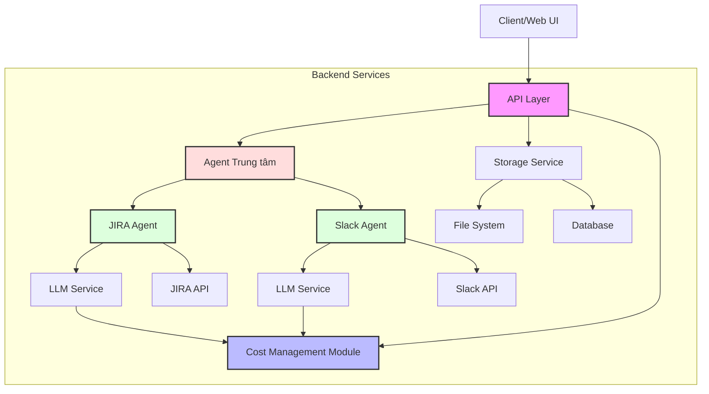

# TÀI LIỆU YÊU CẦU: DEVASSIST BOT

## 1. Giới thiệu và Tổng quan

### 1.1 Mục đích
DevAssist Bot là một chatbot thông minh được thiết kế để hỗ trợ các developer trong việc tự động hóa các tác vụ hành chính và quản lý dự án, giúp họ tập trung vào công việc phát triển sản phẩm. Bot sẽ tương tác với các công cụ phổ biến trong quy trình phát triển phần mềm, ưu tiên JIRA và Slack.

### 1.2 Phạm vi
Hệ thống sẽ bao gồm một web UI để tương tác với người dùng, một agent trung tâm để phân tích yêu cầu và điều phối các agent chức năng, và các agent chuyên biệt để tương tác với các công cụ khác nhau.

## 2. Kiến trúc Hệ thống

### 2.1 Tổng quan Kiến trúc
Hệ thống sẽ được xây dựng theo mô hình agent-based tương tự N8N, bao gồm:
- Web UI: giao diện tương tác với người dùng
- Agent Trung tâm: phân tích yêu cầu và lập kế hoạch hành động
- Agent Chức năng: các agent chuyên biệt tương tác với các công cụ cụ thể
- Cost Management Module: theo dõi và quản lý sử dụng token

### 2.2 Các Thành phần Chính
1. **Web UI**: Giao diện người dùng dạng chat, hỗ trợ nhập văn bản và hiển thị kết quả
2. **Agent Trung tâm**: 
   - Phân tích nội dung yêu cầu
   - Xác định công cụ cần sử dụng
   - Lập kịch bản hành động
   - Điều phối các agent chức năng
3. **JIRA Agent**: Tương tác với JIRA API để quản lý task (ưu tiên cao)
4. **Slack Agent**: Tương tác với Slack API để gửi/nhận tin nhắn (ưu tiên cao)
5. **Calendar Agent**: Quản lý lịch và cuộc họp (tùy chọn)
6. **Email Agent**: Soạn và gửi email (tùy chọn)
7. **Meeting Room Agent**: Đặt và quản lý phòng họp (tùy chọn)
8. **Cost Management Module**: Theo dõi và quản lý sử dụng token

## 3. Yêu cầu Chức năng

### 3.1 Web UI
- RF-UI-01: Cung cấp giao diện chat để nhập lệnh
- RF-UI-02: Hiển thị kết quả dưới dạng văn bản có định dạng
- RF-UI-03: Hỗ trợ hiển thị trạng thái xử lý (đang typing, đang thực hiện hành động)
- RF-UI-04: Lưu lịch sử chat để tham khảo sau

### 3.2 Agent Trung tâm
- RF-CA-01: Phân tích ngôn ngữ tự nhiên để hiểu yêu cầu người dùng sử dụng OpenAI GPT-4o-mini hoặc GPT-3.5-turbo-o3-mini
- RF-CA-02: Xác định công cụ cần sử dụng dựa trên yêu cầu
- RF-CA-03: Lập kế hoạch hành động bao gồm nhiều bước (nếu cần)
- RF-CA-04: Điều phối các agent chức năng theo kịch bản đã lập
- RF-CA-05: Tổng hợp kết quả từ các agent chức năng và trình bày cho người dùng

### 3.3 JIRA Agent (Ưu tiên cao)
- RF-JA-01: Tạo issue mới trên JIRA
- RF-JA-02: Cập nhật trạng thái issue
- RF-JA-03: Tìm kiếm và truy xuất thông tin issue
- RF-JA-04: Gán issue cho thành viên trong dự án
- RF-JA-05: Báo cáo các issue đang được gán cho người dùng

### 3.4 Slack Agent (Ưu tiên cao)
- RF-SA-01: Gửi tin nhắn đến channel hoặc người dùng cụ thể
- RF-SA-02: Tìm kiếm tin nhắn trong lịch sử chat
- RF-SA-03: Tạo thread mới từ tin nhắn
- RF-SA-04: Thông báo trạng thái task cho team qua Slack

### 3.5 Calendar Agent (Tùy chọn)
- RF-CA-01: Tạo cuộc họp mới với thời gian cụ thể
- RF-CA-02: Mời người tham dự vào cuộc họp
- RF-CA-03: Kiểm tra lịch trống của người tham dự
- RF-CA-04: Hiển thị lịch làm việc của ngày/tuần

### 3.6 Email Agent (Tùy chọn)
- RF-EA-01: Soạn và gửi email đến một hoặc nhiều người nhận
- RF-EA-02: Đọc và tóm tắt nội dung email mới
- RF-EA-03: Trả lời email với nội dung được gợi ý

### 3.7 Meeting Room Agent (Tùy chọn)
- RF-MRA-01: Kiểm tra tình trạng phòng họp
- RF-MRA-02: Đặt phòng họp cho thời gian cụ thể
- RF-MRA-03: Hủy đặt phòng họp

### 3.8 Cost Management Module
- RF-CM-01: Theo dõi lượng token sử dụng cho mỗi yêu cầu
- RF-CM-02: Phân bổ ngân sách token theo người dùng hoặc dự án
- RF-CM-03: Cảnh báo khi sử dụng gần đến ngưỡng ngân sách
- RF-CM-04: Báo cáo thống kê sử dụng theo chu kỳ (ngày, tuần, tháng)
- RF-CM-05: Tối ưu hóa sử dụng token bằng cách chọn mô hình phù hợp với độ phức tạp của yêu cầu

## 4. Yêu cầu Phi Chức năng

### 4.1 Hiệu suất
- RNF-P-01: Thời gian phản hồi ban đầu dưới 2 giây
- RNF-P-02: Xử lý đồng thời tối thiểu 100 người dùng

### 4.2 Bảo mật
- RNF-S-01: Mã hóa dữ liệu truyền tải
- RNF-S-02: Xác thực người dùng trước khi cho phép sử dụng bot
- RNF-S-03: Kiểm soát quyền truy cập vào các hệ thống (JIRA, Slack, etc.)

### 4.3 Độ tin cậy
- RNF-R-01: Hệ thống phải hoạt động 24/7 với uptime 99.9%
- RNF-R-02: Cơ chế khôi phục sau lỗi tự động

### 4.4 Khả năng mở rộng
- RNF-E-01: Kiến trúc cho phép thêm agent mới dễ dàng
- RNF-E-02: Hỗ trợ tích hợp với các công cụ bên thứ ba khác

### 4.5 Yêu cầu kỹ thuật về mô hình AI
- RNF-AI-01: Sử dụng mô hình OpenAI GPT-4o-mini hoặc GPT-3.5-turbo-o3-mini
- RNF-AI-02: Cơ chế tự động chuyển đổi giữa các mô hình tùy thuộc vào độ phức tạp của yêu cầu
- RNF-AI-03: Hệ thống caching để giảm thiểu việc gọi API không cần thiết
- RNF-AI-04: Cơ chế kiểm soát độ dài prompt để tối ưu chi phí

## 5. Các Trường hợp Sử dụng

### 5.1 Quản lý Task (Ưu tiên cao)
- UC-01: "Tạo một task JIRA mới về lỗi login với priority cao, gán cho John"
- UC-02: "Hiển thị tất cả task đang được gán cho tôi với deadline trong tuần này"

### 5.2 Trao đổi Dự án (Ưu tiên cao)
- UC-03: "Gửi tin nhắn đến channel #project-alpha thông báo rằng tôi sẽ hoàn thành feature login vào ngày mai"
- UC-04: "Tìm các thảo luận về API authentication trong channel #backend từ tuần trước"

### 5.3 Lịch và Cuộc họp (Tùy chọn)
- UC-05: "Đặt cuộc họp daily standup lúc 9:30 sáng ngày mai ở phòng Mercury, mời cả team backend"
- UC-06: "Kiểm tra lịch của tôi trong ngày hôm nay"

### 5.4 Quản lý Chi phí
- UC-07: "Hiển thị báo cáo sử dụng token trong tháng này"
- UC-08: "Thiết lập ngân sách token cho dự án Alpha là 10,000 token/ngày"

### 5.5 Kịch bản Phức hợp
- UC-09: "Tạo một task JIRA về feature login, đặt meeting để thảo luận với team vào ngày mai lúc 2 giờ chiều, và thông báo trên Slack channel #project-alpha"

## 6. Tích hợp Hệ thống

### 6.1 Tích hợp JIRA (Ưu tiên cao)
- INT-J-01: Sử dụng JIRA REST API để tương tác với JIRA
- INT-J-02: Xác thực qua OAuth hoặc API token

### 6.2 Tích hợp Slack (Ưu tiên cao)
- INT-S-01: Sử dụng Slack API và Webhooks
- INT-S-02: Xác thực qua OAuth

### 6.3 Tích hợp Calendar (Tùy chọn)
- INT-C-01: Tích hợp với Google Calendar API hoặc Microsoft Calendar API
- INT-C-02: Xác thực qua OAuth

### 6.4 Tích hợp Email (Tùy chọn)
- INT-E-01: Tích hợp với SMTP/IMAP hoặc Gmail API
- INT-E-02: Xác thực qua OAuth hoặc mật khẩu ứng dụng

### 6.5 Tích hợp Meeting Room (Tùy chọn)
- INT-M-01: Tích hợp với hệ thống quản lý phòng họp nội bộ
- INT-M-02: Xác thực qua API key hoặc JWT

### 6.6 Tích hợp OpenAI API
- INT-O-01: Sử dụng OpenAI API để truy cập các mô hình GPT-4o-mini và GPT-3.5-turbo-o3-mini
- INT-O-02: Quản lý API keys và hạn mức sử dụng

## 7. Kế hoạch Triển khai

### 7.1 Giai đoạn 1
- Phát triển Web UI cơ bản và Agent Trung tâm
- Tích hợp với JIRA và Slack
- Triển khai Cost Management Module cơ bản

### 7.2 Giai đoạn 2
- Phát triển chức năng quản lý chi phí nâng cao
- Tối ưu hóa việc sử dụng mô hình OpenAI

### 7.3 Giai đoạn 3 (Tùy chọn)
- Phát triển Calendar Agent và Email Agent
- Tích hợp với Google Calendar và hệ thống email

### 7.4 Giai đoạn 4 (Tùy chọn)
- Phát triển Meeting Room Agent
- Tích hợp với hệ thống quản lý phòng họp nội bộ

### 7.5 Giai đoạn 5
- Kiểm thử hệ thống toàn diện
- Triển khai phiên bản beta cho nhóm người dùng hạn chế

### 7.6 Giai đoạn 6
- Thu thập phản hồi và cải tiến
- Triển khai toàn bộ hệ thống

## 8. Yêu cầu Kiểm thử

### 8.1 Kiểm thử Đơn vị
- TEST-U-01: Kiểm thử từng agent riêng biệt
- TEST-U-02: Kiểm thử module quản lý chi phí

### 8.2 Kiểm thử Tích hợp
- TEST-I-01: Kiểm thử tương tác giữa các agent
- TEST-I-02: Kiểm thử tích hợp với OpenAI API

### 8.3 Kiểm thử Người dùng
- TEST-U-01: Kiểm thử với các kịch bản sử dụng thực tế
- TEST-U-02: Thu thập phản hồi từ người dùng
