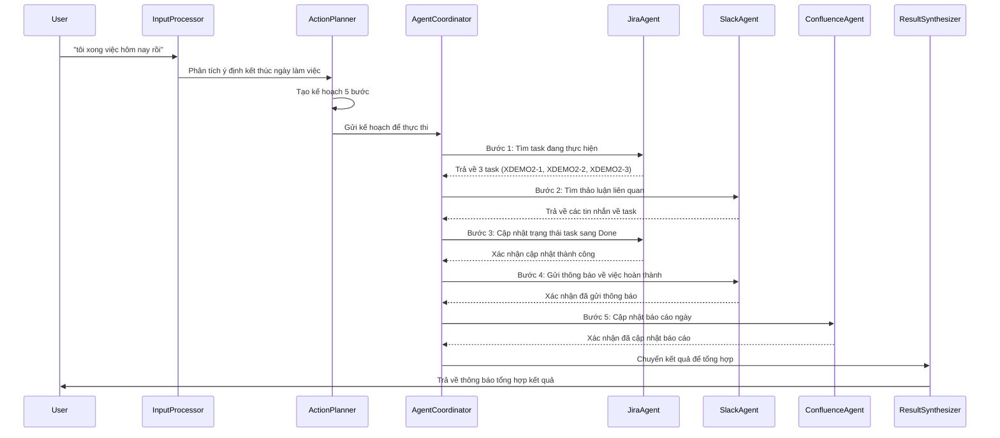
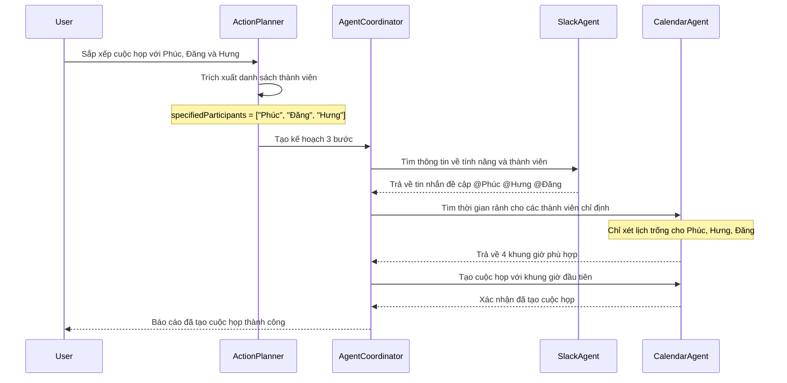
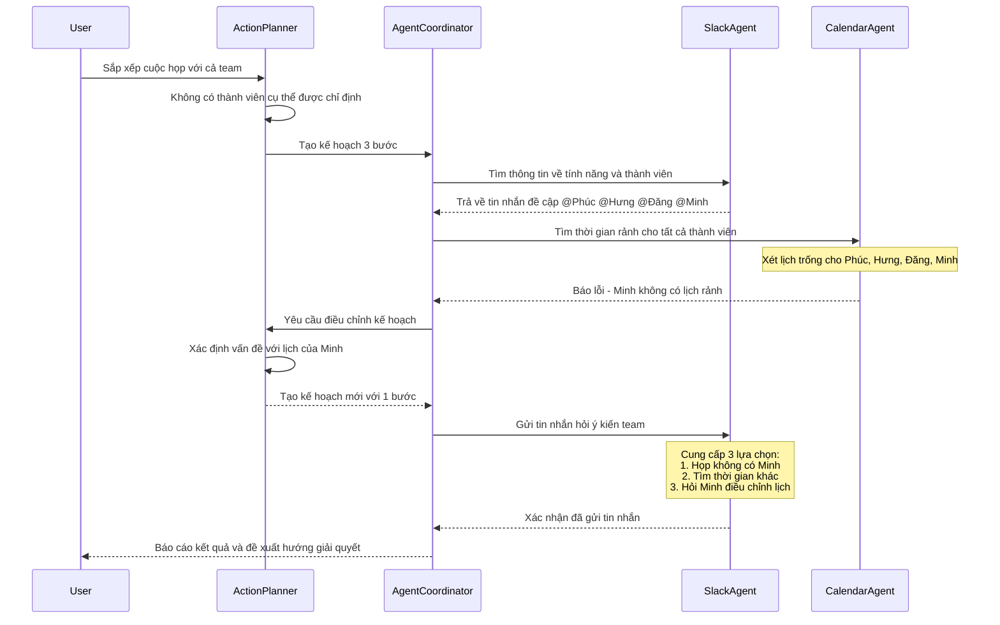
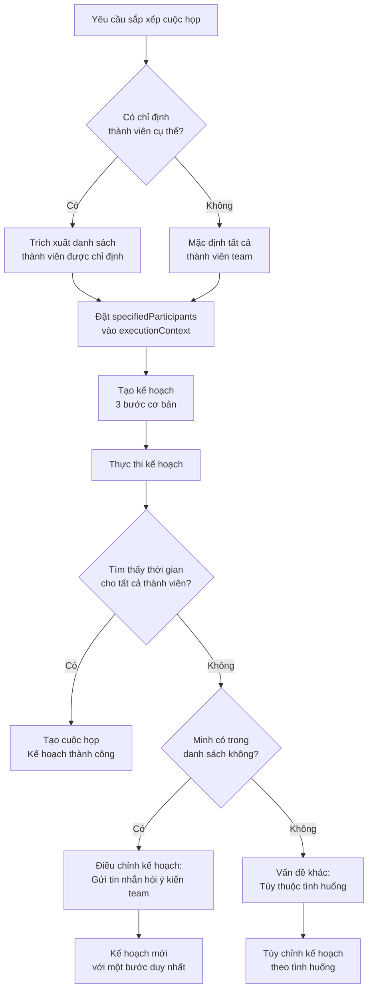
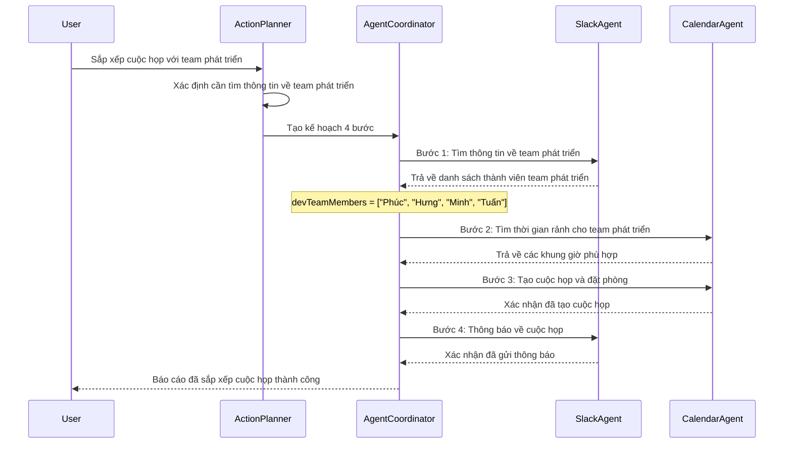
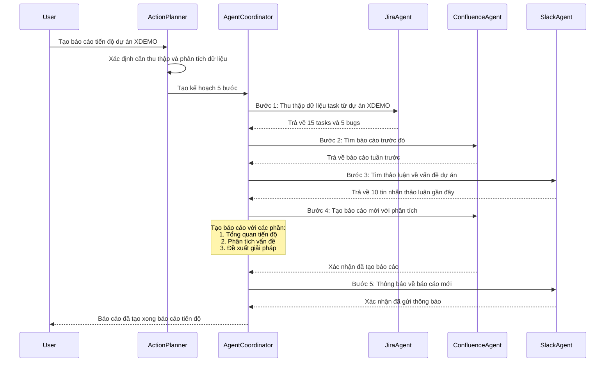
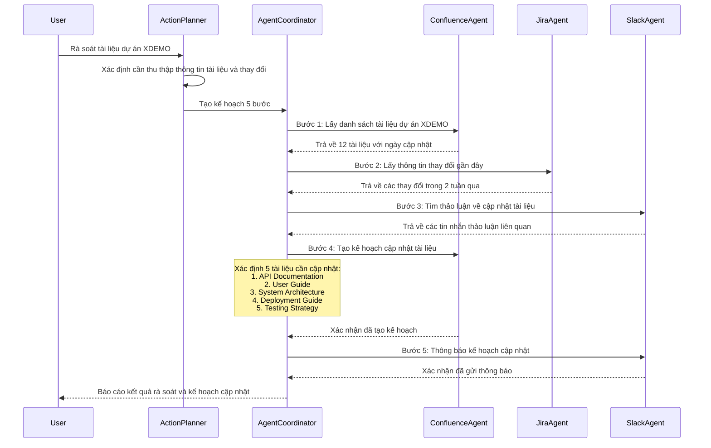
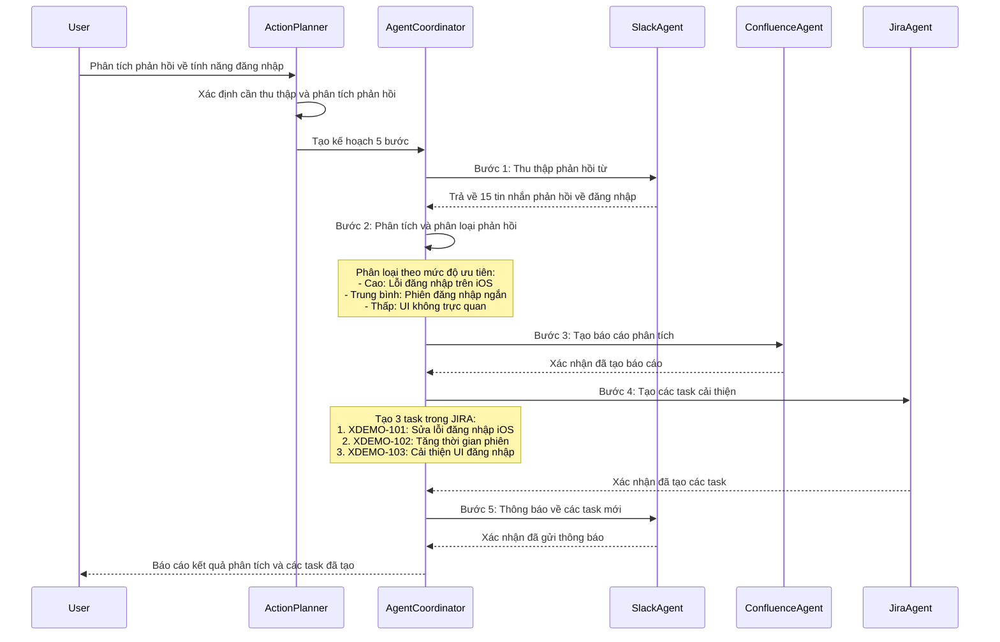

# Kế hoạch kiểm thử kịch bản phức tạp cho Central Agent

Tài liệu này mô tả các kịch bản kiểm thử phức tạp cho Central Agent, tập trung vào khả năng xử lý các tình huống đa dạng và phức tạp. Các kịch bản này được thiết kế để kiểm tra khả năng thích ứng, xử lý lỗi và phối hợp giữa các thành phần của hệ thống trong điều kiện thực tế.

## Tổng quan

Central Agent là thành phần chính trong hệ thống quản lý công việc, có nhiệm vụ phối hợp giữa các Sub-Agent (JIRA, Slack, Google Calendar...) để thực hiện các yêu cầu của người dùng. Việc kiểm thử toàn diện các kịch bản phức tạp giúp đảm bảo hệ thống có thể xử lý các tình huống thực tế và khó khăn, nâng cao độ tin cậy của hệ thống.

Các kịch bản kiểm thử trong tài liệu này tập trung vào:
- Xử lý nhiều yêu cầu đồng thời
- Điều phối các tác vụ có phụ thuộc phức tạp
- Khả năng phục hồi sau lỗi
- Xử lý ngữ cảnh hội thoại phức tạp
- Tích hợp với nhiều Sub-Agent cùng lúc

## 1. Kịch bản kiểm thử phức tạp

### 1.1 Kết thúc ngày làm việc

**Mô tả**: Người dùng thông báo kết thúc ngày làm việc và muốn hệ thống tự động xử lý các tác vụ liên quan như cập nhật trạng thái công việc, tạo báo cáo ngày và thông báo cho team. Hệ thống cần tự động tìm các task đang làm, cập nhật trạng thái và thực hiện các hành động kết thúc ngày.

**Endpoint**: `POST /central-agent/process`

**Curl Command**:
```bash
curl -X POST "http://localhost:3001/central-agent/process" \
  -H "Content-Type: application/json" \
  -d '{
    "message": "tôi xong việc hôm nay rồi", 
    "userId": "user123"
  }' --max-time 300
```

**Cấu hình Mock Sub-Agents**:
- **MockJiraAgent**: 
  - Cấu hình để trả về 3 task (XDEMO2-1, XDEMO2-2, XDEMO2-3) ở trạng thái "In Progress" hoặc "To Do" 
  - Xử lý cập nhật trạng thái task sang "Done"
  - Trả về đầy đủ thông tin task bao gồm trường `lastUpdated`
  
- **MockSlackAgent**: 
  - Cấu hình để tìm tin nhắn liên quan đến các task
  - Xử lý thông báo cập nhật task lên kênh chung
  - Hỗ trợ đa dạng định dạng tin nhắn
  
- **MockConfluenceAgent**:
  - Tạo/cập nhật báo cáo hàng ngày
  - Lưu trữ thông tin về công việc hoàn thành

**Luồng thực thi**:
1. Central Agent nhận yêu cầu "tôi xong việc hôm nay rồi" từ người dùng
2. InputProcessor phân tích yêu cầu và xác định ý định kết thúc ngày làm việc
3. ActionPlanner tạo kế hoạch 5 bước:
   - Tìm các task đang thực hiện (JIRA)
   - Tìm các thảo luận liên quan (SLACK)
   - Cập nhật trạng thái task (JIRA)
   - Gửi thông báo về việc cập nhật (SLACK)
   - Cập nhật báo cáo hàng ngày (CONFLUENCE)
4. AgentCoordinator thực thi từng bước trong kế hoạch
5. ResultSynthesizer tổng hợp kết quả và trả về phản hồi

**Kỳ vọng**:
- Hệ thống tự động xác định các task cần cập nhật 
- Cập nhật thành công trạng thái của tất cả task liên quan
- Gửi thông báo trên Slack với thông tin đầy đủ về các task đã cập nhật
- Tạo báo cáo ngày trên Confluence
- Trả về thông báo tổng hợp cho người dùng

**Sơ đồ luồng xử lý**:



### 1.2 Sắp xếp lịch họp dựa trên thời gian rảnh của nhóm

**Mô tả**: Người dùng muốn sắp xếp một cuộc họp nhóm trong tuần này dựa trên thời gian rảnh. Hệ thống cần tìm khung giờ thích hợp, kiểm tra phòng trống và tạo lịch họp. Kịch bản này được chia thành các trường hợp con để đánh giá khả năng xử lý các tình huống khác nhau.

#### 1.2.1 Sắp xếp cuộc họp với các thành viên cụ thể

**Mô tả**: Người dùng chỉ định rõ danh sách thành viên cần tham gia cuộc họp. Hệ thống cần tôn trọng danh sách này và chỉ tìm khung giờ cho đúng những người được chỉ định.

**Endpoint**: `POST /central-agent/process`

**Curl Command**:
```bash
curl -X POST "http://localhost:3001/central-agent/process" \
  -H "Content-Type: application/json" \
  -d '{
    "message": "sắp xếp cuộc họp với Phúc, Đăng và Hưng để kickoff dự án X", 
    "userId": "user123"
  }' | jq
```

**Luồng thực thi**:
1. Central Agent xác định rõ các thành viên được chỉ định (Phúc, Đăng, Hưng)
2. Xác định khung giờ phù hợp cho chính xác những thành viên này qua CalendarAgent
3. Tạo cuộc họp mới trong lịch và chỉ mời đúng những thành viên đã chỉ định
4. Đặt phòng họp và gửi thông báo về cuộc họp

**Kỳ vọng**:
- Hệ thống nhận diện đúng các thành viên được chỉ định (Phúc, Đăng, Hưng)
- Không bao gồm thành viên khác (như Minh) trong quá trình tìm kiếm lịch trống
- Tạo thành công cuộc họp với đúng các thành viên được chỉ định
- Trả về xác nhận với thông tin chi tiết về cuộc họp đã tạo

**Sơ đồ luồng xử lý**:



#### 1.2.2 Sắp xếp cuộc họp với toàn bộ team

**Mô tả**: Người dùng yêu cầu sắp xếp cuộc họp với "cả team" mà không chỉ định cụ thể thành viên. Hệ thống phải xác định tất cả thành viên của team và xử lý trường hợp không tìm được thời gian phù hợp cho tất cả.

**Endpoint**: `POST /central-agent/process`

**Curl Command**:
```bash
curl -X POST "http://localhost:3001/central-agent/process" \
  -H "Content-Type: application/json" \
  -d '{
    "message": "sắp xếp cuộc họp với cả team để kickoff dự án X", 
    "userId": "user123"
  }' | jq
```

**Luồng thực thi**:
1. Central Agent xác định tất cả thành viên trong team dự án (thông qua Slack)
2. Tìm kiếm khung giờ phù hợp cho tất cả thành viên qua CalendarAgent
3. Phát hiện Minh không có lịch rảnh trong tuần này
4. Điều chỉnh kế hoạch để xử lý tình huống này
5. Gửi tin nhắn hỏi ý kiến team về việc họp thiếu Minh, tìm thời gian khác, hoặc hỏi Minh điều chỉnh lịch

**Kỳ vọng**:
- Hệ thống nhận diện tất cả thành viên trong team bao gồm Minh
- Phát hiện và xử lý trường hợp Minh không có lịch rảnh
- Điều chỉnh kế hoạch thay vì dừng hẳn quy trình
- Gửi tin nhắn Slack với các lựa chọn phù hợp để tiếp tục quy trình

**Sơ đồ luồng xử lý**:



**So sánh cơ chế phán đoán của Action Planner**:



Sự khác biệt trong cách Central Agent xử lý hai kịch bản sắp xếp cuộc họp:

1. **Trích xuất thành viên**: Với kịch bản 1.2.1, hệ thống trích xuất cụ thể danh sách thành viên từ yêu cầu. Với kịch bản 1.2.2, hệ thống phải tìm kiếm thông tin về team từ Slack.

2. **Xử lý lỗi**: Kịch bản 1.2.1 thành công vì tất cả thành viên được chỉ định có lịch rảnh. Kịch bản 1.2.2 cần điều chỉnh kế hoạch khi phát hiện Minh không có lịch rảnh.

3. **Điều chỉnh kế hoạch**: Cơ chế điều chỉnh kế hoạch cho phép hệ thống chuyển từ kế hoạch ban đầu (tạo cuộc họp) sang kế hoạch thay thế (gửi tin nhắn hỏi ý kiến) khi gặp trường hợp ngoại lệ.

4. **Thông minh ngữ cảnh**: Hệ thống hiểu được mối quan hệ giữa các thành viên và quyết định đưa ra các lựa chọn phù hợp (họp thiếu người, đổi lịch, hoặc liên hệ trực tiếp).

#### 1.2.3 Sắp xếp cuộc họp với team phát triển

**Mô tả**: Người dùng muốn sắp xếp cuộc họp với "team phát triển" - một nhóm chung chung không được chỉ định cụ thể. Hệ thống cần tìm thông tin về team phát triển rồi mới tiến hành tìm thời gian và tạo lịch họp.

**Endpoint**: `POST /central-agent/process`

**Curl Command**:
```bash
curl -X POST "http://localhost:3001/central-agent/process" \
  -H "Content-Type: application/json" \
  -d '{
    "message": "sắp xếp cuộc họp với team phát triển về tính năng mới trong tuần này", 
    "userId": "user123"
  }' --max-time 300
```

**Cấu hình Mock Sub-Agents**:
- **MockSlackAgent**: 
  - Tìm kiếm thông tin về "team phát triển" trong workspace
  - Xác định danh sách thành viên của team
  
- **MockCalendarAgent**: 
  - Trả về lịch trống cho các thành viên trong team phát triển
  - Hỗ trợ tạo sự kiện lịch mới và đặt phòng họp

**Luồng thực thi**:
1. Central Agent xác định cần tìm hiểu về "team phát triển" trước tiên
2. Tìm thông tin về team phát triển và thành viên qua SlackAgent
3. Xác định khung giờ phù hợp cho các thành viên qua CalendarAgent
4. Tạo cuộc họp mới và mời các thành viên qua CalendarAgent
5. Gửi thông báo về cuộc họp qua SlackAgent

**Kỳ vọng**:
- Hệ thống xác định đúng thành viên của team phát triển
- Tìm được khung giờ phù hợp cho các thành viên
- Tạo thành công cuộc họp và đặt phòng họp
- Thông báo đầy đủ về cuộc họp cho các thành viên

**Sơ đồ luồng xử lý**:



### 1.3 Báo cáo tiến độ dự án và phân tích vấn đề

**Mô tả**: Người dùng yêu cầu hệ thống tạo báo cáo tiến độ dự án, phân tích các vấn đề đang gặp phải và đề xuất giải pháp. Kịch bản này kiểm tra khả năng tổng hợp thông tin từ nhiều nguồn và phân tích dữ liệu phức tạp.

**Endpoint**: `POST /central-agent/process`

**Curl Command**:
```bash
curl -X POST "http://localhost:3001/central-agent/process" \
  -H "Content-Type: application/json" \
  -d '{
    "message": "tạo báo cáo tiến độ dự án XDEMO và phân tích các vấn đề hiện tại", 
    "userId": "user123"
  }' --max-time 300
```

**Cấu hình Mock Sub-Agents**:
- **MockJiraAgent**: 
  - Cung cấp danh sách task theo dự án XDEMO với trạng thái và mức ưu tiên
  - Trả về các bugs và issues đang mở
  
- **MockConfluenceAgent**: 
  - Tìm kiếm báo cáo trước đó của dự án XDEMO
  - Tạo trang báo cáo mới với phân tích
  
- **MockSlackAgent**: 
  - Tìm kiếm thảo luận gần đây về vấn đề của dự án XDEMO

**Luồng thực thi**:
1. Central Agent xác định yêu cầu tạo báo cáo tiến độ cho dự án XDEMO
2. Thu thập dữ liệu từ các nguồn: JIRA, Confluence, Slack
3. Phân tích dữ liệu và xác định vấn đề
4. Tạo báo cáo chi tiết trên Confluence
5. Thông báo về báo cáo mới trên Slack

**Kỳ vọng**:
- Hệ thống thu thập đầy đủ dữ liệu từ các nguồn
- Phân tích chính xác tiến độ và vấn đề dự án
- Tạo báo cáo có cấu trúc rõ ràng với số liệu chính xác
- Đề xuất giải pháp khả thi cho các vấn đề

**Sơ đồ luồng xử lý**:



### 1.4 Rà soát và cập nhật tài liệu dự án

**Mô tả**: Người dùng yêu cầu hệ thống rà soát tài liệu dự án, xác định những tài liệu cần cập nhật và tạo kế hoạch cập nhật. Kịch bản này kiểm tra khả năng kiểm duyệt tài liệu và lập kế hoạch cập nhật.

**Endpoint**: `POST /central-agent/process`

**Curl Command**:
```bash
curl -X POST "http://localhost:3001/central-agent/process" \
  -H "Content-Type: application/json" \
  -d '{
    "message": "rà soát tài liệu dự án XDEMO và cập nhật cho phiên bản mới", 
    "userId": "user123"
  }' --max-time 300
```

**Cấu hình Mock Sub-Agents**:
- **MockConfluenceAgent**: 
  - Cung cấp danh sách tài liệu XDEMO hiện có với ngày cập nhật
  - Hỗ trợ cập nhật và tạo mới tài liệu
  
- **MockJiraAgent**: 
  - Cung cấp thông tin về các thay đổi gần đây trong dự án XDEMO
  
- **MockSlackAgent**: 
  - Tìm kiếm thảo luận về cập nhật tài liệu

**Luồng thực thi**:
1. Central Agent xác định yêu cầu rà soát tài liệu dự án XDEMO
2. Thu thập danh sách tài liệu hiện có từ Confluence
3. Kiểm tra thay đổi gần đây trong dự án từ JIRA
4. Xác định tài liệu cần cập nhật dựa trên thời gian và thay đổi
5. Tạo kế hoạch cập nhật tài liệu
6. Thông báo kế hoạch qua Slack

**Kỳ vọng**:
- Hệ thống xác định chính xác tài liệu cần cập nhật
- Tạo kế hoạch cập nhật chi tiết với mức độ ưu tiên
- Thông báo kế hoạch đến team qua Slack

**Sơ đồ luồng xử lý**:



### 1.5 Phân tích phản hồi khách hàng về tính năng đăng nhập

**Mô tả**: Người dùng yêu cầu hệ thống phân tích phản hồi từ khách hàng về tính năng đăng nhập và tạo task cải thiện. Kịch bản này kiểm tra khả năng phân tích dữ liệu phi cấu trúc và chuyển đổi thành hành động cụ thể.

**Endpoint**: `POST /central-agent/process`

**Curl Command**:
```bash
curl -X POST "http://localhost:3001/central-agent/process" \
  -H "Content-Type: application/json" \
  -d '{
    "message": "phân tích phản hồi từ khách hàng về tính năng đăng nhập và tạo task cải thiện", 
    "userId": "user123"
  }' --max-time 300
```

**Cấu hình Mock Sub-Agents**:
- **MockSlackAgent**: 
  - Cung cấp tin nhắn phản hồi từ khách hàng trong kênh #customer-feedback
  - Cấu hình mẫu phản hồi về vấn đề đăng nhập trên iOS
  
- **MockJiraAgent**: 
  - Hỗ trợ tạo task cải thiện với mức độ ưu tiên
  - Liên kết task với phản hồi khách hàng
  
- **MockConfluenceAgent**: 
  - Hỗ trợ tạo báo cáo phân tích phản hồi khách hàng

**Luồng thực thi**:
1. Central Agent xác định yêu cầu phân tích phản hồi về tính năng đăng nhập
2. Thu thập phản hồi khách hàng từ kênh Slack
3. Phân tích và phân loại phản hồi theo mức độ nghiêm trọng
4. Tạo báo cáo phân tích trên Confluence
5. Tạo các task cải thiện trên JIRA
6. Thông báo kết quả qua Slack

**Kỳ vọng**:
- Hệ thống thu thập đầy đủ phản hồi về tính năng đăng nhập
- Phân loại chính xác các vấn đề theo mức độ ưu tiên
- Tạo các task cải thiện hợp lý trong JIRA
- Tạo báo cáo phân tích chi tiết

**Sơ đồ luồng xử lý**:



## 2. Cấu hình kiểm thử và môi trường

### 2.1 Cấu hình Mock Agents

**MockJiraAgent**:
- Cấu hình tập dữ liệu mẫu:
  - 10 task với các trạng thái khác nhau (To Do, In Progress, Review, Done)
  - 3 dự án (XDEMO, XDEV, XTEST)
  - Các mối quan hệ phụ thuộc giữa các task

**MockSlackAgent**:
- Cấu hình các kênh: #general, #project-xdemo, #dev-team, #customer-feedback
- Mẫu tin nhắn liên quan đến task và dự án
- Mẫu phản hồi khách hàng về các tính năng
- Hỗ trợ tìm kiếm tin nhắn liên quan đến các task XDEMO2-xxx
- Hỗ trợ tìm kiếm tin nhắn về việc hoàn thành công việc

**MockConfluenceAgent**:
- Không gian làm việc mẫu: "XDEMO Project"
- Các trang tài liệu: Requirements, Design Docs, Meeting Notes, Customer Feedback
- Mẫu báo cáo ngày và tuần

**MockCalendarAgent**:
- Lịch team với các sự kiện định kỳ: Daily Standup, Sprint Planning
- Thời gian rảnh/bận của các thành viên
- Danh sách phòng họp và tình trạng

**MockEmailAgent**:
- Mẫu email cho lời mời họp
- Mẫu email phản hồi từ khách hàng

### 2.2 Metrics đo lường

Các metrics được sử dụng để đánh giá hiệu quả của Central Agent:

1. **Tỷ lệ thành công**: Phần trăm kịch bản được thực hiện thành công
2. **Thời gian phản hồi**: Thời gian trung bình để hoàn thành một yêu cầu
3. **Số lần thử lại**: Số lần trung bình phải thử lại các bước bị lỗi
4. **Độ chính xác kế hoạch**: Tỷ lệ bước trong kế hoạch được thực hiện thành công
5. **Độ phức tạp kế hoạch**: Số bước trung bình được tạo cho mỗi yêu cầu
6. **Chi phí token**: Số token LLM được sử dụng cho mỗi yêu cầu

### 2.3 Quy trình kiểm thử

1. **Chuẩn bị môi trường**:
   - Cấu hình các mock agent với dữ liệu mẫu
   - Thiết lập các biến môi trường cần thiết

2. **Thực hiện kiểm thử**:
   - Chạy các kịch bản kiểm thử theo thứ tự
   - Ghi lại kết quả và metrics

3. **Phân tích kết quả**:
   - So sánh kết quả thực tế với kỳ vọng
   - Xác định các vấn đề và điểm cải thiện

4. **Báo cáo và tối ưu hóa**:
   - Tạo báo cáo kiểm thử chi tiết
   - Đề xuất cải tiến cho Central Agent

## 3. Kết luận

Các kịch bản kiểm thử này cung cấp một cách tiếp cận toàn diện để đánh giá khả năng của Central Agent trong việc xử lý các yêu cầu phức tạp từ người dùng. Thông qua việc kiểm thử với nhiều tình huống khác nhau, chúng ta có thể đảm bảo hệ thống đủ mạnh mẽ và linh hoạt để đáp ứng các nhu cầu thực tế.

Việc liên tục cập nhật và mở rộng các kịch bản kiểm thử này sẽ giúp phát hiện sớm các vấn đề tiềm ẩn và cải thiện chất lượng tổng thể của Central Agent. 